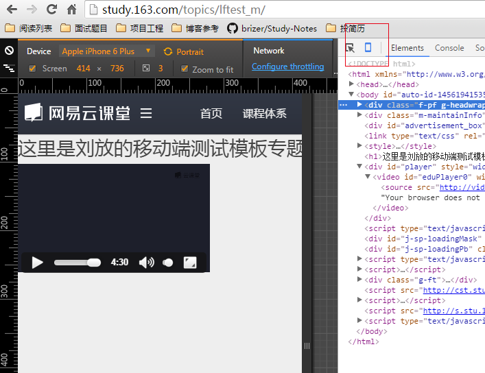
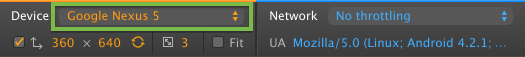
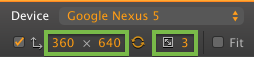
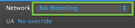
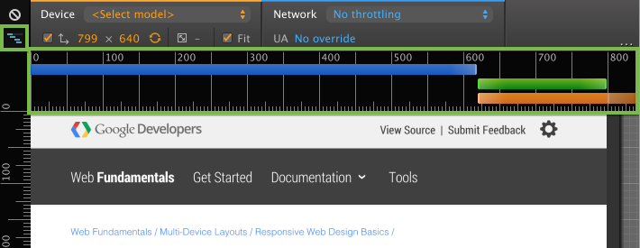
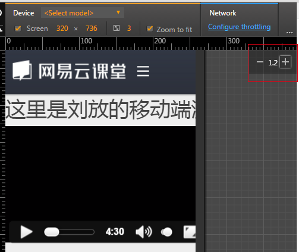
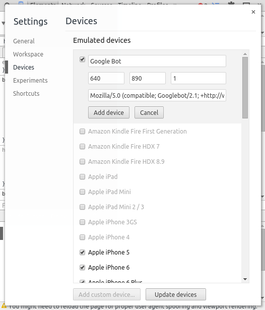

# Chrome Devtools 使用指南之三

---

##**前言**

本文主要说说移动web的开发工具使用。

---

##**使用**

点击浏览器工具中的手机图标，启用设备模式，图标变为蓝色和视口变换成设备模拟器：

###**切换设备**

我们可以通过Device选项来切换仿真的设备：

可以看到下面还有一行选项，用来切换使用屏幕分辨率仿真模拟的屏幕分辨率 模拟分辨率图标复选框以及通过点击纵向和横向视图之间交替交换维度 互换尺寸图标。

也可以来调整分辨率：

而第二个绿框，则是设备的像素比率(DPR),也就是逻辑像素和物理像素之间的比率。

###**网络环境**

我们可以模拟网络环境：

###**响应式**

通过左上角图标，查询响应式：

这里的蓝色代表查询目标的最大宽度，绿色代表查询的范围内瞄准宽度，橙色代表查询指定的最小宽度。

###**屏幕缩放**

我们可以通过右上角的数字来模拟屏幕的缩放：

###**触控事件**

进入移动模式后，鼠标移动会显示一个小圆点，默认是touch事件系列，这里是默认单点触控事件，如果需要多点触控，[查看这里][1]。

###**自定义设备**

我们选择仿真设备时有时候觉得不够，则可以自己定义设备：

1. 进入DevTools设置。
2. 激活设备选项卡。
3. 点击“添加自定义设备”按钮，在面板的底部。
4. 填写显示在列表的顶部的形式。
5. 按“添加设备”
6. 启用设备模式，找到你的自定义设备的设备菜单。

---

##参考**

[官网][2]

  [1]: http://www.html5rocks.com/en/mobile/touch/#toc-touchdev
  [2]: https://developer.chrome.com/devtools/docs/device-mode