# Chrome Devtools 使用指南之二


---

##**前言**

本文主要对Console控制台进行学习。

---

##**基本操作**

###**清空控制台内容**

在控制台中使用`clear()`,或者在javascript中使用`console.clear()`。

###**frame选择**

console可以打开不同的frame。

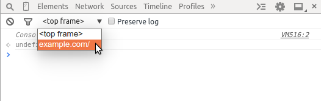

##**ConsoleAPI**

###**console.log**

用来将内容输出到控制台。
```
var a = document.createElement('p');
a.appendChild(document.createTextNode('foo'));
a.appendChild(document.createTextNode('bar'));
console.log("Node count: " + a.childNodes.length);
```

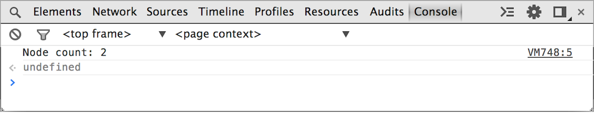

###**console.error**

和console.log的区别在于颜色。console.error是红色，而console.warn是黄色。

```
function connectToServer() {
    console.error("Error: %s (%i)", "Server is  not responding",500);
}
connectToServer();
```

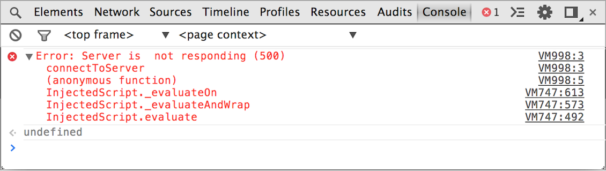

```
if(a.childNodes.length < 3 ) {
    console.warn('Warning! Too few nodes (%d)', a.childNodes.length);
}
```

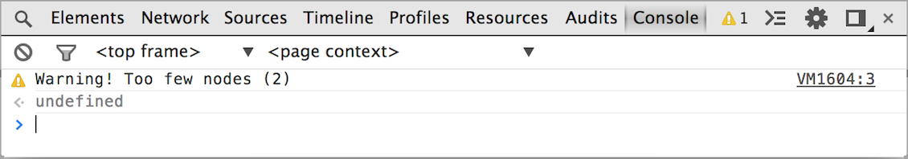


###**console.assert**

该方法只有在参数返回false时成为error。
```
console.assert(list.childNodes.length < 500, "Node count is > 500");
```

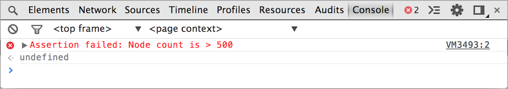

###**console.group**

用来输出一组结果。
```
var user = "jsmith", authenticated = false;
console.group("Authentication phase");
console.log("Authenticating user '%s'", user);
// authentication code here...
if (!authenticated) {
    console.log("User '%s' not authenticated.", user)
}
console.groupEnd();
```

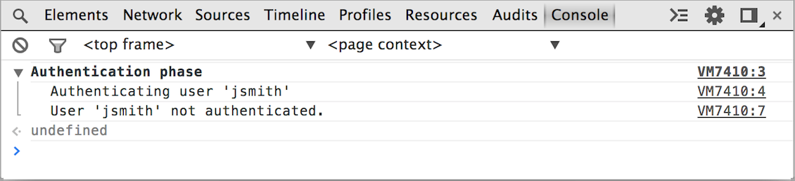

这里主要需要和`console.groupEnd()`配合使用。

###**console.table**

用来展示结构化的数据。

```
console.table([{a:1, b:2, c:3}, {a:"foo", b:false, c:undefined}]);
console.table([[1,2,3], [2,3,4]]);
```

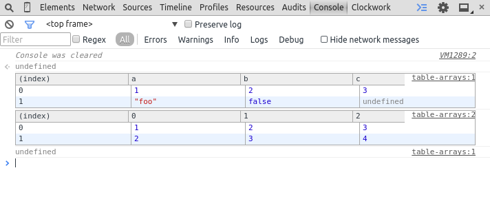

###**console.time**

和console.timeEnd一起使用来记录执行时间：

```
console.time("Array initialize");
    var array= new Array(1000000);
    for (var i = array.length - 1; i >= 0; i--) {
        array[i] = new Object();
    };
console.timeEnd("Array initialize");
```

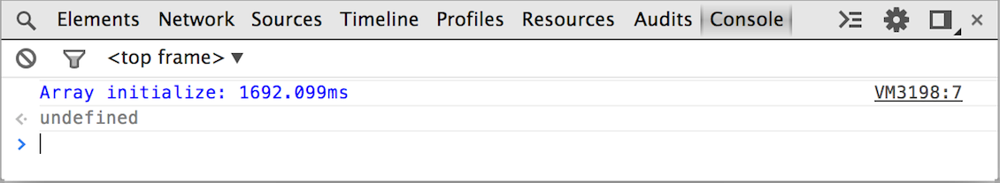

###**console.timeStamp**

该命令可以往Timeline中添加标记，在查询性能问题时非常有用。

```
function AddResult(name, result) {
    console.timeStamp("Adding result");
    var text = name + ': ' + result;
    var results = document.getElementById("results");
    results.innerHTML += (text + "<br>");
}
```

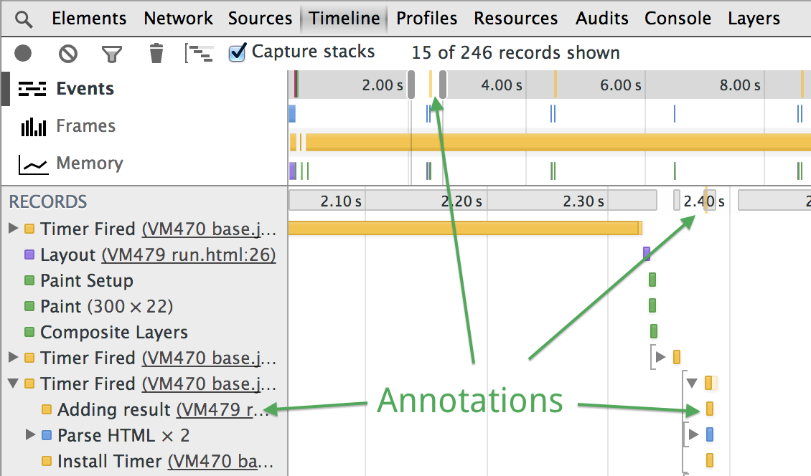

###**debugger**

和断点作用一样，有时候需要多次设置同一断点时，不然直接在代码中添加debugger：

```
brightness : function() {
    debugger;
    var r = Math.floor(this.red*255);
    var g = Math.floor(this.green*255);
    var b = Math.floor(this.blue*255);
    return (r * 77 + g * 150 + b * 29) >> 8;
}
```

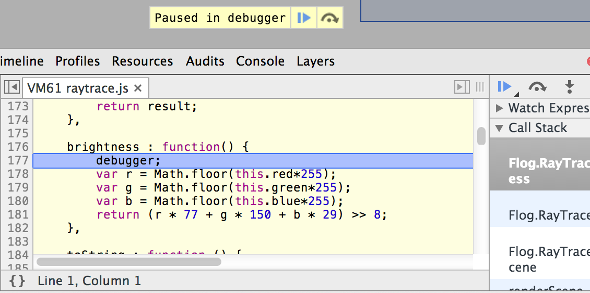


##**CommandLineAPI**

命令行API是指直接在console面板中执行的命令，比如下图：

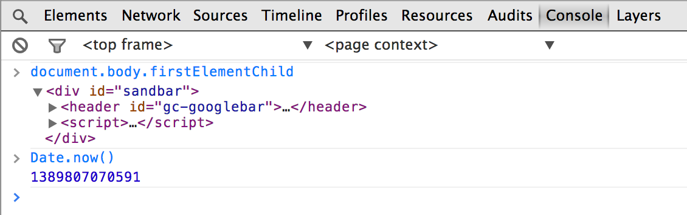

###**选择元素**

如下几种方式：`$(),$$(),$x()`。分别对应`document.querySelector(),document.querySelectorAll(),XPath`：
```
$('code') // Returns the first code element in the document.
$$('figure') // Returns an array of all figure elements in the document.
$x('html/body/p') // Returns an array of all paragraphs in the document body.
```

**距离选择**
$0到$4对应最近和最远选择过的节点。

###**监听事件**

监听指定类型事件：
```
monitorEvents(document.body, "click");
```

如果第二个参数未指定则监听所有类型事件。


---
##**参考**

[console][1]

[consoleAPI][2]


  [1]: https://developer.chrome.com/devtools/docs/console
  [2]: https://developer.chrome.com/devtools/docs/console-api