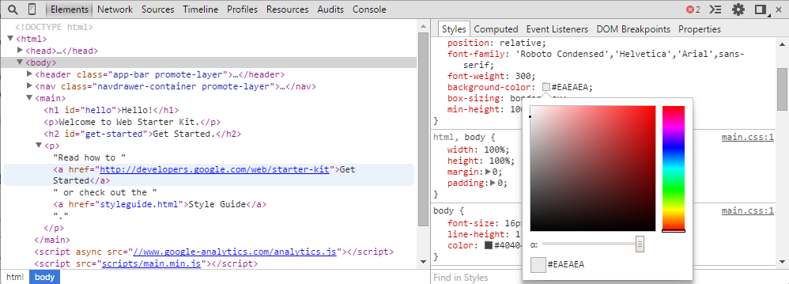
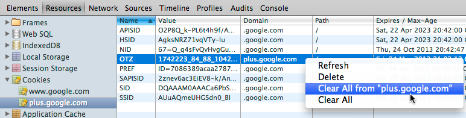
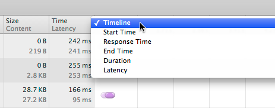
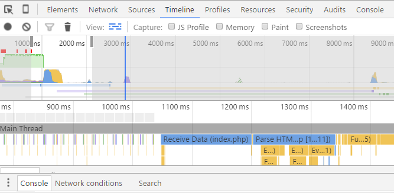
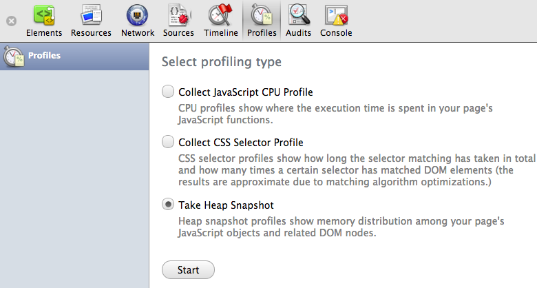
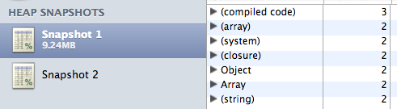

# chrome devtools使用指南之一

---

##**前言**

本文主要对浏览器开发工具基本操作和功能进行学习。主要是Elements，Resources,Networks,Sources,Profiles,Timelines,Audits等面板。至于Console面板详细介绍看一篇吧。

---
##**面板**

面板效果如下：

可以看到如下菜单栏：
Elements,Resources,Network,Timeline,Profiles,Resources,Security,Audits,Console。

可以使用`Ctrl+[` 和 `Ctrl+]`在面板间切换。
 
###**Elements**

Elements面板是用来修改DOM相关的，可以修改样式和html代码等。
可以通过选中DOM节点后进行对应的属性查看：

我们可以通过选中节点后右键`Edit as HTML`来直接对html进行修改：

我们还可以通过EventListeners来查看节点上对应的事件，并转到响应函数的位置：

其中每个事件有以下几个属性：

- handler:函数，可以通过右键Show Function Definition来找到定义。 
- isAttribute:如果该事件是通过DOM属性监听则为true。比如onClick。
- lineNumber：行数
- listenerBody：函数本身的内容。
- node：绑定监听事件的DOM节点，移动上去可以对应DOM位置
- type：事件类型，比如click
- useCapture：addEventListener是否设置

**修改样式**

通过Styles可以修改DOM的样式，还可以通过点击颜色来使用取色器：

###**Resources**

该栏目主要存放web对应的cookie，cache，websql
还有localStorage和SessionStorage等信息。

这里主要看一下cookies的列：

对应的属性如下：

- Name — cookie名字.
- Value — cookie值.
- Domain — 域名.
- Path — 路径.
- Expires / Maximum Age— 最大时间，对于session来说一直是“session”.
- Size — 大小.
- HTTP — 如果打钩则说明只能通过HTTP传输.
- Secure — 如果打钩则说明必须安全传输.

至于后面两种设置，可以看看[这篇文章][1]。

**清除**

我们可以手动清除：

**Frames**
我们可以在Frames中看到网页所有的字体、图片、脚本和样式文件：

###**Networks**

网络面板结构图：

每一列含义如下：
- Name：资源的URL
- Method：HTTP协议的请求方式，GET或POST
- Status and Text：HTTP状态码
- Type：资源类型
- Initiator：请求发起者，可能是一个脚本也可能是重定向等
- Timeline：资源加载所需时间线

再来看看Timeline，我们可以查看不同的时间：

分别对应：
- Strat Time:按照每个网络请求的开始时间排序
- Response Time:按照响应时间排序
- End Time：按照完成时间排序
- Duration：按照总时间排序
- Latency：响应和开始请求之间的时间

当我们点击某一个资源后，出现Header，Preview，Responser和Timing。可以用来查看HTTP各种类型的头信息和响应结果：

这里的Timing则显示资源在加载各个阶段的耗时：

每个阶段意义如下：

- Stalled:用户代理花费时间
- Proxy:连接代理服务器的时间
- DNS Lookup:DNS查询时间
- Initial Connection:建立TCP连接所需时间
- SSL:建立SSL安全通道时间
- Request Sent:发送网络请求花费时间
- Waiting(TTFB):等待初始响应时间，也称为Time To First Byte，可以理解为延迟。
- Content Download:接收响应数据花费时间

###**Timeline**
该面板主要是用来查看应用加载时间的。

结构如下：

我们以百度的首页为例，可以看到加载页面后的Timeline面板效果如下：

不同颜色分别对应：

举一个例子，当我们加载一个html时，首先我们会发送http请求，然后接受请求和数据，完成加载。然后开始解析html和css并执行脚本等等：

具体对应标识的含义可以[查看这里][2]。

当我们指向某一个阶段时，会出现详细信息：

我们可以通过Timeline找到应用的性能问题，并作出对策。具体有一些改进技巧，可以看看[这篇文章][3]。

我们可以通过帧模式来检测动画的性能，通过内存模式来查看是否有内存泄露问题等。

###**Profiles**

Profiles是性能分析工具，刚才说到的Timeline上如果有很多黄色的部分，那就可能是脚本产生的问题，可以选择javascriptCPU工具，如果是css选择器的问题，就可以选择css工具：

而第三种Heap 快照是用来比较两个时间点间内存的。
要使用这个功能，点击‘Start’，重复你怀疑（出现你发现的那些信息的时刻）会引起内存泄露的动作，这时记录下第一个快照。 接下来点击record按钮 ☻ 来记录第二个快照，这次不需要与程序进行交互。

###**Audits**

该面板会分析当前应用可以改进的性能问题，比如代码合并，css重用等。不用详细介绍。

---
##**感悟**

其实很多工具必须在特定的场景下通过经验的积累来熟练，这里只能学习个大概和基础的操作。下一次再学习console控制台的详细使用。

---
##**参考**

[Web安全之Cookie管理][4]

[Elements][5]

[Resources][6]

[NetWork][7]

[Events][8]

[TimeLine][9]

[Chrome渲染分析之Timeline工具的使用][10]

[使用Chrome DevTools的Timeline和Profiles改进性能][11]

  [1]: http://blog.csdn.net/mevicky/article/details/48310993
  [2]: https://developer.chrome.com/devtools/docs/timeline#timeline-event-reference
  [3]: http://www.oschina.net/translate/performance-optimisation-with-timeline-profiles
  [4]: http://blog.csdn.net/mevicky/article/details/48310993
  [5]: https://developer.chrome.com/devtools/docs/dom-and-styles
  [6]: https://developer.chrome.com/devtools/docs/resource-panel
  [7]: https://developer.chrome.com/devtools/docs/network
  [8]: https://developer.chrome.com/devtools/docs/timeline#timeline-event-reference
  [9]: https://developer.chrome.com/devtools/docs/timeline
  [10]: http://www.ghugo.com/chrome-timeline/?utm_source=tuicool&utm_medium=referral
  [11]: http://www.oschina.net/translate/performance-optimisation-with-timeline-profiles