#Nej之模块化开发

---

##**前言**

需要开发study项目，需要用到nej，故对此进行学习。

文章先介绍基本概念，然后统一介绍相关API。最后通过一个应用实例简单认识下nej。

---

##**方案结构**

整个方案**纵向采用MVC分层架构思路，横向采用模块化调度思路**，对系统的各子系统模块化封装，模块之间通过**消息机制交互**，示意图如下所示：

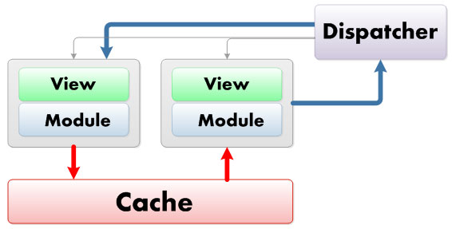

由以下几部分组成：

**历史管理器**：主要负责管理操作历史及系统对外接口变化检测

**模块调度器**：主要负责按照接口变化调度相应的模块

**模块**：主要负责实现具体模块的业务逻辑

相互关系如图：

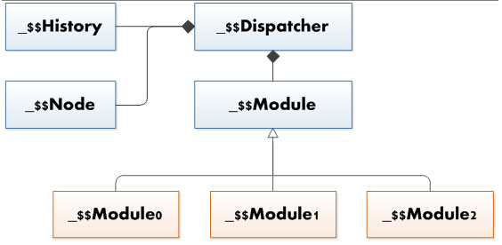

---

##**模块类型**

可以分为：

**访问模块**：通过对外接口可直接访问到指定模块

**私有模块**：此类模块多为可访问模块的组成模块，若干私有模块组成一个可访问模块

如下图，每个橙色框可视为一个私有模块，私有模块是无法通过地址栏直接访问到的。

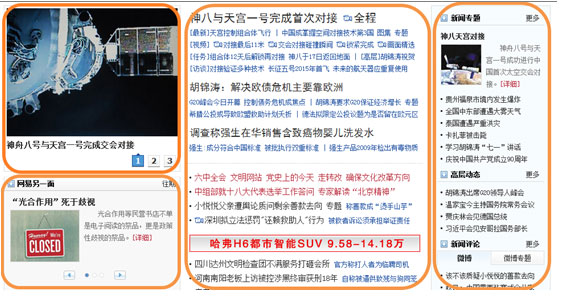

---

##**UMI**

**UMI（Uniform Module Identifier）**：模块统一标识符，用来唯一标识系统中指定的模块。

必须以“/”符号开始，**私有模块标识必须以“/？”符号**开始。 

简单的模块标识符如“/a/b/”

假设有三个模块的UMI为“/a”，“/a/b”，“/a/c”则表示b和c模块为a的子模块。

---

##**模块结构**

一个模块由html，css和js组成。模块的结构通过三类基本**模板**类型引入，如下图：

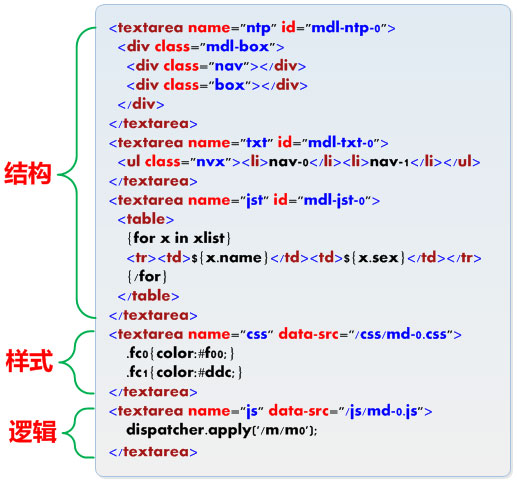

---

##**调度器**

框架会在全局实例化一个调度器实例dispatcher，可以直接调用此实例的接口完成相应的操作。

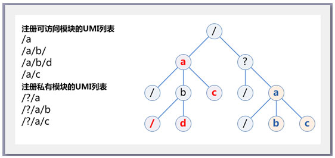

---

##**消息机制**

分为三种：**目标消息**，**目标广播**和**群体广播**。

分别举例：

目标消息，传送到指定UMI，仅此模块会收到消息：

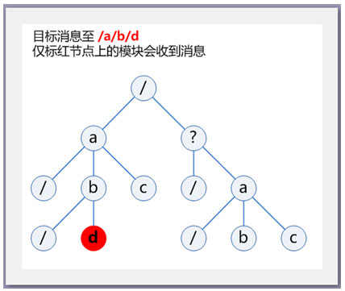

目标广播，传送到至UMI路径上的所有模板，都会收到消息：

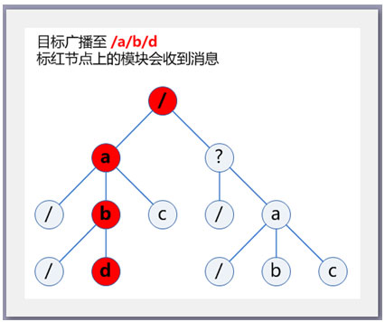

群体广播，传送到至UML的所有子孙模块和路径上的模板。

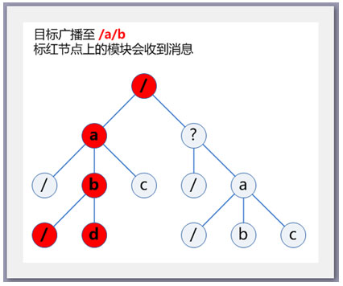

---

##**历史管理器**

负责检测系统对外接口的变化，同时记录每次变化历史。

---

##**相关API**

###**nej.ut._$$Module**

该模板是所有模块的基类。所有模块**必须从此模块基类继承**，否则调度器将忽略注册。

####**__onShow**

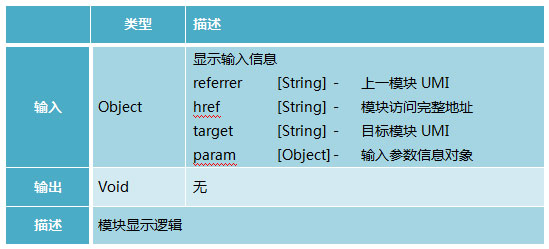

####**__onApply**

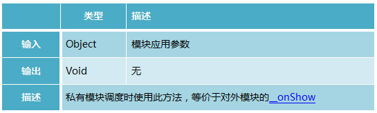

####**__onHide**

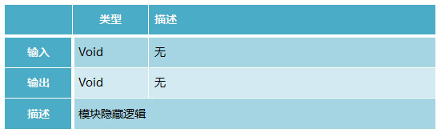

####**__onRefresh**

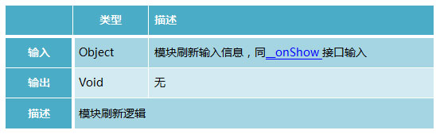

####**__onMessage**

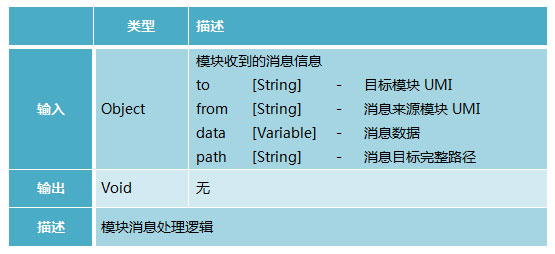

####**__onBeforeHide**

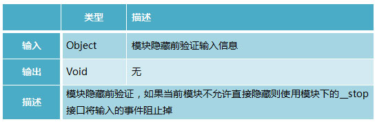

###**dispatcher**

####**_$regist**

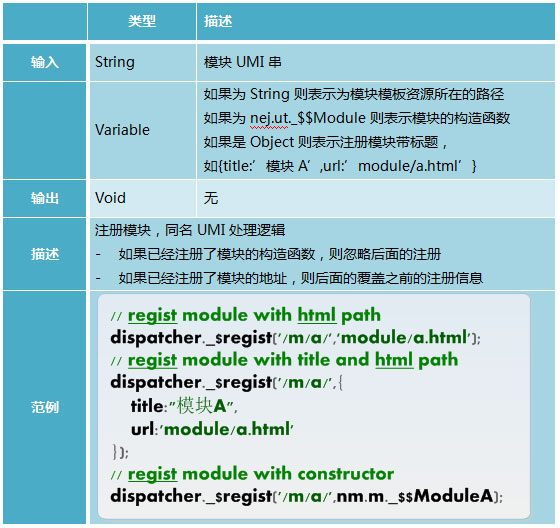

####**_$registAll**

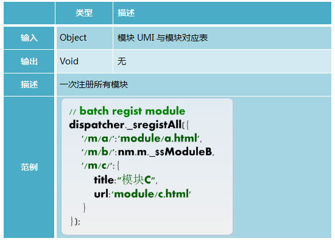

####**_$active**

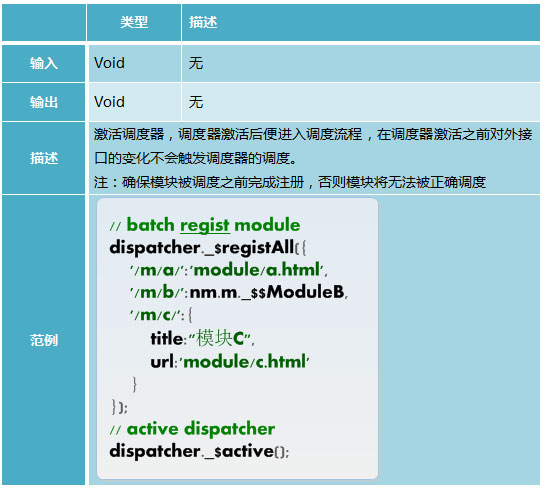

####**_$apply**

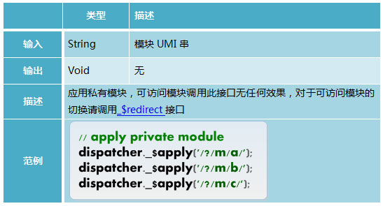

####**_$redirect**

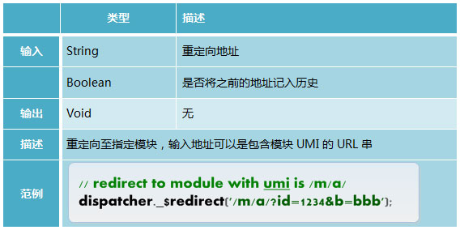

####**_$message**

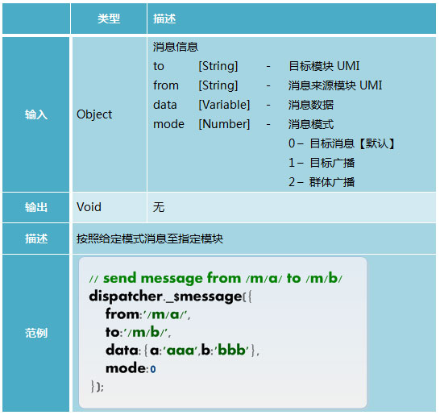

####**_$rule**

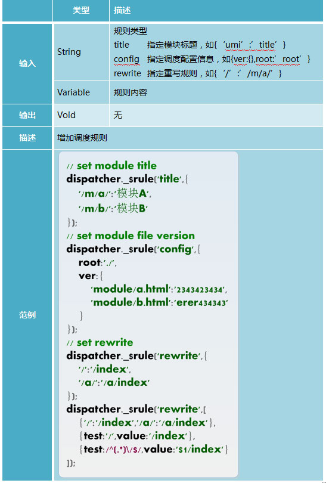

###**location**

####**location.redirect**

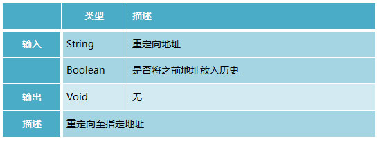

####**location.active**

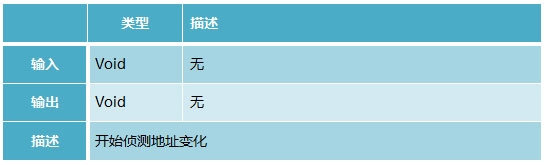

####**location.onurlchange**

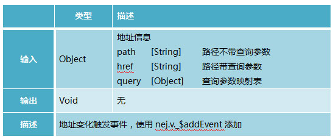

---

##**应用举例**

系统入口：

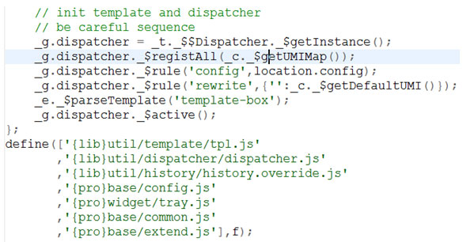

模块结构：

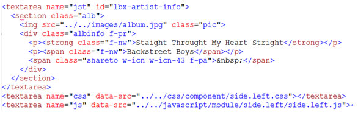

模块逻辑：

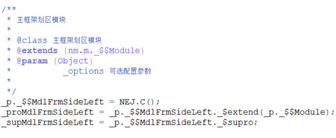

---

##**参考**

[nej之模块化开发手册](http://nej.netease.com/course/topic/dispatcher/ "")