#Nej之模板系统

---
##**前言**

模板系统非常常用，Nej也有一套自己的模板系统。

---

##**结构**

先来说说整个模板系统的结构。

NEJ模板系统包含**基本模板**(Text模板、Node、Item模板、JST模板)和**扩展模板**(CSS模板、JS模板、HTML模板)。

开发人员一般会用JST模板和LIST模板。

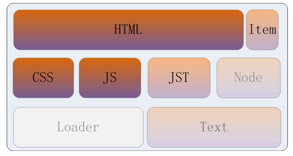


###**_$parseTemplate**

除了Item模板以外，其他模板都可以通过通用接口nej.e._$parseTemplate来添加或使用：

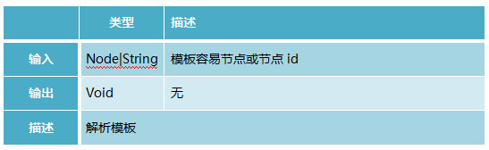

模板在添加的时候不会解析，在初次使用时才会被解析，并缓存，从而提高效率。


---

接下来一一介绍各个种类的模板。


##**text模板**


text模板提供基本的**文本缓存功能**，标示符为txt。开发人员一般不用，而是用更强大的Item模板或JST模板。

###**nej.e._$addTextTemplate

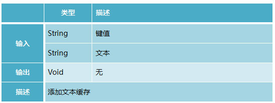


###**nej.e._$getTextTemplate

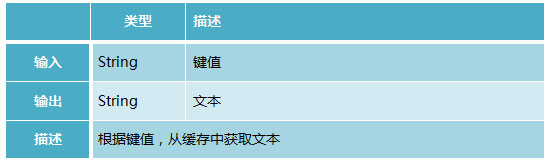


###**实例**

我们有如下场景，每点一次添加高中，就加一行。

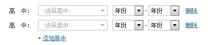


html代码如下：
```
<!-- 高中模块 --> 
<div id="seniors">
    <div class="senior">
        <label>高中：</label>
        <select><option>-选择高中-</option></select>
        <select><option>年份</option></select>
        <span>-</span>
        <select><option>年份</option></select>
        <a href="javascript:void(0);">删除</a>
    </div>
</div>
<!-- /高中模块 -->

<!-- Text模板 -->
<textarea name="txt" id="seniorTextTemplate" style="display:none;">
    <div class="senior">
        <label>高中：</label>
        <select><option>-选择高中-</option></select>
        <select><option>年份</option></select>
        <span>-</span>
        <select><option>年份</option></select>
        <a href="javascript:void(0);">删除</a>
    </div>
</textarea>
<!-- /Text模板 -->
```

可以看到我们创建了一个id为seniorTextTemplate的Text模板。

js代码如下：

```
<script>
// 解析模板
e._$parseTemplate('seniorTextTemplate');
…
// 点击“添加高中”的响应函数
function onClickAddSenior(){
    var _econtent = e._$get('seniors');
    var _html = e._$getTextTemplate('seniorTextTemplate');
    var _node = e._$html2node(_html);
    _econtent.appendChild(_node);
}
</script>
```

---

##**Node模板**

提供基本的**节点缓存**功能，标示符为ntp。开发人员可以使用这个模板来缓存DOM节点，但是一般不会用，而是用Item模板，在使用Item模板时，使用Node模板来生成节点。

###**nej.e._$addNodeTemplate**

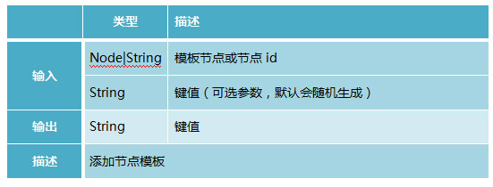


demo：

```
<script>
// 以下代码将id为'photoList'的节点添加到缓存中
var _key = e._$addNodeTemplate('photoList');
</script>
 
<script>
// 以下代码将_element节点以节点id为键值后缀添加到缓存中
var _key = e._$addNodeTemplate(_element, _element.id);
</script>
```

###**nej.e._$getNodeTemplate**

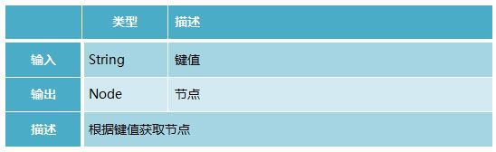


demo:

```
<script>
// 以下代码将从缓存中获取键值为_key的节点
var _node = e._$getNodeTemplate(_key);
</script>
```

---

##**Item模板**

提供节点+逻辑缓存功能，非常适合带有逻辑的列表项的开发。

###**nej.e_$getItemTemplate**

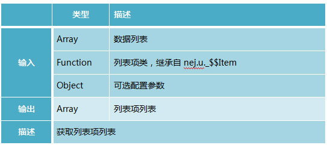


demo:

```
<script>
// 以下代码将用_friends数据，用wwq._$$FriendItem构造出列表项
var _friends = [{name:'魏文庆', gender:1}, {name:'严跃杰', gender:1}, {name:'张晓容'}];
var _friendItems = e._$getItemTemplate(_friends, wwq._$$FriendItem);
</script>
```


Item模板使用范例：

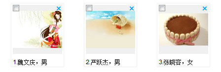

html代码如下：

```
<!―名片列表模块 --> 
<div id="friends">
</div>
<!-- /名片列表模块 -->
…
<div id="templates" style="display:none;">
<!-- node模板 -->
<textarea id="friendNodeTemplate" name="ntp">
    <div class="m-friend">
        
        <div class="info">
<span></span>.<span></span>，<span></span>
</div>
        <input type="checkbox"/>
<a href="javascript:void(0);" title="删除">×</a>
     </div>
</textarea>
<!-- /node模板 -->
<!-- 其他模板 -->
<!-- ....... -->
<!-- /其他模板 -->
</div>
```

js代码如下：

```
<script>
// 解析Node模板
e._$parseTemplate('templates');
…
// 添加名片列表逻辑
var _friends = [{name:'魏文庆', gender:1, ava:'../image/0.jpg'},
                         {name:'严跃杰', gender:1, ava:'../image/1.jpg'}, 
                         {name:'张晓容', ava:'../image/2.jpg'}];
friendItems = e._$getItemTemplate(_friends, wwq._$$FriendItem, {
    parent: 'friends'  // 容器节点id
});
…
// 列表项类wwq._$$FriendItem实现逻辑
var wwq = NEJ.P('wwq');
var pro, supro;
// 好友项
wwq._$$FriendItem = NEJ.C();
pro = wwq._$$FriendItem._$extend(ui._$$Item, !0);
supro = ui._$$Item.prototype;
/**
 * 初始化节点，子类重写具体逻辑
 * @return {Void}
 */
pro.__initNode = function(){
    supro.__initNode.apply(this, arguments);
    var _espans = this.__body.getElementsByTagName('span');
    this.__ecb = this.__body.getElementsByTagName('input')[0];
    this.__eimg = this.__body.getElementsByTagName('img')[0];
    this.__enumber = _espans[0];
    this.__ename = _espans[1];
    this.__egender = _espans[2];
    this.__edelete = this.__body.getElementsByTagName('a')[0];
    v._$addEvent(this.__edelete, 'click', this.__onClickDelete._$bind(this));
    v._$addEvent(this.__ecb, 'click', this.__onClickCheck._$bind(this));
};
/**
 * 初始化外观信息
 * @return {Void}
 */
pro.__initXGui = function(){
    // 设置节点模板的id，将结构和逻辑关联起来
    this.__seed_html = 'friendNodeTemplate';
};
/**
 * 刷新项,子类实现具体逻辑
 * @return {Void}
 */
pro.__doRefresh = function(_data){
    this.__eimg.src = _data.ava;
    this.__enumber.innerText = this.__index + 1;
    this.__ename.innerText = _data.name;
    this.__egender.innerText = _data.gender?'男':'女';
};
/**
 * 点击删除的响应函数
 * @param {Object} _event   事件对象
 */
pro.__onClickDelete = function(_event){
    // todo
};
/**
 * 点击复选框的响应函数
 * @param {Object} _event   事件对象
 */
pro.__onClickCheck = function(_event){
    this.__ecb.checked?e._$addClassName(this.__body, 'checked'):e._$delClassName(this.__body, 'checked');;
};
/**
 * 控件销毁
 * @return {Void}
 */
pro.__destroy = function(){
    supro.__destroy.apply(this, arguments);
    this.__eimg.src = '';
    this.__ecb.checked = false;
    e._$delClassName(this.__body, 'checked');
};
</script>

```

---

##**JST模板**

用来合并数据和html结构。

###**nej.e._$addHtmlTemplate**


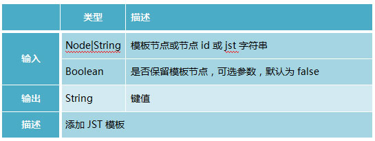


demo1：

```
<script>
// 以下代码将jst字符串_workersHtml添加到缓存中
var _workersHtml = '<table class="w-table">\
        <thead>\
            <tr><th>序号</th><th>姓名</th><th>性别</th></tr>\
        </thead>\
        {if !defined("workers")}\
            <tr><td colspan="3">数据加载失败，请稍后再试！</td></tr>\
        {elseif workers&&workers.length}\
            {list workers as x}\
                <tr{if x_index==x_length-1} class="last"{/if}>\
<td>${x_index+1}</td>\
<td>${x.name}</td>\
<td>{if x.gender==1}男{else}女{/if}</td>\
</tr>\
            {/list}\
        {else}\
            <tr><td colspan="3">没有工人！</td></tr>\
        {/if}\
    </table>'
var _key = e._$addHtmlTemplate(_workersHtml);
</script>
```

demo2：
html：

```
<!-- jst模板 -->
<textarea id="workersJstTemplate" style="display:none;">
    <table class="w-table">
        <thead>
            <tr><th>序号</th><th>姓名</th><th>性别</th></tr>
        </thead>
        {if !defined("workers")}
            <tr><td colspan="3">数据加载失败，请稍后再试！</td></tr>
        {elseif workers&&workers.length}
            {list workers as x}
                <tr{if x_index==x_length-1} class="last"{/if}>
<td>${x_index+1}</td>
<td>${x.name}</td>
<td>{if x.gender==1}男{else}女{/if}</td>
</tr>
            {/list}
        {else}
            <tr><td colspan="3">没有工人！</td></tr>
        {/if}
    </table>
</textarea>
<!-- /jst模板 -->
```

js：

```
<script>
// 以下代码将id为'workersJstTemplate'的文本域的值作为jst字符串添加到缓存中
var _key = e._$addHtmlTemplate('workersJstTemplate');
</script>
```

##**nej.e._$getHtmlTemplate**

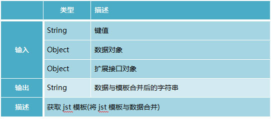

demo1:

```
<script>
// 以下代码将数据_data与键值为_key的jst模板合并
var _data = {workers: [{name:'魏文庆', gender:1}, 
                        {name:'严跃杰', gender:1}, 
                        {name:'张晓容'}]};
var _html = e._$getHtmlTemplate(_key, _data);
</script>
```

demo2：

```
<script>
// 以下代码将数据_data与键值为_key的jst模板合并
// 扩展接口传入formatGender，在键值为_key的jst模板可以使用该接口
// 比如：${_worker.gender|formatGender}
var _data = {workers: [{name:'魏文庆', gender:1}, 
                        {name:'严跃杰', gender:1}, 
                        {name:'张晓容'}]};
var _html = e._$getHtmlTemplate(_key, _data, {formatGender: function(_value){
    return _value==1?'男':'女';
}});
</script>
```

###**nej.e._$renderHtmlTemplate**

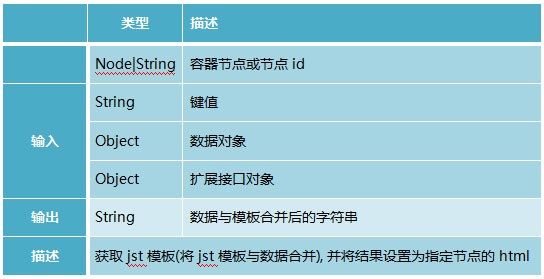

demo：

```
<script>
// 以下代码将数据_data与键值为_key的jst模板合并
// 合并的结果设置为id为content的节点的html
var _data = {workers: [{name:'魏文庆', gender:1}, 
                        {name:'严跃杰', gender:1}, 
                        {name:'张晓容'}]};
var _html = e._$renderHtmlTemplate('content', _key, _data);
</script>
```

JST模板应用范例：

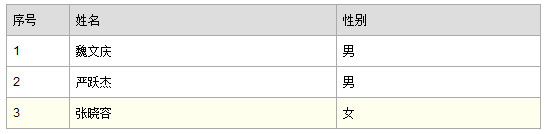

html如下：
```
<!-- 工人列表容器节点 -->
<div class="content">       
</div>
<!-- /工人列表容器节点 -->
…
<!-- jst模板 -->
<textarea id="workersJstTemplate" style="display:none;">
    <table class="w-table">
        <thead>
            <tr><th>序号</th><th>姓名</th><th>性别</th></tr>
        </thead>
        {if !defined("workers")}
            <tr><td colspan="3">数据加载失败，请稍后再试！</td></tr>
        {elseif workers&&workers.length}
            {list workers as x}
                <tr{if x_index==x_length-1} class="last"{/if}>
<td>${x_index+1}</td>
<td>${x.name}</td>
<td>{if x.gender==1}男{else}女{/if}</td>
</tr>
            {/list}
        {else}
            <tr><td colspan="3">没有工人！</td></tr>
        {/if}
    </table>
</textarea>
<!-- /jst模板 -->
```

js:

```
<script>
// 解析JST模板
e._$parseTemplate('workersJstTemplate');
…
// 数据与模板合并，并且显示到页面上
var _data = {workers: [{name:'魏文庆', gender:1}, 
                        {name:'严跃杰', gender:1}, 
                        {name:'张晓容'}]};
e._$renderHtmlTemplate('content', 'workersJstTemplate', _data);
</script>
```

---

##**CSS模板**

css模板提供css文件延迟加载以及css代码延迟生效功能，也是通过nej.e._$parseTemplate来调用。

demo：

html：

```
<!-- CSS模板 -->
<textarea id="cssTemplate"  name="css" data-src="/css/a.css" style="display:none;">
    .g-doc{width:auto;}
.m-btns button{margin-right:10px;}
.w-table{margin-top:10px;width:100%;}
.w-table .hint{background-color:#ffe;height:50px; }
.w-table .last{background-color:#ffe;}
.content{height:450px;}
</textarea>
<!-- /CSS模板 -->
```

js:

```
<script>
// 解析JS模板
// 以下代码执行后，/css/a.css加载并生效，textarea里的代码段也会生效
e._$parseTemplate('cssTemplate');
</script>
```

---
##**JS模板**

提供了js文件延迟加载以及js代码延迟生效功能。

demo：

html：

```
<!-- JS模板 -->
<div id="jsTemplate" style="display:none;">
<textarea name="js" data-src="/js/a.js"></textarea>
<textarea name="js" data-src="/js/b.js">
    var f = function(){
            var e = NEJ.P('nej.e');
            e._$get('common').disabled = false;
            e._$get('empty').disabled = false;
            e._$get('failed').disabled = false;
            e._$get('string').disabled = false;
};
define(['{lib}base/element.js'], f);
</textarea>
</div>
<!-- /JS模板 -->
```

js:

```
// 解析JS模板
// 以下代码执行后，/js/a.js、/js/b.js加载并生效，textarea里的代码段也会生效
e._$parseTemplate('jsTemplate');
```

---

##**HTML模板**

该模板提供了模块的延迟加载功能。

demo：

用户进入网易博客个人中心时，显示个人中心首页。用户点击左栏导航的“好友管理”，显示好友管理模块，如下图所示。


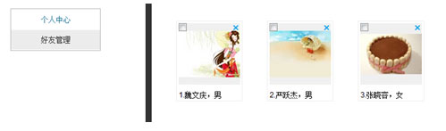

html:

```
<!-- html模板 -->
<textarea id="htmlTemplate" name="html" data-src="template.friends.html" style="display:none;"></textarea>
<!-- /html模板 -->
好友模块模板html文件template.friends.html内容如下:
<!-- ie6未指定编码默认为GBK，其他浏览器与父页面编码相同 -->
<meta charset="utf-8"/>
<!-- css模板 -->
<textarea name="css">
    #friends{margin-left:-20px;overflow:hidden;}
.m-friend{float:left;_display:inline;position:relative;zoom:1;
margin:20px;border:1px solid #eee;}
.m-friend.checked{border-color:red;}
.m-friend img{width:100px;height:100px;margin:3px;}
.m-friend .info{margin-left:3px;}
.m-friend input{position:absolute;left:3px;top:3px;}
.m-friend a{position:absolute;right:4px;top:-1px;line-height:1;
font-size:20px;text-decoration:none;}
</textarea>
<!-- /css模板 -->
<!-- node模板 -->
<textarea id="friendsNodeTemplate" name="ntp" style="display:none;">
    <div  data-module="friends">
    </div>
</textarea>
<!-- /node模板 -->
<!-- node模板 -->
<textarea id="friendNodeTemplate" name="ntp" style="display:none;">
    <div class="m-friend">
        
        <div class="info">
<span></span>.<span></span>，<span></span>
</div>
        <input type="checkbox"/>
<a href="javascript:void(0);" title="删除">×</a>
     </div>
</textarea>
<!-- /node模板 -->
<!-- js模板 -->
<textarea name="js" data-src="../javascript/template.friends.js"></textarea>
<!-- /js模板 -->
```

js:

```
<script>
// 延迟加载模块的逻辑
// 以下代码执行后，好友模块的模板template.1.html会被加载执行
e._$parseTemplate('htmlTemplate');
</script>
```

好友模块模板引用js：

```
<script>
var wwq = NEJ.P('wwq');
// 页面初始化接口
function init(){
    e._$parseTemplate('friendsNodeTemplate');
    var _efriends = e._$getNodeTemplate('friendsNodeTemplate');
    e._$parseTemplate('friendNodeTemplate');
    var _friends = [{name:'魏文庆', gender:1, ava:'../image/0.jpg'},
                             {name:'严跃杰', gender:1, ava:'../image/1.jpg'}, 
                             {name:'张晓容', ava:'../image/2.jpg'}];
    e._$getItemTemplate(_friends, wwq._$$FriendItem, {
        parent: _efriends,
        key: 'friendNodeTemplate'
    });
    e._$get('main').appendChild(_efriends);
}
init();
</script>
```

---

##**JST语法参考**

JST模板语法和freemarker类型，不做详解，可以参考：[jst语法](http://nej.netease.com/course/topic/template/ "")


