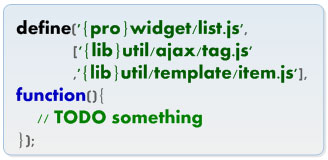

#**NEJ之文件依赖**

##**前言**

本文主要说说NEJ的文件依赖系统用法。主要是define方法和对应的js文件引入之间的关系。最后给出了基本的demo。

---

##**路径配置**

文件定义时指定的路径可以通过路径配置的变量来指定前缀：


我们来看一个项目中的demo，我们在html或者ftl中引用js：

```
    <script src="/src/javascript/vendor/nej/src/define.js?pro=/src/javascript/web/&core=/src/javascript/core/"></script>
    <script src="/src/javascript/web/pages/cloudClass/myCloudClass.js"></script> 
```


然后我们在引入的js文件myCloudClass.js中这样定义文件依赖：

```
define('{pro}pages/cloudClass/myCloudClass.js',
      ['{lib}util/dispatcher/dispatcher.2.js',
       '{pro}util/util.js','{core}util/userUtil.js',
    '{lib}util/template/tpl.js'],f);
```
可以看到，pro和core是我们上面define.js的参数。

从上面的例子中我们还可以学到的是模块的定义和依赖。

---

##**define**

我们来说说define方法：

带三个参数依次为：当前文件路径，依赖文件列表，文件执行函数



可以忽略当前文件路径。


---

##**应用**

下面看一个基本的模块：


和一个稍微复杂一点的模块：


---

##**感悟**

应该是AMD规范的写法，考虑到该框架的创建时间，觉得公司的工程师还是技术挺先进的。


