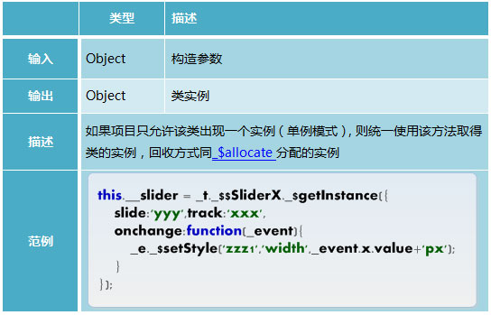
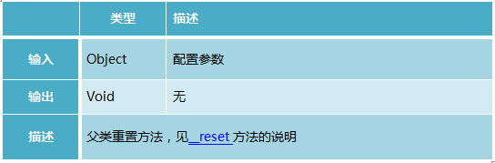
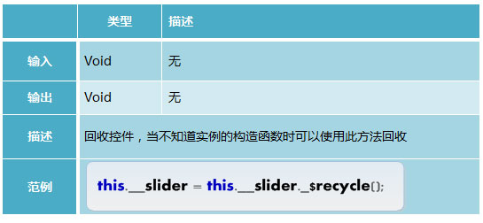
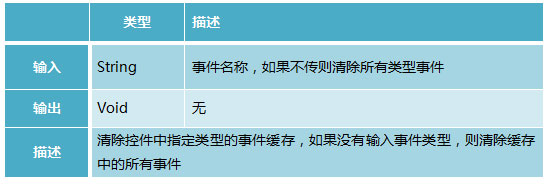
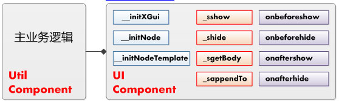
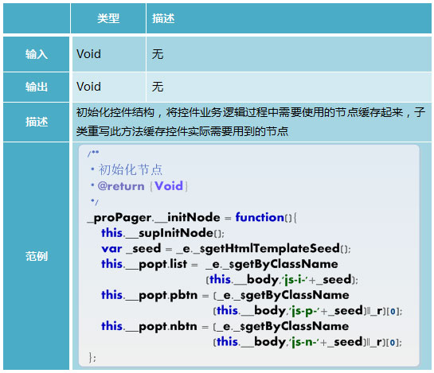
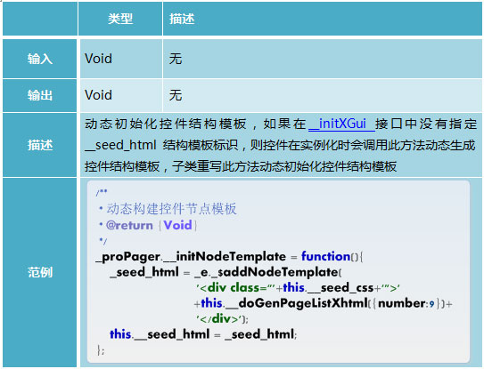
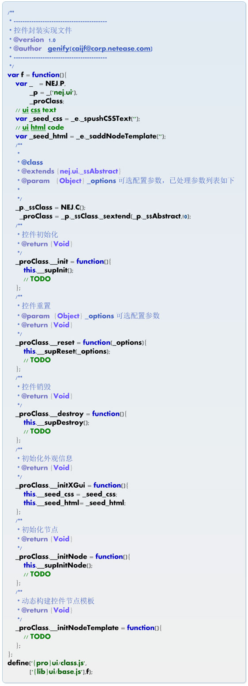

#**NEJ之组件化开发**


##**前言**

组件是一个可以独立运行的系统或模块，其目的是为了将程序模块化，实现重用。本文主要是对NEJ的组件化开发方式进行学习。


---

##**类模型**

###**定义NEJ.C**

使用NEJ.C方法来定义一个类：


通过此方法定义的类具有以下特性：
1. 具有静态方法_$extend，可以从其他类继承
2. 实例具有`init`方法用来初始化组件，该方法中通过`supInit`调用父类`__init`方法。

###**继承_$extend**

通过NEJ.C定义的类可以通过`_$extend`方法来继承：


###**实现init**


通过NEJ.C定义的类可以使用`init`来初始化类：

__init


---

##**组件体系**

体系结构如下：


底层都是事件驱动，分为Util和UI组件。

Util主要是**业务逻辑的实现**，UI主要是对**组件的视觉外观以及结构**的实现。

由于UI是紧耦合，所以**Util可以用来重用**，在不同的地方**只需要调整对应的UI**即可。

---


##**Util组件**

NEJ中所有组件都继承自nej.ut._$$Event类，该类主要实现组件分配回收的业务逻辑及对事件驱动的支持：


类方法：

###**_$allocate**


###**_$recycle**


###**_$getInstance**




实例方法：

###**__reset**


###**__supReset**




###**__destroy**


###**__supDestroy**


###**__doInitDomEvent**


###**_$recycle**



事件方法：

###**_$setEvent**


###**_$batEvent**


###**_$hasEvent**


###**_$clearEvent**




###**_$appendEvent**


###**_dispatchEvent**


---

##**UI组件**

UI继承自Util，因此具有Util的基本行为：




###**__initXGui**


###**__initNode**




###**__supInitNode**


###**__initNodeTemplate**




---

##**控件模板**

Util：


UI：




---

##**实例**

UI控件，这里将项目中一个NEJ的UI自定义组件代码展示，主要通过后台接口获取数据再配合JST模板进行数据填充，并无复杂的业务逻辑：

```
/**
 * ----------------------------------------------------------------
 * 所属系列课程
 * @version  1.0
 * @author   hzgaojie(hzgaojie@corp.netease.com)
 * ----------------------------------------------------------------
 */
var f = function(){
    var g = window,
        o = NEJ.O,
        f = NEJ.F,
        e = NEJ.P('nej.e'),
        v = NEJ.P('nej.v'),
        p = NEJ.P('edu.m'),
        d = NEJ.P('edu.d'),
        u = NEJ.P('nej.u'),
        eu= NEJ.P('edu.u'),
        _proLiveInfo,
 
        _liveInfoHtmlTpl = e._$addHtmlTemplate(
                '{list dt as item}\
                    <a target="_blank" href="${item.link}" class="f-cb">\
                        <p class="f-fl">\
                            <span class="status living living-${item.state}">\
                                {if item.state == 0}\
                                    正在直播\
                                {elseif item.state == 1}\
                                    直播已结束\
                                {elseif item.state == 2}\
                                    直播未开始\
                                {/if}\
                            </span>\
                            <span class="title">${item.name}</span>\
                            <span class="time">${item.time}</span>\
                            <span class="teacher">讲师:${item.teacher}</span>\
                        </p>\
                        <i class="f-fr">进入直播间></i>\
                    </a>\
                {/list}');       
        
        /**
         *
         * @extends
         * @param
         */
 
        eu._$$LiveInfoUI = NEJ.C();
        _proLiveInfo = eu._$$LiveInfoUI._$extend(eu._$$UIBase, true);
 
        /**
         * 初始化外观信息
         *
         */
        _proLiveInfo.__initXGui = function() {
            this.__seed_html = this.__body;
        };
        /**
         * 初始化节点
         *
         * @return {Void}
         */
        _proLiveInfo.__initNode = function() {
            this.__supInitNode();
        };
 
 
 
        /**
         * 重置控件
         *
         * @param {Object}
         */
        _proLiveInfo.__reset = function(_options){
            this.__supReset(_options);
            this.__uiTpl = _liveInfoHtmlTpl;
 
            var _data = JSON.parse(_options.liveInfoList);
            var len = _data.length;
            var newData = [];
 
            //模板方法不接收复杂对象 只接收{name:'jack'}简单对象
            for(var i = 0; i < len; ++i ) {
                newData.push(
                    {
                        link : _data[i].link,
                        name : _data[i].name,
                        state : _data[i].state,
                        teacher : _data[i].teacher,
                        time : eu._$formatCommonTime(_data[i].time)
                    }
                );
            }   
            console.log(this.__uiTpl);
 
            this.__uiTpl = e._$getHtmlTemplate(this.__uiTpl,{dt:newData});
 
            this.__body.innerHTML = this.__uiTpl;
 
        }
 

        /**
         * 控件销毁
         * @return {Void}
         */
        _proLiveInfo.__destroy = function(){
 
            //调用子类的销毁函数
            this.__supDestroy();
        }
 
}
define('{pro}ui/smartSpec/LiveInfoUI.js',
        ['{core}ui/baseui/uibase.js',
         '{pro}util/util.js'], f);


```


---

##**感悟**

NEJ的组件化开发思想挺不错的，其中Util和UI的区分，把握得很好，很多组件都是外观的变化，其业务逻辑都是差不多的，将逻辑抽出来重用，再调整外观，是一种不错的解决方案。


