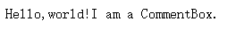
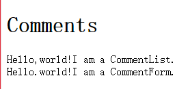
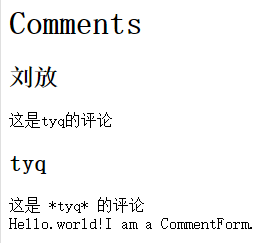
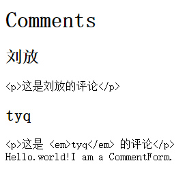
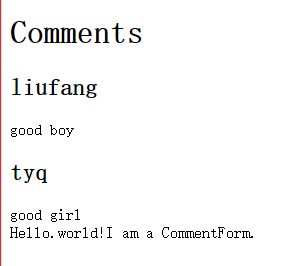
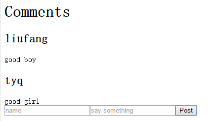

#入门教程


---

##**前言**

随着[入门教程][1]做一个评论组件出来。


---

首先是[官网提供的源码地址][2]。

首先新建public/index.html:
```
<!-- index.html -->
<!DOCTYPE html>
<html>
  <head>
    <meta charset="utf-8" />
    <title>React Tutorial</title>
    <script src="https://cdnjs.cloudflare.com/ajax/libs/react/0.14.0/react.js"></script>
    <script src="https://cdnjs.cloudflare.com/ajax/libs/react/0.14.0/react-dom.js"></script>
    <script src="https://cdnjs.cloudflare.com/ajax/libs/babel-core/5.8.23/browser.min.js"></script>
    <script src="https://cdnjs.cloudflare.com/ajax/libs/jquery/2.1.1/jquery.min.js"></script>
  </head>
  <body>
    <div id="content"></div>
    <script type="text/babel" src="scripts/example.js"></script>
    <script type="text/babel">
      // 如果需要自己加代码，可以将上面的example.js注释掉
    </script>
  </body>
</html>
```

这里引用jquery不是说明react必须依赖jquery。


---

###**设计组件结构**

我们首先设计组件的结构：

```
CommentBox
  CommentList
    Comment
  CommentForm
```

###**定义组件**

我们先定义一个简单的CommentBox：
```
    <div id="content"></div>
    
    <script type="text/babel">
      // 如果需要自己加代码，可以将上面的example.js注释掉
    var CommentBox = React.createClass({
      render: function(){
        return (
          <div className="commentBox">
            Hello,world!I am a CommentBox.
          </div>
        );
      }
    });

    React.render(
      <CommentBox />,
      document.getElementById("content")
    );

    </script>
```
效果如下：



---

我们使用的[JSX语法][3]在以后会详解。
在上面的代码中，我们通过React.createClass()来创建一个新的组件。其中最重要的方法是render，该方法返回一颗React组件树，这棵树最终将会演变成HTML。

接下来我们定义CommentList，CommentForm。
```
    //CommentList组件
    var CommentList = React.createClass({
      render:function(){
        return (
          <div className="commentList">
          Hello,world!I am a CommentList.
          </div>
        );
      }
    });
    //CommentForm组件
    var CommentForm = React.createClass({
      render:function(){
        return (
          <div className="commentForm">
          Hello.world!I am a CommentForm.
          </div>
        );
      }
    });
```

###**组装**

我们把上面定义的两个组件组装到CommentBox中：
```
    //CommentBox组件
    var CommentBox = React.createClass({
      render: function(){
        return (
          <div className="commentBox">
            <h1>Comments</h1>
            <CommentList />
            <CommentForm />
          </div>
        );
      }
    });
```

效果如下：



组件拼接成功。

---

###**props**

我们创建Comment组件，该组件依赖于从父级传入的数据。我们可以通过this.props访问到这些数据：

```
    //Comment组件
    var Comment = React.createClass({
      render:function(){
        return (
          <div className="comment">
            <h2 className="commentAuthor">
              {this.props.author}
            </h2>
            {this.props.children}
          </div>
        );
      }
    });
```

接下来我们就可以对每一个独立的评论重用相同的代码了，先添加一些评论到CommentList：

```
    //CommentList组件
    var CommentList = React.createClass({
      render:function(){
        return (
          <div className="commentList">
            <Comment author="刘放">这是刘放的评论</Comment>
            <Comment author="tyq">这是 *tyq* 的评论</Comment>
          </div>
        );
      }
    });
```
得到效果如下：



其中我们通过this.props.author和this.props.children 来访问属性。

---

###**添加markdown语法格式**

需要用到第三方库：

```
<script src="https://cdnjs.cloudflare.com/ajax/libs/marked/0.3.2/marked.min.js"></script>
```

接下来进行转换输出：

```
    //Comment组件
    var Comment = React.createClass({
      render:function(){
        return (
          <div className="comment">
            <h2 className="commentAuthor">
              {this.props.author}
            </h2>
            {marked(this.props.children.toString())}
          </div>
        );
      }
    });
```

效果如下：



可以看到结果并不是我们想要的，这样因为React在保护应用免受XSS攻击。我们进入如下修改：
```
    //Comment组件
    var Comment = React.createClass({
      rawMarkup:function(){
        var rawMarkup = marked(this.props.children.toString(),{sanitize:true});
        return { __html:rawMarkup };
      },
      render:function(){
        return (
          <div className="comment">
            <h2 className="commentAuthor">
              {this.props.author}
            </h2>
            <span dangerouslySetIneerHTML={this.rawMarkup()}/>
          </div>
        );
      }
    });
```

我们传入sanitize:true,告诉marked转义掉评论文本中的HTML标签而不是直接原封不动地返回这些标签。

---

###**数据引入**

之前我们使用的是静态数据，现在我们模拟从后端传来json格式数据：

```
	//模拟评论数据
	var data = [
		{author:"liufang",text:"good boy"},
		{author:"tyq",text:"good girl"}
	];
```

接下来我们在渲染时，将data绑定到属性：
```
	ReactDOM.render(
		<CommentBox data={data}/>,
		document.getElementById("content")
	);
```

CommentBox组件汇总将data属性传递下去：
```
	//CommentBox组件
	var CommentBox = React.createClass({
		render: function() {
			return (
				<div className="commentBox">
					<h1>Comments</h1>
					<CommentList data={this.props.data} />
					<CommentForm />
				</div>
			);
		}
	});
```

最后在CommentList中进行属性对于赋值：

```
	//CommentList组件
	var CommentList = React.createClass({
		render: function() {
			var commentNodes = this.props.data.map(function (comment) {
				return (
					<Comment key={comment.author} author={comment.author}>
						{comment.text}
					</Comment>
				);
			});
			return (
				<div className="commentList">
					{commentNodes}
				</div>
			);
		}
	});
```

通过map将data遍历，取author和text属性对应赋值。
效果如下



---

###**响应状态变化**

前面提到，组件根据props渲染自己，props是从父组件传递过来的不变的属性列表。为了实现交互，我们给组件引入了可变的**state**。`this.state`是组件私有的，可以通过调用`this.setState()`来改变，当state更新后，组件就会重新渲染。

我们先将数据存入data.json：

```
[
  {"author":"liufang","text":"good boy"},
  {"author":"tyq","text":"good girl"}
]
```

然后在渲染时通过url：

```
	ReactDOM.render(
		<CommentBox  url="./data.json"/>,
		document.getElementById("content")
	);
```

将CommentBox组件改成通过ajax获取：

```
	//CommentBox组件
	var CommentBox = React.createClass({
		//初始化组件的state设置，在组件生命中仅执行一次
		getInitialState:function(){
		  return {data:[]};
		},
		//组件渲染时，React自动调用的方法
		componentDidMount:function(){
    $.ajax({
      url:this.props.url,
      dataType:'json',
      cache:false,
      success:function(data){
      	//关键，将数据设置到视图
        this.setState({data:data});
      }.bind(this),
      error:function(xhr,status,err){
        console.error(this.props.url,status,err.toString());
      }.bind(this)
    });
		},
		render: function() {
			return (
				<div className="commentBox">
					<h1>Comments</h1>
					<CommentList data={this.state.data} />
					<CommentForm />
				</div>
			);
		}
	});
```
上面的**componentDidMount**是一个组件渲染的时候被React自动调用的方法。其中的关键点就是调用`this.setState()`,在服务器数据改变时，对数据进行改变。

---

###**实时数据**

上面就可以得到正常的效果了。如果我们需要实现实时更新的话。需要进行以下改变，从而进行简单的轮询。
首先，在渲染时传入轮询时间：

```
	ReactDOM.render(
		<CommentBox  url="./data.json" pollInterval={2000} />,
		document.getElementById("content")
	);
```

然后对CommentBox进行改装，进行轮询：

```
	//CommentBox组件
	var CommentBox = React.createClass({
		//初始化组件的state设置，在组件生命中仅执行一次
		getInitialState:function(){
		  return {data:[]};
		},
		//请求服务器函数
		loadCommentsFromServer:function(){
		  $.ajax({
		    url:this.props.url,
		    dataType:'json',
		    cache:false,
		    success:function(data){
		      this.setState({data:data});
		    }.bind(this),
		    error:function(xhr,status,err){
		      console.error(this.props.url,status,err.toString());
		    }.bind(this)
		  });	
		},
		//组件渲染时，React自动调用的方法
		//进行轮询调用请求
		componentDidMount:function(){
    this.loadCommentsFromServer();
    setInterval(this.loadCommentsFromServer,this.props.pollInterval);
		},
		render: function() {
			return (
				<div className="commentBox">
					<h1>Comments</h1>
					<CommentList data={this.state.data} />
					<CommentForm />
				</div>
			);
		}
	});
```

这样就可以达到轮询的效果。

---

###**添加评论**

前面的CommentList和Comment组件功能都基本完成了。接下来就是CommentForm组件，其功能是将评论的名字和内容保存到服务器。

```
	//CommentForm组件
	var CommentForm = React.createClass({
		handleSubmit:function(e){
		  e.preventDefault();
		  var author = this.refs.author.value.trim();
		  var text = this.refs.text.value.trim();
		  if(!text||!author){
		  	return;
		  }
		  //发送到服务器
		  //清空表单
		  this.refs.author.value='';
		  this.refs.text.value='';
		  return;
		},
		render:function(){
			return (
				<form className="commentForm" onSubmit={this.handleSubmit}>
				  <input type="text" ref="author" placeholder="name" />
				  <input type="text" ref="text" placeholder="say something" />
				  <input type="submit" value="Post" />
				</form>
			);
		}
	});
```

效果如下：



---

###**刷新评论栏**

当用户提交评论时，我们需要刷新评论列表来加进这条新评论。在CommentBox组件中完成这个逻辑，因为该组件拥有代表评论列表的state。

我们需要从子组件传数据到它的父组件。我们在父组件的render方法中这样做：传递一个新的回调函数`handleCommentSubmit`到子组件，绑定它到子组件的`onCommentSubmit`事件上。无论事件什么时候触发，回调函数都会被调用。

```
	//CommentBox组件
	var CommentBox = React.createClass({
		//初始化组件的state设置，在组件生命中仅执行一次
		getInitialState:function(){
		  return {data:[]};
		},
		//请求服务器函数
		loadCommentsFromServer:function(){
		  $.ajax({
		    url:this.props.url,
		    dataType:'json',
		    cache:false,
		    success:function(data){
		      this.setState({data:data});
		    }.bind(this),
		    error:function(xhr,status,err){
		      console.error(this.props.url,status,err.toString());
		    }.bind(this)
		  });	
		},
		//组件渲染时，React自动调用的方法
		//进行轮询调用请求
		componentDidMount:function(){
    this.loadCommentsFromServer();
    setInterval(this.loadCommentsFromServer,this.props.pollInterval);
		},
		//绑定到子组件的回调函数
		handleCommentSubmit:function(comment){
  //提交到服务器并刷新列表
		},
		render: function() {
			return (
				<div className="commentBox">
					<h1>Comments</h1>
					<CommentList data={this.state.data} />
					//CommentForm表单提交事件
					<CommentForm onCommentSubmit={this.handleCommentSubmit} />
				</div>
			);
		}
	});
```

当用户提交表单时，在CommentForm中调用这个回调函数：

```
	//CommentForm组件
	var CommentForm = React.createClass({
		handleSubmit:function(e){
		  e.preventDefault();
		  var author = this.refs.author.value.trim();
		  var text = this.refs.text.value.trim();
		  if(!text||!author){
		  	return;
		  }
		  //发送到服务器
		  //清空表单
		  //提交表单时调用回调函数
		  this.props.onCommentSubmit({author:author,text:text});
		  this.refs.author.value='';
		  this.refs.text.value='';
		  return;
		},
		render:function(){
			return (
				<form className="commentForm" onSubmit={this.handleSubmit}>
				  <input type="text" ref="author" placeholder="name" />
				  <input type="text" ref="text" placeholder="say something" />
				  <input type="submit" value="Post" />
				</form>
			);
		}
	});
```

剩下的就是将数据提交到服务器上去了。

---

###**感悟**

终于把入门demo给做完了，对react的组件化开发大概也有了一定的了解。个人觉得入门还是比较简单。
下一次详细学习JSX语法吧。


  [1]: http://reactjs.cn/react/docs/tutorial.html
  [2]: https://github.com/reactjs/react-tutorial/tree/master/public
  [3]: http://reactjs.cn/react/docs/jsx-in-depth.html