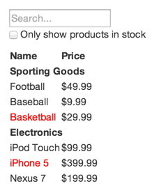
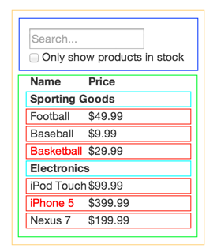

# React之深入组件实现


---

##**前言**

前面对React的基本用法学习得差不多，这里通过官网的一个demo来实现一个较为复杂的组件。

---

##**确定结构**

先看看原型稿：



JSON数据格式：
```
[
  {category: "Sporting Goods", price: "$49.99", stocked: true, name: "Football"},
  {category: "Sporting Goods", price: "$9.99", stocked: true, name: "Baseball"},
  {category: "Sporting Goods", price: "$29.99", stocked: false, name: "Basketball"},
  {category: "Electronics", price: "$99.99", stocked: true, name: "iPod Touch"},
  {category: "Electronics", price: "$399.99", stocked: false, name: "iPhone 5"},
  {category: "Electronics", price: "$199.99", stocked: true, name: "Nexus 7"}
];
```

设计思路是将组件尽可能小而细：




五个组件:

`FilterableProductTable` （橘色）： 包含整个例子的容器
`SearchBar` （蓝色）： 接受所有 用户输入（ user input ）
`ProductTable` （绿色）： 根据 用户输入（ user input ） 过滤和展示 数据集合（ data collection ）
`ProductCategoryRow` （青色）： 为每个 分类（ category ） 展示一列表头
`ProductRow` （红色）： 为每个 产品（ product ） 展示一列

他们的层级关系如下：

FilterableProductTable
--SearchBar
--ProductTable
----ProductCategoryRow
----ProductRow


---

##**设置props**

我们先定义一个静态的页面：
```
//种类标题组件
var ProductCategoryRow = React.createClass({
  render:function(){
    return (<tr><th colSpan="2">this.props.category</th></tr>)
  }
});
//产品组件
var ProductRow = React.createClass({
  render:function(){
    //如果我=stocked为false，则标红
    var name = this.props.product.stocked ? 
    this.props.product.name:
    <span style={{color:'red'}}>
      {this.props.product.name}
    </span>;  
    return (
      <tr>
        <td>{name}</td>
        <td>{this.props.product.price}</td>
      </tr>
    );
  }
});
//呈现表格组件
var ProductTable = React.createClass({
  render:function(){
    var rows = [];
    var lastCategory = null;
    this.props.products.forEach(function(product){
      //确保同一类似产品在同一标题组件下
      if(product.category !== lastCategory){
        rows.push(<ProductCategoryRow category={product.category} key={product.category} />);
      }
      rows.push(<ProductRow product={product} key={product.name} />);
      lastCategory = product.category;
    });
    return (
      <table>
        <thead>
          <tr>
            <th>Name</th>
            <th>Price</th>
          </tr>
        </thead>
        <tbody>
          {rows}
        </tbody>
      </table>
    );
  }
});
//搜索框组件
var SearchBar = React.createClass({
  render:function(){
    return (
      <form>
        <input type="text" placeholder="Search..."/>
        <p>
          <input type="checkbox" />
          {' '}
          Only show products in stocked
        </p>
      </form>
    );
  }
});
//主组件
var FilterableProductTable = React.createClass({
  render:function(){
    return (
      <div>
        <SearchBar />
        <ProductTable products={this.props.products} />
      </div>
    );
  }
});
//定义数据
var PRODUCTS = [
  {category: 'Sporting Goods', price: '$49.99', stocked: true, name: 'Football'},
  {category: 'Sporting Goods', price: '$9.99', stocked: true, name: 'Baseball'},
  {category: 'Sporting Goods', price: '$29.99', stocked: false, name: 'Basketball'},
  {category: 'Electronics', price: '$99.99', stocked: true, name: 'iPod Touch'},
  {category: 'Electronics', price: '$399.99', stocked: false, name: 'iPhone 5'},
  {category: 'Electronics', price: '$199.99', stocked: true, name: 'Nexus 7'}
];

ReactDOM.render(
  //将数据通过products属性传递下去
  <FilterableProductTable products={PRODUCTS} />,
  document.getElementById('example')
);
```

效果如下：


---

##**添加state**
不过这是一个静态版本，所以我们只用到了props就将父级的数据传递到了各个子级。如果我们要交互，就需要使用state。
我们需要找出哪些组件属性会改变，就改用state，不改变的我们就应该尽量使用props。

首先我们为主组件添加必要的state，修改如下：
```
//主组件
var FilterableProductTable = React.createClass({
  getInitialState: function() {
    return {
      filterText: '',
      inStockOnly: false
    };
  },

  render: function() {
    return (
      <div>
        <SearchBar
          filterText={this.state.filterText}
          inStockOnly={this.state.inStockOnly}
        />
        <ProductTable
          products={this.props.products}
          filterText={this.state.filterText}
          inStockOnly={this.state.inStockOnly}
        />
      </div>
    );
  }
});
```

对应的搜索组件通过主组件的state进行对应判断：

```
//搜索组件
var SearchBar = React.createClass({
  render: function() {
    return (
      <form>
        <input type="text" placeholder="Search..." value={this.props.filterText} />
        <p>
          <input type="checkbox" checked={this.props.inStockOnly} />
          {' '}
          Only show products in stock
        </p>
      </form>
    );
  }
});
```

还有表格组件：

```
//呈现表格组件
var ProductTable = React.createClass({
  render: function() {
    var rows = [];
    var lastCategory = null;
    this.props.products.forEach(function(product) {
      //过滤产品
      if (product.name.indexOf(this.props.filterText) === -1 || (!product.stocked && this.props.inStockOnly)) {
        return;
      }
      //保证产品类型一致的产品
      if (product.category !== lastCategory) {
        rows.push(<ProductCategoryRow category={product.category} key={product.category} />);
      }
      rows.push(<ProductRow product={product} key={product.name} />);
      lastCategory = product.category;
    }.bind(this));
    return (
      <table>
        <thead>
          <tr>
            <th>Name</th>
            <th>Price</th>
          </tr>
        </thead>
        <tbody>{rows}</tbody>
      </table>
    );
  }
});
```

我们决定了 state 数据模型位于 `FilterableProductTable` 之中。首先，给 `FilterableProductTable` 添加 `getInitialState()` 方法，该方法返回 `{filterText: '', inStockOnly: false}` 来反映应用的初始化状态。然后传递 `filterText` 和 `inStockOnly` 给 `ProductTable` 和 `SearchBar` 作为 prop 。最后，使用这些 props 来过滤 `ProductTable` 中的行，设置在 `SearchBar` 中表单字段的值。

---
##**反馈state的值**
接下来我们需要对自己的查询条件进行反馈。首先在主组件中添加处理事件并反馈到子组件：

```
//主组件
var FilterableProductTable = React.createClass({
  //初始化state
  getInitialState: function() {
    return {
      filterText: '',
      inStockOnly: false
    };
  },
  //处理state
  handleUserInput:function(filterText,inStockOnly){
    this.setState({
      filterText:filterText,
      inStockOnly:inStockOnly
    });
  },
  render: function() {
    return (
      <div>
        <SearchBar
          filterText={this.state.filterText}
          inStockOnly={this.state.inStockOnly}
          // 传递事件
          onUserInput={this.handleUserInput}
        />
        <ProductTable
          products={this.props.products}
          filterText={this.state.filterText}
          inStockOnly={this.state.inStockOnly}
        />
      </div>
    );
  }
});
```

然后在搜索组件中，通过onChange触发将state值**回调**到父级：

```
//搜索组件
var SearchBar = React.createClass({
  handleChange:function(){
    this.props.onUserInput(
      this.refs.filterTextInput.value,
      this.refs.inStockOnlyInput.checked
    );
  },
  render: function() {
    return (
      <form>
        <input 
          type="text"
          placeholder="Search..."
          value={this.props.filterText}
          ref="filterTextInput"
          onChange={this.handleChange}
        />
        <p>
          <input
           type="checkbox"
           checked={this.props.inStockOnly}
           ref="inStockOnlyInput"
           onChange={this.handleChange}
         />
          {' '}
          Only show products in stock
        </p>
      </form>
    );
  }
});
```

最后整个组件功能完成。
[demo][1]

---

##**参考**

[深入理解React][2]


  [1]: http://codepen.io/brizer/pen/bEKKpB
  [2]: http://reactjs.cn/react/docs/thinking-in-react.html