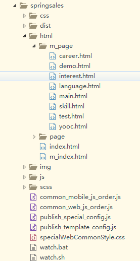
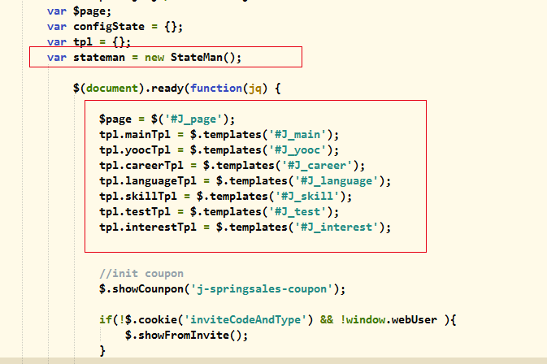
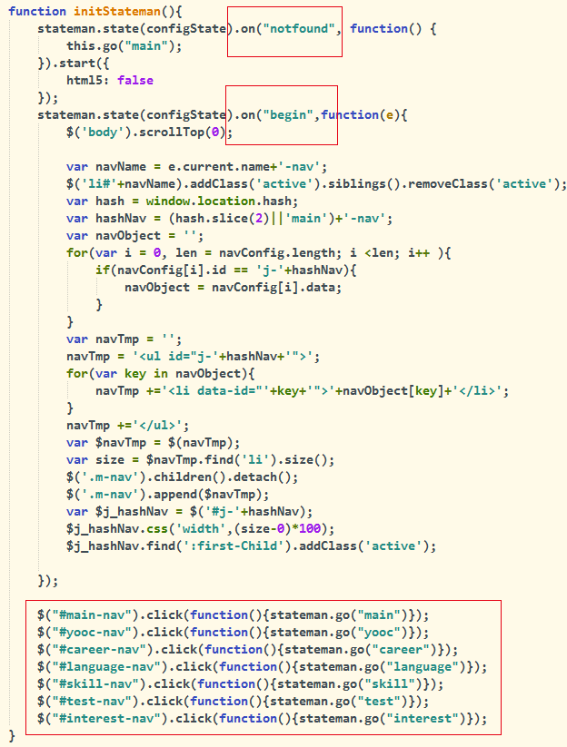
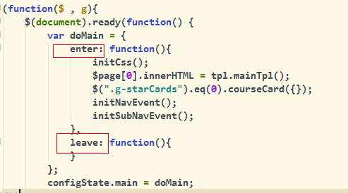
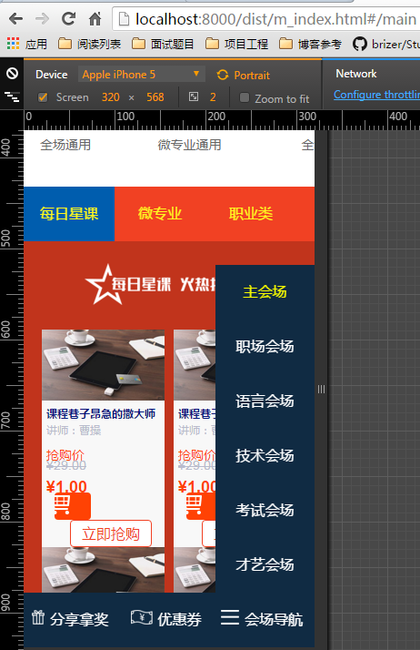
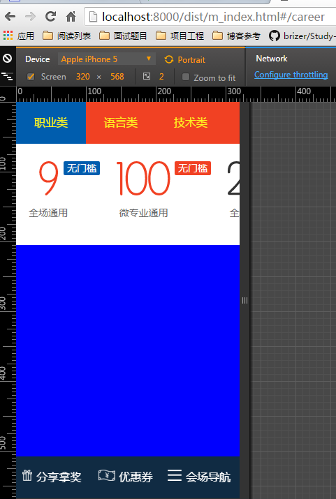

# StateMan实践之一


---

##**前言**

StateMan是一款网易出品的路由框架，可以轻松实现单页面引用程序的路由系统。将复杂的问题简单化，让开发者专注于业务逻辑的开发。

由于项目的使用，这里对其基本功能进行整理，日后随着项目规模的递增，会深入理解。

---

##**引用**

首先看看项目的架构：



我们以移动端也就是m_index.html为例子。
通过StateMan将m_index.html和m_page文件夹中的多个html结合到一个文件中，从而实现带有路由机制的单页面应用程序。

我们在m_index.html引入需要的静态资源：
```
    <script type="text/javascript" src="http://cst.stu.126.net/u/js/cms/stateman.min.js"></script>
    <script type="text/javascript" src="http://cst.stu.126.net/u/js/cms/jsrender.min.js"></script>
```

这里的jsrender是一款基于jquery的javascript模板。
然后我们将各个分页面放置到引入的js前面：
```
	<!-- 模板必须加载在js之前 -->
    <script type="text/x-jsrender" id="J_main">
       <!-- relpace-html:html/m_page/main.html -->
    </script>
    <script type="text/x-jsrender" id="J_yooc">
       <!-- relpace-html:html/m_page/yooc.html -->
    </script>    
    <script type="text/x-jsrender" id="J_career">
       <!-- relpace-html:html/m_page/career.html -->
    </script>
    <script type="text/x-jsrender" id="J_language">
       <!-- relpace-html:html/m_page/language.html -->
    </script>
    <script type="text/x-jsrender" id="J_skill">
        <!-- relpace-html:html/m_page/skill.html -->
    </script>
    <script type="text/x-jsrender" id="J_test">
        <!-- relpace-html:html/m_page/test.html -->
    </script>
    <script type="text/x-jsrender" id="J_interest">
        <!-- relpace-html:html/m_page/interest.html -->
    </script>
```

这里的relpace是项目中模板的写法，可以理解为简单的替换html。

接下来在后面引入对应分页面的js文件：

```
    <script>
        <!-- relpace-js:js/m_page/main.js -->
    </script>
    <script>
        <!-- relpace-js:js/m_page/yooc.js -->
    </script>
    <script>
        <!-- relpace-js:js/m_page/career.js -->
    </script>
    <script>
        <!-- relpace-js:js/m_page/language.js -->
    </script>
    <script>
        <!-- relpace-js:js/m_page/skill.js -->
    </script>
    <script>
        <!-- relpace-js:js/m_page/test.js -->
    </script>
    <script>  
        <!-- relpace-js:js/m_page/interest.js -->
    </script>  
    <script>
        <!-- relpace-js:js/m_index.js -->
    </script> 
```

---

##**配置路由**

资源引入完毕后，我们需要进行路由的配置。我们首先在m_index.html中进行模板和StateMan的配置：



这里的J_page可以理解为最后完成的单页面应用程序的容器，是需要我们自己添加到m_index.html中的。

```
<div id="J_page"></div>  
```

接下来我们在m_index.js中进行具体的初始化配置：



第一部分是首页指引，第二部分是每个路由进入后的事件，第三个部分是项目内导航栏的点击事件。其中需要注意的是`stateman.go`，用来跳转路由。

我们再以主会场main.js为例：



很容易理解这里的enter和leave分别是进入该路由和离开该路由对应的触发事件。

通过`configState.main = doMain`将各个路由配置统一。

---

##**效果**

通过点击不同导航，触发到不同路由：





---

##**更多**

更多细节可以查阅[stateman手册][1]。


  [1]: http://leeluolee.github.io/stateman/?API-zh=undefined&doc=API&lang=zh