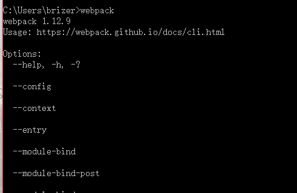
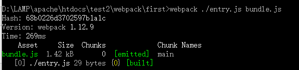
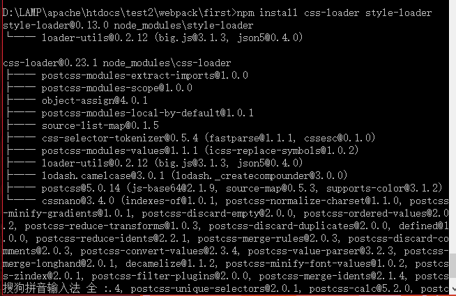
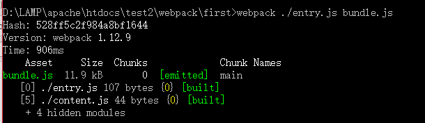
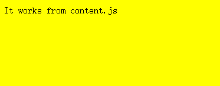
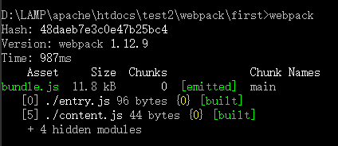

# WebPack之入门教程


---

##**前言**

前面介绍了WebPack的作用，现在来跟着教程走一道。

---

##**安装**
首先是安装，笔者之前就安装过了，所以不再介绍，直接上[官网教程][1]。

---

##**目标**
通过本文，完成以下目标：
1. 学会使用WebPack
2. 学会使用loader
3. 学会使用development server

---
##**编译绑定第一个文件**
安装完毕后，我们输入webpack，会出现以下结果：



说明安装成功了。

接下来我们**编译文件**。
首先在空文件夹中创建entry.js:
```
document.write("It works");
```

然后创建index.html:
```
<!doctype html>
<html lang="en">
<head>
	<meta charset="UTF-8">
	<title>Document</title>
</head>
<body>
<script src="bundle.js"></script>
</body>
</html>
```

接下来我们执行命令行`webpack ./entry.js bundle.js` :



发现文件夹下生成了bundle.js文件。
文件内容很复杂，不用管，只用知道这个是WebPack编译我们的entry.js并绑定的文件。

我们再通过浏览器方法index.html,即可得到结果：
```
It works
```

---
##**添加第二个文件**

接下来我们添加第二个文件content.js:
```
module.exports="It works from content.js";
```

然后我们修改entry.js:
```
//document.write("It works");
document.write(require("./content.js"));
```

我们再次执行命令`webpack ./entry.js bundle.js`，查看index.html,结果变为：
```
It works from content.js
```

WebPack会分析我们输入文件与其他文件的从属和模块依赖关系。

---

##**第一个loader**

前面我们说过，WebPack默认是以javascript为标准的，如果我们需要加载css文件，就需要`css-loader`。

我们先通过`npm install css-loader style-loader`来安装。
安装成功后：




接下来定义style.css:

```
body {
  background-color: yellow;
}
```
然后将entry.js改为如下：
```
//document.write("It works");
require("!style!css!./style.css");
document.write(require("./content.js"));
```

再次编译后：



访问index.html,效果如下：



说明我们的css文件加载成功。
我们通过对require中的参数添加前缀，指定对应的loader来帮助加载。

---
##**绑定loader**

如果我们不想每次在代码中去添加前缀呢？
我们将entry.js修改如下：
```
//document.write("It works");
require("./style.css");
document.write(require("./content.js"));
```
这样的写法多么简单。
我们要做的就是在编译的时候进行设置：
```
webpack ./entry.js hundle.js --module-bind "css=style!css"
```
这里需要注意的是，在windows平台上一定要使用双引号，否则会报错。

然后访问index.html，会发现css文件正常加载。

---
##**配置文件**

随着项目的增大，我们不可能每次编译时都去设置各种参数，所以我们可以用配置文件来代替。
新建文件webpack.config.js如下：
```
module.exports = {
  entry:"./entry.js",
  output:{
  	path:__dirname,
  	filename:"bundle.js"
  },
  module:{
  	loaders:[
      {test:/\.css$/,loader:"style!css"}
  	]
  }
};
```

这样直接执行webpack命名即可：



得到完整结果。

---

##**参考**

[Getting started][2]


  [1]: http://webpack.github.io/docs/installation.html
  [2]: http://webpack.github.io/docs/tutorials/getting-started/