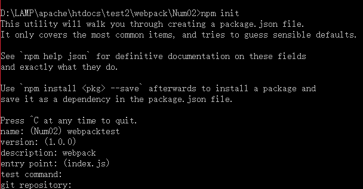
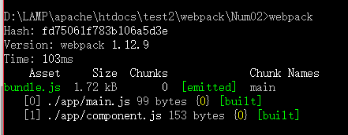
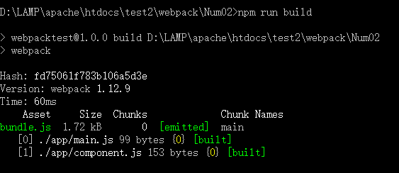

# Webpack之深入教程


---

##**前言**

前面我们学习了WebPack的安装和入门教程，了解了基本的编译流程和webpack.config.js配置文件的运用。接下来我们继续WebPack的使用。

---

##**引用**
首先新建一个空文件夹，格式如下：

/app
--main.js
--component.js
/build
--bundle.js (自动创建)
--index.html
package.json
webpack.config.js

在该目录运行`npm init`,完成基本配置项：



然后我们配置webpack.config.js文件如下：
```
var path=require("path");
module.exports = {
  entry:path.resolve(__dirname,"app/main.js"),
  output:{
    path:path.resolve(__dirname,"build"),
    filename:"bundle.js",
  },
};
```
将入口和输出指定好。

接下来我们编写app/component.js文件：
```
'use strict';

module.exports = function(){
  var element = document.createElement("h1");
  element.innerHTML = "Hello world";
  return element;
};
```

还有app/main.js:
```
'use strict'
var component = require("./component.js");

document.body.appendChild(component());
```

接下来运行webpack命令：




会发现bundle.js文件已经自动生成了。其作用就是绑定和对应webpack.config.js中的入口和输出，这一点我们在前面的文章中也说过。

最后是index.html：
```
<!doctype html>
<html lang="en">
<head>
	<meta charset="UTF-8">
	<title>Document</title>
</head>
<body>
<script src="bundle.js"></script>
</body>
</html>
```

在浏览器中访问index.html就可以得到hello world了。


---

##**自定义命令**

之前我们是通过`webpack`命令来进行编译，接下来我们通过在package.json中自定义命令build来执行webpack：
```
{
  "name": "webpacktest",
  "version": "1.0.0",
  "description": "webpack",
  "main": "index.js",
  "scripts": {
    "test": "echo \"Error: no test specified\" && exit 1",
    "build":"webpack"
  },
  "author": "",
  "license": "ISC"
}
```

然后我们就可以执行`npm run build` 来进行编译了：



当我们的项目非常复杂时，可以通过这种自定义`scripts`的方式来保存界面的简洁。

---

##**配置服务器**

我们每次都通过`npm run build` 然后刷新有点不太方便。我们可以通过设置`webpack-dev-server`来完成自动刷新。

首先输入 `npm i webpack-dev-server --save`，此外，我们需要去调整 `package.json` scripts 部分去包含这个指令：
```
  "scripts": {
    "test": "echo \"Error: no test specified\" && exit 1",
    "build": "webpack",
    "dev": "webpack-dev-server --devtool eval --progress --colors --hot --content-base build"
  },
```

这样我们就可以通过命名 npm run dev 来执行以下命令：

webpack-dev-server - 在 localhost:8080 建立一个 Web 服务器
--devtool eval - 为你的代码创建源地址。当有任何报错的时候可以让你更加精确地定位到文件和行号
--progress - 显示合并代码进度
--colors - Yay，命令行中显示颜色！
--content-base build - 指向设置的输出目录

我们就可以通过访问`http://localhost:8080/`来查看效果了，web服务器会监听文件修改，并重新合并我们的代码，非常方便。

这次我们将content.js修改如下：

```
'use strict';

module.exports = function(){
  var element = document.createElement("h1");
  element.innerHTML = "Hello world!!";
  return element;
};
```

刷新index.html没有反应，刷新localhost:8080则有反应，这就说明webpack-server-dev起作用了。

---
##**自动刷新**

前面说到，我们需要刷新localhost:8080才会有反应，如果我们需要文件改变后应用自动刷新呢？

我们需要设置webpack.config.js:
```
var path=require("path");
module.exports = {
  entry:[
    "webpack/hot/dev-server",
    "webpack-dev-server/client?http://localhost:8080",
    path.resolve(__dirname,"app/main.js"),
  ],
  output:{
    path:path.resolve(__dirname,"build"),
    filename:"bundle.js",
  },
};
```

然后重新运行`npm run dev`,再修改文件后，localhost:8080中的内容就会自动更新了。

---

##**模块**

之前一直没有提到的，就是WebPack运行我们使用不同的模块定义方式：
ES6 模块

    import MyModule from './MyModule.js';

CommonJS

    var MyModule = require('./MyModule.js');

AMD

    define(['./MyModule.js'], function (MyModule) {
    
    });


相对路径和绝对路径：
```
// ES6 相对路径
import utils from './../utils.js';

// ES6 绝对路径
import utils from '/utils.js';
```
**相对路径**是相对当前目录，**绝对路径**是相对入口文件。


---

##**参考**

[第一步][1]
[开始工作流][2]
[浏览器自动刷新][3]
[引入文件][4]


  [1]: https://fakefish.github.io/react-webpack-cookbook/Getting-started.html
  [2]: https://fakefish.github.io/react-webpack-cookbook/Running-a-workflow.html
  [3]: https://fakefish.github.io/react-webpack-cookbook/Automatic-browser-refresh.html
  [4]: https://fakefish.github.io/react-webpack-cookbook/Requiring-files.html