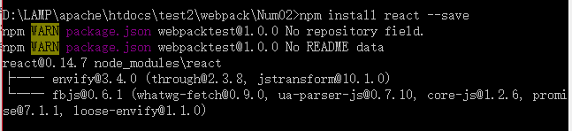
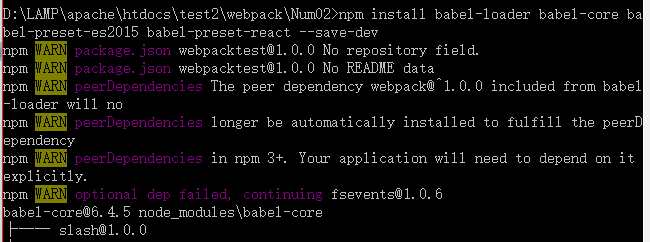
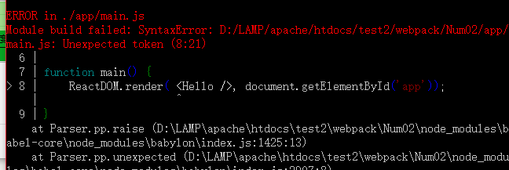
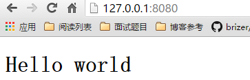
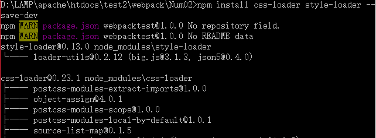
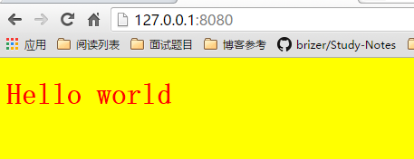

# WebPack之与React结合


---

##**前言**

之前学习了WebPack的配置和自动刷新，绑定服务器等细节。本文学习WebPack与React的结合使用。

---

##**安装react**
我们接着在上次的文件夹中继续今天的学习。我们通过npm来安装react:
```
npm install react --save
```




---
##**使用react**
react的语法我在前面整理过，这里不再重复。

首先修改component.jsx文件：
```
import React from 'react';

export default class Hello extends React.Component {
  render() {
    return <h1>Hello world</h1>;
  }
}

```

然后是main.js：
```
import React from 'react';
import Hello from './component.jsx';

main();

function main() {
    React.render(<Hello />, document.getElementById('app'));
}
```

接下来是index.html:
```
<!DOCTYPE html>
<html>
  <head>
    <meta charset="UTF-8"/>
  </head>
  <body>
    <div id="app"></div>

    <script src="http://localhost:8080/webpack-dev-server.js"></script>
    <script src="bundle.js"></script>
  </body>
</html>
```


---
##**转换JSX**

我们需要Babel这个loader来将JSX转换为javascript：
```
npm install babel-loader babel-core babel-preset-es2015 babel-preset-react --save-dev
```



如果我们出现了如下问题：



就说明我们缺少指定loader：babel-preset-es2015和babel-preset-react。 
接下来我们修改配置文件webpack.config.js:
```
var path = require('path');
var config = {
  entry: path.resolve(__dirname, 'app/main.js'),
  output: {
    path: path.resolve(__dirname, 'build'),
    filename: 'bundle.js'
  },
  module: {
    loaders: [{
      test: /\.jsx?$/, // 用正则来匹配文件路径，这段意思是匹配 js 或者 jsx
      loader: 'babel?presets[]=react,presets[]=es2015' // 加载模块 "babel" 是 "babel-loader" 的缩写
    }]
  }
};

module.exports = config;
```

然后我们启用之前的命令`npm run dev`，就可以得到正常结果：



---

##**加载css**

前面我们也学过通过WebPack来加载css，需要用到css-loader和style-loader，css-loader会遍历css文件，然后找到`url()`表达式然后处理他们，style-loader会把原来的css代码插入页面中的一个style标签中。

我们先通过npm下载loader：`npm install css-loader style-loader --save-dev`：



然后我们修改webpack.config.js文件如下：
```
var path = require('path');
var config = {
  entry: path.resolve(__dirname, 'app/main.js'),
  output: {
    path: path.resolve(__dirname, 'build'),
    filename: 'bundle.js'
  },
  module: {
    loaders: [{
      test: /\.jsx?$/, // 用正则来匹配文件路径，这段意思是匹配 js 或者 jsx
      loader: 'babel?presets[]=react,presets[]=es2015' // 加载模块 "babel" 是 "babel-loader" 的缩写
    },{
      test:/\.css$/,
      loader:'style!css'
    }]
  }
};

module.exports = config;
```

然后我们来进行加载，在main.js中引入main.css:
```
import React from 'react';
import Hello from './component.jsx';
import './main.css';//引入css

main();

function main() {
    React.render(<Hello />, document.getElementById('app'));
}
```

在component.jsx中引入component.css：
```
import React from 'react';
import './component.css'

export default class Hello extends React.Component {
  render() {
    return <h1>Hello world</h1>;
  }
}
```

然后重新运行我们的服务器`npm run dev` ,访问127.0.0.1:8080,会发现样式加载成功：




这样css就成功加载了。

其他资源比如[图片][1]、[fonts][2]还有[less等工具][3]，都需要下载对应的loader就可以做为模块引入到应用中。


  [1]: https://fakefish.github.io/react-webpack-cookbook/Inlining-images.html
  [2]: https://fakefish.github.io/react-webpack-cookbook/Inlining-fonts.html
  [3]: https://fakefish.github.io/react-webpack-cookbook/Loading-LESS-or-SASS.html