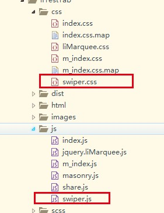
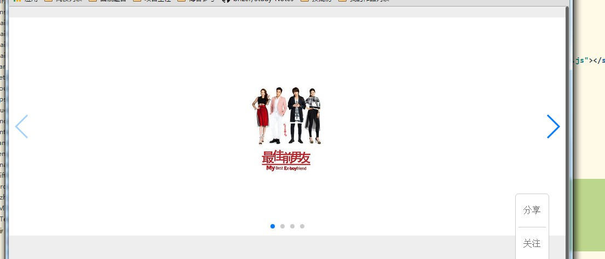
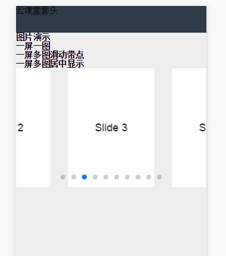

#**jQuery之幻灯片插件swiper**


---

##**前言**

活动专题页需要一款移动端和PC端均兼容的幻灯片组件，故使用swiper。本文简单说下该组件的使用，详细的还得看API。

---

##**介绍**

[官网](http://www.swiper.com.cn/ "")


[效果演示](http://www.swiper.com.cn/demo/index.html "")

这里各个效果的实现方法得去github上搜英文版的swiper来查阅。

[API](http://www.swiper.com.cn/api/index.html "")

---

##**使用方法**

首先引入jquery

再引入组件对应的css和js：




普通切换：


```
	<!--普通切换-->
    <div class="swiper-container">    
        <div class="swiper-wrapper">
            <div class="swiper-slide"></div>
            <div class="swiper-slide"></div>
            <div class="swiper-slide"></div>
            <div class="swiper-slide"></div>    
        </div>  
        <div class="swiper-pagination"></div>
        <div class="swiper-button-next"></div>
        <div class="swiper-button-prev"></div>
    </div>

```

对应js：

```
    /*普通切换*/
    var swiper = new Swiper('.swiper-container', {
        pagination: '.swiper-pagination',
        paginationClickable: true,
        nextButton: '.swiper-button-next',
        prevButton: '.swiper-button-prev',
        spaceBetween: 30
    });

```

效果如下：





还很各种其他的特效，比如3D旋转、正方体卡片等，请直接看官网。


---

##**移动端使用方法**

###**一屏一图**


一屏一图宽，每次滑动就是一个图：

还是先引入对应文件，然后代码如下：

```
<div class="swiper-container swiper-container-horizontal">
		<div class="swiper-wrapper">
			<div class="swiper-slide swiper-slide-active" style="width:500px;"></div>   
			<div class="swiper-slide swiper-slide-next" style="width:500px;"></div>
			<div class="swiper-slide" style="width: 500px;"></div>
			<div class="swiper-slide" style="width: 500px;"></div>
		</div>
	</div>
```

对应js：

```
var swiper = new Swiper('.swiper-container');
```


###**一屏多图**

效果如下：



先引入对应文件，代码如下：

```
	<h1>一屏多图居中显示</h1>
	<div class="swiper-container">
		<div class="swiper-wrapper">
			<div class="swiper-slide">Slide 1</div>
			<div class="swiper-slide">Slide 2</div>
			<div class="swiper-slide">Slide 3</div>
			<div class="swiper-slide">Slide 4</div>
			<div class="swiper-slide">Slide 5</div>
			<div class="swiper-slide">Slide 6</div>
			<div class="swiper-slide">Slide 7</div>
			<div class="swiper-slide">Slide 8</div>
			<div class="swiper-slide">Slide 9</div>
			<div class="swiper-slide">Slide 10</div>
		</div>
		 
		<div class="swiper-pagination"></div>
	</div>
```

Js：

```
    /*一屏多图居中显示*/
    var swiper = new Swiper('.swiper-container', {
        pagination: '.swiper-pagination',
        slidesPerView: 2,     //每屏显示几个图片
        centeredSlides: true,
        paginationClickable: true,
        spaceBetween: 30              
    });

```

---

##**感悟**

jQuery的组件圈非常丰富，想想看React的发展日后一定也会很好。


