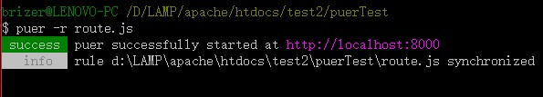
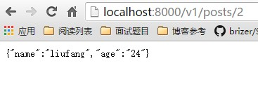
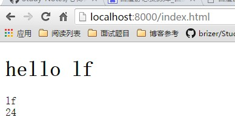
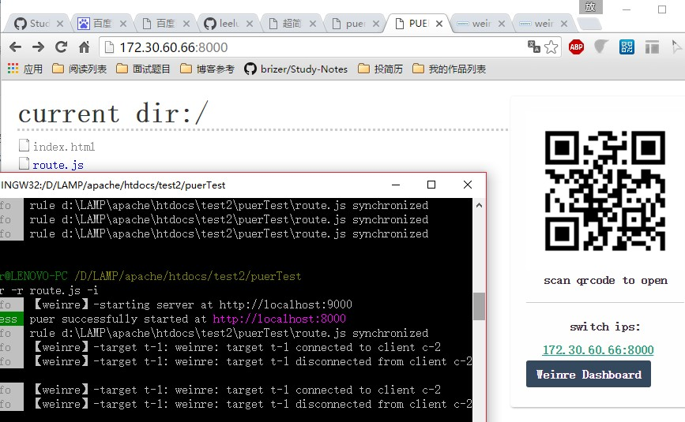

#**puer使用手册**


---


##**前言**

puer是网易的同事写的一款实时刷新、本地调试接口、移动端调试集成一体的工具。本文主要以实例说说其如何使用。

---

##**安装**

安装过程很简单，直接通过npm安装全局puer：

```
npm install puer -g
```

通过puer -h命名查看帮助，出现说明安装成功。

---

##**实时刷新**

puer最基本的功能，直接却换到工程文件夹下，执行puer命令即可：

```
cd /path/to/workspace 
puer 
```

puer会默认打开一个8000端口的页面，当然，端口可以通过 -p 8001这样的格式来控制。

编辑当前路径下的文件，会**实时更新页面**。


---

##**本地调试接口**


现在一般都是前后端分离来开发，后端负责给出接口，前端负责将接口获取后进行数据拼接展示和交互。

但是有时候后端的接口没有出来，或者说不方便给我们直接调用，我们就会在本地创建模拟数据来操作。
无非就是写在代码中，然后在联调时再去修改。

这样成本有点大，我们可以通过puer来在本地模拟ajax请求数据格式。

###**GET**

我们在工程目录下建一个route.js文件，代码如下：

```
// use addon to mock http request
module.exports = {
  // GET
  "GET /v1/posts/:id": function(req, res, next){
	// response json format
    res.send({
      name: "liufang",
      age: "24"
    })
  },
  // PUT POST DELETE is the same
  "PUT /v1/posts/:id": function(){
  },
  "POST /v1/posts": function(){
  },
  "DELETE /v1/posts/:id": function(){
  }
}
```

我们通过

```
puer -r route.js
```

来开启puer：



访问localhost:8000/v1/posts/2,效果如下：




可以看到成功获取GET数据。

###**POST**

post其实和get一样的，我们修改下route.js：

```
// use addon to mock http request
module.exports = {
  // GET
  "GET /v1/posts/:id": function(req, res, next){
	// response json format
    res.send({
      name: "liufang",
      age: "24"
    })
  },
  // PUT POST DELETE is the same
  "PUT /v1/posts/": function(){
  },
  "POST /v1/posts/getData": function(req,res,next){
    res.send({
      name:"lf",
      age:24
    })
  },
  "DELETE /v1/posts/:id": function(){
  }
}
```

然后在index.html中ajax请求：
```

<!DOCTYPE html>
<html lang="en">
<head>
	<meta charset="UTF-8">
	<title>Document</title>
</head>
<body>
<h1>hello lf</h1>
<div class="j-name"></div>
<div class="j-age"></div>
<script src="http://apps.bdimg.com/libs/jquery/2.1.4/jquery.min.js"></script>
<script>
	$.ajax({
		url:'/v1/posts/getData',
		method:'post'
	}).done(function(data){
		var res =data;
		$('.j-name').html(res.name);//lf
		$('.j-age').html(res.age);  //24
	});
</script>
</body>
</html>
```

直接访问localhost:8000/index.html
效果如下：





---

##**移动端调试**

puer集成了weinre，我们在启动时带上puer -i参数，然后利用运用端访问网站(记住在同一网段)，然后开启Weinre即可：




这样就可以在PC端上调试移动页面了。这里建议使用chrome浏览器噢。

---

##**参考**

参考[作者的博客](http://leeluolee.github.io/2014/10/24/use-puer-helpus-developer-frontend/ "")。


