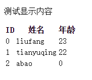

#AngularJS权威指南十二章之多重视图和路由


---

##**前言**

---

除了使用[ng-include指令][1]在视图中引用多个模板外，更好的做法是将视图分解成布局和模板视图，并且根据用户当前访问的URL来展示对应的视图。
我们可以将模板分解到视图中，并在布局模板内进行组装。我们可以在`$route`服务的提供者`$routeProvider`中通过声明路由来实现这个功能。

---

##**安装**

我们可以通过bower来安装，bower在34章会学习到。也可以直接下载angular-route.js文件。
最后把ngRoute模块在我们的应用中当做依赖加载进来：
```
angular.module("app",["ngRoute"]);
```

---

##**布局模板**

布局模板是用来组装各个视图的。通过将ng-view指令和路由组合到一起，我们可以精确地指定当前路由所对应的模板在DOM中的渲染位置。

```
<header>
  <h1>Header</h1>
</header>
<div class="content">
  <div ng-view></div>
</div>
<footer>
  <h5>Footer</h5>
</footer>
```
布局模板可能像上面那样，我们将所有需要渲染的内容都放到了`<div class="content">`中，而`<header>`和`<footer>`的内容在路由改变时不会有任何变化。

[ng-view][2]是由ngRoute模块提供的一个特殊指令，它的独特作用是将HTML中给`$route`对应的视图内容占位。它会创建自己的作用域并将模板嵌套在内部。

---

##**路由**

我们可以使用when和otherwise两个方法来定义应用的路由。
用config函数在特定的模块或应用中定义路由。

```
angular.module("myApp",[])
  .config(["$routeProvider",function($routeProvider){
    //在这里定义路由
  }]);
```

我们可以用when方法来添加一个特定的路由：

```
angular.module("myApp",[])
  .config(["$routeProvider",function($routeProvider){
    //在这里定义路由
    $routeProvider
      .when('/',{
        templateUrl:'views/home.html',
        controller:'HomeController'
    });
  }]);
```

when方法接受两个参数，第一是路由路径，这个路径会和`$location.path`进行匹配，`$location.path`也就是当前URL的路径。
第二个是匹配对象，决定了当第一个参数中的路由能够匹配时具体做什么。

一个复杂的路由例子：
```
angular.module("myApp",[])
  .config(["$routeProvider",function($routeProvider){
    //在这里定义路由
    $routeProvider
      .when('/',{
        templateUrl:'views/home.html',
        controller:'HomeController'
     })
      .when('/',{
        templateUrl:'views/login.html',
        controller:'LoginController'
     })
      .when('/',{
        templateUrl:'views/dashboard.html',
        controller:'DashboardController',
        resolve:{
          user:function(SessionService){
            return SessionService.getCurrentUser();
          }
        }
     })
      .otherwise({
        redirectTo:'/' 
     });
  }]);
```

说说配置对象中的配置项

**controller**

```
controller:'MyController'
//或者
controller:function($scope){}
```
如果配置对象中设置了controller属性，那么这个**指定的控制器会与路由所创建的新作用域关联**在一起。如果参数值是字符型，会在模块中所有注册过的**控制器中查找对应的内容**，然后与路由关联在一起。如果参数值是函数型，这个函数会**作为模板中DOM元素的控制器**并与模板进行关联。

**template**

AngularJS会将配置对象中的HTML模板渲染到对应的具有ng-view指令的DOM元素中。

**templateUrl**

应用会根据该属性指向的路径读取视图，然后渲染到具有ng-view指令元素中。

**resolve**

```
resolve:{
  'data':["$http",function($http){
    return $http.get('/api').then(
      function success(resp) {return response.data;},
      function error(reason) {return false;}
    );
  }];
}
```

如果设置了该属性，AngularJS会将列表中的元素都注入到控制器中的。如果这些依赖是promise对象，它们在控制器加载以及$routeChangeSuccess被触发之前，会被resolve并设置成一个值。

上面的例子中，resolve会发送一个$http请求，并将data的值替换为返回结果的值。列表中的键data会被注入到控制器中，所以在控制器中可以使用它。

**redirectTo**

路径替换。

**reloadOnSearch**

如果设置为true（默认），当$location.search()发生变化时会重新加载路由。如果设置为false，那么当URL中的查询串部分发生变化时就**不会重新加载路由**。这个小窍门对路由嵌套和**原地分页**等需求非常有用。

---

##**使用$stateProvider路由配置**

将项目中的一个使用stateProvider进行多路由设置的demo展示如下：


```
  g.adminApp.config(function($stateProvider,$urlRouterProvider){  
         $stateProvider
           .state('aggreLive',{
            url:'/aggreLive/',
            templateUrl:'aggreLive.htm',
            controller:'aggreLive'
           })
           .state('aggreVideo',{
            url:'/aggreVideo/',
            templateUrl:'aggreVideo.htm',
            controller:'aggreVideo'
           }) 
           .state('aggreTeacher',{
            url:'/aggreTeacher/',
            templateUrl:'aggreTeacher.htm',
            controller:'aggreTeacher'
           })
           .state('aggreQuestion',{
            url:'/aggreQuestion/',
            templateUrl:'aggreQuestion.htm',
            controller:'aggreQuestion'
           })
           .state('aggreProduct',{
            url:'/aggreProduct/',
            templateUrl:'aggreProduct.htm',
            controller:'aggreProduct'
           });
         $urlRouterProvider.otherwise('/aggreLive/');      
           
        })
```


---

##**\$location服务**

该服务用以解析地址中的URL。其实是对window.location对象的API进行优雅封装。

**path()**

用来获取页面当前的路径。

    $location.path();//返回当前路径

修改当前路径并跳转到应用中的另一个URL：

    $location.path('/');//把路径修改为'/'路由

**replace()**

跳转后不能点击后退按钮。

    $location.path('/home');
    $location.replace();
    //或者
    $location.path('/home').replace();

**absUrl()**
获取编码后的完整URL。

还有其他，可以查看[API][3]。


---
##**路由事件**

\$route服务在路由过程中的每个阶段都会触发不同的事件，可以为这些不同的路由事件设置监听器并作出响应。我们需要给路由设置事件监听器，用$rootScope来监听这些事件。

**$routeChangeStart**

AngularJS在路由变化之前会广播`$routeChangeStart`事件。路由服务会开始加载路由变化所需要的所有依赖，并且模板和resolve键中的promise也会被resolve。

[API][4]


---
##**实例**

自己做了一个简单的路由实例，由index.html引入list.html。
其中index.html代码如下：
```
<!doctype html>
<html lang="en">
<head>
	<meta charset="UTF-8">
	<title>Document</title>
<script src="http://apps.bdimg.com/libs/angular.js/1.4.6/angular.min.js"></script>	
<script src="http://cdn.bootcss.com/angular.js/1.3.0-beta.1/angular-route.js"></script>	
</head>
<body ng-app="myApp">
  <div ng-controller="TextController">
    <p>{{someText}}</p>
  </div>
  <div ng-view></div>
<script>
var myApp = angular.module("myApp",['ngRoute']);
myApp.controller("TextController",function($scope){
  $scope.someText="测试显示内容";
});
//路由
function RouteConfig($routeProvider){
  $routeProvider
    .when('/',{
      controller:'ListController',
      templateUrl:'list.html'
    })
    .otherwise({
      redirectTo:'/'
    });
}
//配置路由
myApp.config(RouteConfig);

messages= 
[
  {
    id:0,name:'liufang',age:'23'
  },
  {
  	id:1,name:'tianyuqing',age:'22'
  },
  {
  	id:2,name:'abao',age:'0'
  }
];
myApp.controller('ListController',function($scope){
  $scope.messages = messages;
});

</script>
</body>
</html>
```

list.html代码如下：
```
<table>
  <tr>
  	<th>ID</th>
  	<th>姓名</th>
  	<th>年龄</th>
  </tr>
  <tr ng-repeat="message in messages">
  	<td>{{message.id}}</td>
  	<td>{{message.name}}</td>
  	<td>{{message.age}}</td>
  </tr>
</table>
```

效果如下：



可以看到，我们通过在index中配置路由，将list.html中内容以ListController的形式加入到主页面。


  [1]: http://docs.angularjs.cn/api/ng/directive/ngInclude
  [2]: http://docs.angularjs.cn/api/ngRoute/directive/ngView
  [3]: http://docs.angularjs.cn/api/ng/service/$location
  [4]: http://docs.angularjs.cn/api/ngRoute/service/$route