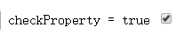
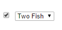
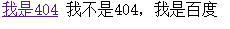
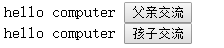
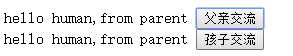
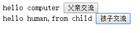
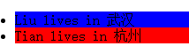

#AngularJS权威指南第九章之内置指令

---
##**前言**

本章主要学习了各种ng-*的指令的用法，大部分我也做了demo。
下一章详细学习指令的定义等内容。

---

AngularJS提供了一系列的内置指令，其中一些指令重载了元素的HTML元素，比如form和a标签。另一些则是ng为前缀。

这里有一个最佳实践，就是ng开头的都是AngularJS提供的内置指令，因此不要把自己开发的指令也以这个前缀命名。

##**基础ng指令**

###**布尔类型**

AngularJS提供了一组带有ng-前缀版本的布尔属性，**通过运算表达式的值**来决定在目标元素上**是插入还是移除**对应的属性。

**ng-disabled**
使用[ng-disabled][1]可以把disabled属性绑定到以下表单输入字段上:input,textarea,selext,button：

```
    <input type="text" ng-model="someProperty">
    <!-- 除非input有值，否则button一直禁用 -->
    <button ng-model="button" ng-disabled="!someProperty">AButton</button>
    <textarea ng-disabled="isDisabled" cols="30" rows="10"></textarea>
    <script>
    angular.module('app',[])
      .run(function($rootScope,$timeout){
        //textarea会禁用并在5秒后启用
        $rootScope.isDisabled =true;
        $timeout(function(){
          $rootScope.isDisabled = false;
        },5000);
      });
    </script>
```

**ng-readonly**

ng-readonly和ng-disabled类似：

```
    <!-- 如果someProperty存在则不可编辑 -->
    <input type="text" ng-readonly="someProperty" value="我在这">
```

**ng-checked**

通过ng-checked将某个表达式同是否出现checked属性进行绑定：

```
    <!-- 如果checkbox选中，则checkProperty为true，初始为选中状态 -->
    <label>checkProperty = {{ checkProperty }}</label>
    <input type="checkbox" ng-checked="checkProperty" ng-init="checkProperty = true" ng-model="checkProperty">
```



**如果checkbox被选中，则ng-checked绑定的checkProperty会返回true**。我们通过ng-init进行初始化操作。

**ng-selected**

和ng-checked用法类似，对是否出现option标签的selected属性进行绑定：

```
    <!-- 当checkbox选中后，select会选择第二个 -->
    <input type="checkbox" ng-model="isTwoFish">
    <select>
      <option>One Fish</option>
      <option ng-selected="isTwoFish">Two Fish</option>
    </select>
```



ng-selected对应的model为true，则当前option会被选中。

设置默认selected：

html：

```
   <div class="col-xs-3">
    <select class="form-control col-xs-3" ng-model="firstTemplate" ng-options="template.id as template.name for template in templates"></select>
   </div>   
```

js:
```
    g.adminApp.controller("recommendSMSCreate",function($scope,$rootScope,ngdwr,$stateParams,$interval){
     $rootScope.tabs[0].active = true;
     
     $scope.templates = [{id:0,name:'【网易云课堂】'}]; 
     $scope.firstTemplate = $scope.templates[0].id;        
    });
```

**ng-href**

ng-href是用来取代a标签原有的href的。当使用当前作用域中的属性动态创建URL时，如果插值尚未生效，href会指向404，而**ng-href会等到插值生效后再执行点击链接的行为**。

```
<!-- 第一个在2秒内访问是404，第二个在2秒内无法访问，2秒后都可以正常访问 -->
<div ng-controller="HrefController">
  <a href="{{ myHref }}">我是404</a>
  <a ng-href="{{ myHref}}">我不是404，我是百度</a>
</div>
<script>
var app = angular.module('app',[]);

  app.controller('HrefController',function($scope,$timeout){
    $timeout(function(){
      $scope.myHref = "http://www.baidu.com";
    },2000);
  });
</script>
```

2秒内，效果如下：



**ng-src**
AngularJS会告诉浏览器在ng-src对应的表达式生效之前不要加载图片。和ng-href类似，这里就不举例了。

###**在指令中使用子作用域**

下面的指令会以父级作用域为原型生成子作用域，这种继承的机制可以创建一个隔离层，用来将需要协同工作的方法和数据模型对象放置在一起。

**ng-app**

ng-app为AngularJS应用创建`$rootScope`，ng-controller则会以`$rootScope`或者另外一个ng-controller的作用域为原型创建新的子作用域。

也就是说，任何具有ng-app属性的DOM元素将被标记为`$rootScope`的起始点，`$rootScope`是作用域链的起始点，任何嵌套在ng-app内的指令都会继承它。

前面的例子中我们也用到了，通过run方法来访问`$rootScope`。

如果需要在一个页面中放置多个AngularJS应用，需要手动引导应用，这个第24章会讲到。

**ng-controller**

ng-controller的作用是为嵌套在其中的指令创建一个子作用域，避免将所有操作和模型都定义在$rootScope上。用这个指令可以在一个DOM元素上放置控制器：
```
<div ng-controller="SomeController">
  {{ someModel.someProperty }}
  <!-- 点击按钮后字符串会改变 -->
  <button ng-click="someAction()">交流</button>
</div>
<body>
<script>
var app = angular.module("app",[]);
app.controller("SomeController",function($scope){
  // 创建模型
  $scope.someModel = {
    someProperty : "hello computer"
  }
  // 设置操作
  $scope.someAction = function(){
    $scope.someModel.someProperty = "hello human";
  };
});
</script>
```

上面是一个简单的ng-controller的写法，我们通过使用`$scope`来提供一个干净的作用域对象供我们操作。我们**显示声明数据模型**。

```
<div ng-controller="SomeController">
  {{ someProperty }}
  <!-- 点击按钮后字符串会改变 -->
  <button ng-click="someAction()">父亲交流</button>
  <div ng-controller="ChildController">
    {{ someProperty }}
    <button ng-click="childAction()">孩子交流</button>
  </div>
</div>
<body>
<script>
var app = angular.module("app",[]);
app.controller("SomeController",function($scope){
  $scope.someProperty = "hello computer";
  $scope.someAction = function(){
    $scope.someProperty = "hello human,from parent";
  };
});
app.controller("ChildController",function($scope){
  $scope.childAction = function(){
    $scope.someProperty = "hello human,from child";
  };
});

</script>
```


一开始效果如下：



如果我们点击“父亲交流”按钮：



如果我们点击“孩子交流”按钮：



由于原型继承的关系，修改父级对象中的someProperty会同时修改子对象中的值，但是反之则不行。

再看看如果我们显示声明模型的情况：
```
<div ng-controller="SomeController">
  {{ someModel.someProperty }}
  <!-- 点击按钮后字符串会改变 -->
  <button ng-click="someAction()">父亲交流</button>
  <div ng-controller="ChildController">
    {{ someModel.someProperty }}
    <button ng-click="childAction()">孩子交流</button>
  </div>
</div>
<script>
var app = angular.module("app",[]);
app.controller("SomeController",function($scope){
  $scope.someModel = {
    someProperty : "hello computer"
  }
  $scope.someAction = function(){
    $scope.someModel.someProperty = "hello human,from parent";
  };
});
app.controller("ChildController",function($scope){
  $scope.childAction = function(){
    $scope.someModel.someProperty = "hello human,from child";
  };
});

</script>
```

这样两个模板就绑定了。也就是说在子`$scope`中修改属性也会修改父`$scope`。他们会通过引用共享，这就和javascript中的值类型和引用类型有点相似。
这个特性是使用ng-controller时最重要的特性之一。

**ng-include**

使用ng-include可以加载、编译并包含外部HTML片段到当前的应用中。模板的URL被限制在与应用文档相同的域和协议下，可以通过白名单或包装成被信任的值来突破限制。

使用ng-include时AngularJS会自动创建一个子作用域。如果我们想使用某个特定的作用域，必须在同一个DOM元素上添加ng-controller指令，这样当模板加载完成后，不会像往常一样从外部作用域继承并创建一个新的子作用域：

```
<div ng-include="/myTempalteName.html" ng-controller="MyController" ng-init="name = 'world'">
  hello {{ name }}
</div>
```

**ng-switch**

这个指令和ng-switch-when及on="propertyName"一起使用，可以在propertyName发生变化时渲染不同指令到视图中。
```
<!-- 当输入Liu时会显示Liu，其他时候显示And The Winner is
 --><input type="text" ng-model="person.name"/>
<div ng-switch on="person.name">
  <!-- 默认值 -->
  <p ng-switch-default>And The Winner is</p>
  <h1 ng-switch-when="Liu">{{ person.name }}</h1>
</div>
<script>
var app = angular.module("app",[]);

</script>
```

在switch被调用之前我们用ng-switch-default来输出默认值。

**ng-view**

ng-view指令用来设置将被路由管理和放置在HTML中的视图的位置。第十二章再深入研究这些内容。

**ng-if**

使用ng-if指令可以完全根据表达式的值在DOM中**生成或移除一个元素**。如果赋值给**ng-if的表达式的值是false，那对应的元素将会从DOM中移除**，否则对应元素的一个的克隆将被重新插入DOM中。

这里注意ng-if同ng-show或ng-hide指令最本质的区别是，它不是通过css显示或隐藏DOM节点，而是真正生成或移除节点。当一个元素被ng-if从DOM中移除，同它关联的作用域也会被销毁，当它重新加入DOM中时，会**通过原型继承从它的父作用域生成一个新的作用域**。

```
<!-- 只看得见第二个 -->
<div ng-if="2+2 === 5">看不见</div>
<div ng-if="2+2 === 4">看得见</div>
```

**ng-repeat**

ng-repeat用来遍历一个集合或为集合中的每个元素生成一个模板实例。集合中的每个元素都会被赋予自己的模板和作用域。同时每个模板实例的作用域中都会暴露一些特殊的属性。

`$index`:遍历的进度(0...length-1)
`$first`:当元素是遍历的第一个时值为true
`$middle`：当元素处于第一个和最后元素之间时值为true
`$last`:当元素是遍历的最后一个时值为true
`$even`:当`$index`值为偶数时值为true
`$odd`:当`$index`值为奇数时值为true

用法举例：

```
<style>
.odd {
  background-color: blue;
}
.even {
  background-color: red;
}
</style>
</head>
<body>
<!-- 通过ng-repeat遍历li，通过ng-class于class绑定 -->
<ul ng-controller="PeopleController">
  <li ng-repeat="person in people" ng-class="{even:!$even,odd:!$odd}">
    {{person.name}} lives in {{person.city}}
  </li>
</ul>
<script>
var app = angular.module("app",[]);
app.controller('PeopleController',function($scope){
  $scope.people = [
    {name:"Liu",city:"武汉"},
    {name:"Tian",city:"杭州"}
  ];
});
</script>
</body>

```
效果如下：



我们使用`!$even`和`!$odd`来实现反转，`ng-class`通过表达式绑定class到html。

**ng-init**

ng-init指令用来在指令被调用时设置内部作用域的初始状态。

**ng-bind**

我们可以通过ng-bind指令实现和{{}}一样的功能。HTML加载含有{{}}语法的元素后并不会立即渲染它们，导致未渲染内容闪烁。我们可以通过ng-bind将内容绑定来避免闪烁。

```
<span ng-bind="name"></span>
```

**ng-bind-template**

同ng-bind类似，ng-bind-template用来在视图中绑定多个表达式。

```
<pre ng-bind-template="{{salutation}} {{name}}!"></pre>
```

**ng-cloak**

除了使用ng-bind来避免未渲染元素闪烁，还可以在含有{{}}的元素上使用ng-cloak指令。ng-cloak指令会将内部元素隐藏，直到路由调用相应的页面时才显示出来。

```
<div id="template1" ng-cloak>{{ 'hello' }}</div>
```

**ng-model**

ng-model指令用来将input、select、textarea或自定义表单控件同包含它们的作用域中的属性进行绑定。

它将当前作用域中运算表达式的值同给定的元素进行绑定。如果属性不存在，它会隐式创建并将其添加到当前作用域中。

我们应该始终用ng-model来绑定`$scope`上的一个数据模型内的属性，而不是`$scope`上的属性，这样可以避免作用域或后代作用域中发生属性覆盖。

**ng-show/ng-hide**

ng-show和ng-hide根据所给表达式的值来显示或隐藏HTML元素。

```
<div ng-show="2 + 2 == 5">看不见</div>
<div ng-show="2 + 2 == 4">看得见</div>
<div ng-hide="2 + 2 == 5">看得见</div>
<div ng-hide="2 + 2 == 4">看不见</div>
```

**ng-change**

这个指令会在表单输入发生变化时计算给定表达式的值，需要和ng-model配合来使用：

```
<!-- 输出结果为输入结果+2 -->
<div ng-controller="EqController">
  <input type="text" ng-model="eq.x" ng-change="change()">
  <textarea cols="30" rows="10">{{eq.output}}</textarea>
</div>
<script>
var app = angular.module("app",[]);
app.controller("EqController",function($scope){
  $scope.eq = {};
  $scope.change = function(){
    $scope.eq.output = parseInt($scope.eq.x) + 2;
  };
});
</script>
```

只要控件的值发生变化，就会触发ng-change对应的函数。

**ng-form**

ng-form用来在一个表单内部嵌套另一个表单，普通的HTML的form标签是不允许嵌套了。

内部所有子表单都合法时，外部表单才会合法。

```
<style>
input.ng-invalid {
  border:1px solid red;
}
input.ng-valid {
  border:1px solid green;
}
</style>
</head>
<body>
<form name="signup_form" ng-controller="FormController" ng-submit="submitForm()" novalidate>
<!-- 动态获取表单输入控件 -->
  <div ng-repeat="field in fields" ng-form="signup_form_input">
    <input type="text" name="dynamic_input" ng-required="field.isRequired" ng-model="field.name" placeholder="{{field.placeholder}}">
    <!-- 如果未填写，且required为true，则显示 -->
    <div ng-show="signup_form_input.dynamic_input.$dirty && signup_form_input.dynamic_input.$invalid">
      <span class="error" ng-show="signup_form_input.dynamic_input.$error.required">The field is required</span>
    </div>
  </div>
  <!-- 如果表单不合法，则按钮不可用 -->
  <button type="submit" ng-disabled="signup_form.$invalid">Submit All</button>
</form>
<script>
var app = angular.module("app",[]);
app.controller("FormController",function($scope){
  $scope.fields = [
    {placeholder:'UserName',isRequired:true},
    {placeholder:'Password',isRequired:true},
    {placeholder:'Email',isRequired:false},
  ];
  $scope.submitForm = function(){
    alert("it works!");
  };
});
</script>
```

生成一个动态表单，可以自己在服务端配置表单输入项和验证要求，非常方便。

**ng-click**

ng-click用来给指定元素绑定点击时调用的方法或者表达式。

```
<button ng-click="count = count + 1" ng-init="count=0">
  Increment
</button>
count: {{ count }}
```

**ng-select**

ng-select用来将数据同select元素绑定，与ng-model和ng-options一起使用：

```
<!-- select控件 -->
<div ng-controller="CityController">
  <select ng-model="city" ng-options="city.name for city in cities">
    <option value="">选择城市</option>
  </select>
  城市：{{city.name}}
</div>

<script>
var app = angular.module("app",[]);

app.controller("CityController",function($scope){
  $scope.cities = [
    {name:"武汉"},
    {name:"杭州"},
    {name:"上海"}
  ];
});
</script>
```

**ng-submit**

ng-submit用来将表达式同onsubmit事件进行绑定。这个指令同时会阻止浏览器默认行为，除非表单不含有action属性。

```
<script>
  angular.module('submitExample', [])
    .controller('ExampleController', ['$scope', function($scope) {
      $scope.list = [];
      $scope.text = 'hello';
      $scope.submit = function() {
        if ($scope.text) {
          $scope.list.push(this.text);
          $scope.text = '';
        }
      };
    }]);
</script>
<form ng-submit="submit()" ng-controller="ExampleController">
  Enter text and hit enter:
  <input type="text" ng-model="text" name="text" />
  <input type="submit" id="submit" value="Submit" />
  <pre>list={{list}}</pre>
</form>
```

**ng-class**

使用ng-class动态设置元素的类，方法是绑定一个代表所有需要添加的类的表达式。

```
<style>
.red {
  background-color:red;
}
</style>
</head>
<body>
<div ng-controller="ClassController">
  <!-- 如果ng-class中条件成立，则添加.red样式 -->
  <div ng-class="{red:x>5}" ng-if="x>5">Good</div>
  <button ng-click="x=generateNum()" ng-init="x=0">生产数据</button>
  <p>数字是: {{ x }}</p>
</div>
<script>
var app = angular.module("app",[]);

app.controller("ClassController",function($scope){
  $scope.generateNum = function(){
    return Math.floor(Math.random()*10)+1;
  };
});
</script>
```

---

##**感悟**

AngularJS内置的指令不少，这一章的学习花费了不少时间，特别是写demo体会的过程。还是学到了不少，特别是表单的动态创建过程和验证条件的自配置，让我兴奋了一把。自己之前怎么没有想过在自己的项目中把这个模块公共化呢？

随着demo的书写，自己对于AngularJS的用法也是越来越熟悉了呢。很高兴，下一章继续学习指令的详解。


  [1]: http://docs.angularjs.cn/api/ng/directive/ngDisabled
