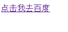
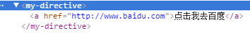
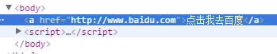

#AngularJS权威指南第八章之指令简介

---

##**前言**

本章简单的学习了如何创建一个指令，以为如果将其复用化，复用化的过程中如何进行作用域绑定。下一章将会学习AngularJS的内置指令。

---
##**自定义HTML**

指令是什么？指令是AngularJS中一个非常重要的概念，其本质上就是AngularJS扩展具有自定义功能的HTML元素的途径。

通过指令，我们可以将一个个小组件合成一个复杂的系统。

我们来创建一个简单的指令：

    <my-directive></my-directive>
    

就可以生成一个简单的链接：

通过AngularJS的`.directive()`方法，我们可以传入一个字符串和一个函数来注册一个新指令。其中字符串是这个指令的名字，指令名应该是驼峰命名风格的，函数应该返回一个对象。

我们通过浏览器工具观察上面的demo，效果如下：

可以看到浏览器使用的是我们自定义的标签。我们可以通过设置，将自定义标签从html中剔除以保证seo：

    angular.module("app",[])
      .directive('myDirective',function(){
        return {
          restrict:'E',
          replace:true,
          template:'<a href="http://www.baidu.com">点击我去百度</a>'
        };
      });

效果如下：

上面这些我们通过`.directive()`方法创建的自定义元素就是指令。

---

##**声明指令**

声明创建指令的合法格式：

    <my-directive></my-directive>
    

    

    <!--directive:my-directive-->
    
为了让AngularJS能够调用我们的指令，需要修改指令定义中的restrict设置。这个设置告诉AngularJS在编译HTML时用哪种声明格式来匹配指令定义。
我们可以通过**E,A,C,M**类分别调用**元素，属性，类，注释**。

---
##**向指令中传递数据**

在刚才的例子中，我们在模板template中硬编码了URL和链接文本，这样未免不够灵活。我们实际上应该通过变量赋值的形式来实现公共模块。

但是需要注意一点的就是共享状态会导致很多问题，如果控制器被移除，或者在控制器的作用域中也定义了一个同名的属性，我们就得修改变量名，这样肯定不好。

所以我们可以通过创建新的子作用域或者隔离作用域来解决：

    

    

这样就将之前例子中的指令复用了。
其中我们在作用域对象scope内部把各个变量值设置为@来进行绑定，这个绑定策略告诉AngularJS将DOM中的some-property属性的值复制给新作用域对象中的someProperty属性。

当然，上面提到的是默认的绑定规则，如果需要显示绑定：

    scope: {
      someProperty:'@someAttr'
    }

被绑定的就是some-attr而不是some-property了。

---

##**感悟**

初始指令，可以将html封装成一块一块的组件，确实非常方便，开发起来应该分工也会非常明确，难怪那么多中大型项目会使用AngularJS来开发，它确实是有自己的优点呢。

这里只是简单的见识了基本的指令创建和赋值，AngularJS内置指令和指令的原理以及详细我还不知道，需要在后面的学习中一一了解。

