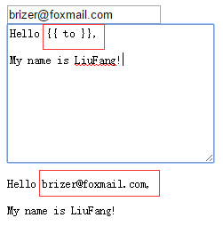
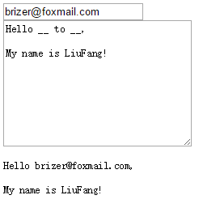

# AngularJS权威指南第六章之表达式


---

##**前言**
本章主要学习了字符串模板的解析，可以手动解析，也可以让AngulasJS自动解析，同时我们还可以配置解析的方式和格式，比较灵活。
还第一次自己添加模块并注入使用，虽然和简单，但是这个方式确实很不错。

---

{{ }}符号将一个变量绑定到`$scope`上的写法本质上就是一个表达式：`{{expression}}`。当用`$watch`进行监听时，AngularJS会对表达式或函数进行运算。

表达式和eval非常类似，但是由AngularJS来处理，它们有以下不同的特性：
1. 所有的表达式都**在其所属的作用域内部执行**，并有访问本地`$scope`的权限；
2. 如果表达式发送了TypeError和ReferenceErroe并不会抛出异常；
3. 不允许使用任何流程控制比如if；
4. 可以接受**过滤器和过滤器链**。

对表达式进行的任何操作，都会在其所属的作用域内部执行，因此可以在表达式内部调用那些限制在此作用域内的变量，并进行循环、函数调用、将变量应用到数学表达式中等操作。

---
##**解析表达式**

AngularJS会在运行**`$digest`**循环的过程中自动解析表达式，但是我们也可以手动解析表达式。

AngularJS通过**`$scope`**这个内部服务来进行表达式的计算，这个服务能够访问当前所处的作用域。这个过程允许我们访问定义在**`$scope`**上的原始javascript数据和函数。

将**`$parse`**服务注入到控制器中，然后调用它就可以实现**手动解析表达式**：

    <div ng-app="app">
      <div ng-controller="MyController">
      	<input ng-model="expr" type="text">
      	<h2>{{ parsedValue }}</h2>
      </div>
    </div>
    <script>
    var app = angular.module('app',[]);
    app.controller('MyController',function($scope,$parse){
      //给expr这个表达式设置一个$watch并解析它
      $scope.$watch('expr',function(newVal,oldVal,scope){
      	if(newVal !== oldVal){
      	  //用该表达式设置parseFun
          var parseFun = $parse(newVal);
          //获取经过解析后表达式的值
          $scope.parsedValue = parseFun(scope);
      	}
      });
    });
    </script>

我们通过**`$watch`**监听expr这个表达式，然后通过**`$parse`**来手动解析。

---

##**插值字符串`$interpolate`**

在AngualrJS中，我们也可以手动进行模板编译。
如果需要在字符串模板中做插值操作，我们需要用到[`$interpolate服务`][1]。
它接收三个参数，其中第一个是必需的：
1. text(字符串型):一个包含字符插值标记的字符串。
2. mustHaveExpression(布尔型):如果设为true，当传入的字符串中不含有 表达式时会返回null。
3. trustedContext(字符串型):AngularJS会对已经进行过字符插值操作的字符串通过`$sec.getTrusted()`方法进行严格的上下文转义。

`$interpolate`服务返回一个函数，用来在特定的上下文中运算表达式：
```
    <div ng-app="app">
      <div ng-controller="MyController">
        <div>
      	  <input ng-model="to" type="email">
        </div>
        <textarea ng-model="emailBody" cols="30" rows="10"></textarea>
        <pre>{{ previewText }}</pre>
      </div>
    </div>
    <script>
    var app = angular.module('app',[]);
    app.controller('MyController',function($scope,$interpolate){
      $scope.to = 'brizer@foxmail.com';
      $scope.emailBody = 'Hello {{ to }},\n\nMy name is LiuFang!';
      $scope.$watch('emailBody',function(body){
        if(body){
          //将previewText中的to改成$scope.to属性的值
          var template = $interpolate(body);
          $scope.previewText = template({to:$scope.to});
        }
      });
    });
    </script>
```
效果如下：



现在`{{previewText}}`内部的文本中可以将`{{to}}`当做一个变量来使用，并对文本的变化进行实时更新。

---
##**自定义模板符合**

如果我们想在文本中使用不同于{{}}的符号来表示表达式的开始和结束，可以在`$interpolateProvider`中配置。
[API](https://code.angularjs.org/1.2.28/docs/api/ng/provider/$interpolateProvider)

我们可以用`startSymbol()`和`endSymbol()`来修改标识开始和结束的符号。
```
    <div ng-app="app">
      <div ng-controller="MyController">
        <div>
      	  <input ng-model="to" type="email">
        </div>
        <textarea ng-model="emailBody" cols="30" rows="10"></textarea>
        <pre>__ previewText __</pre>
      </div>
    </div>
    <script>
    //我们先创建一个服务
    angular.module('emailParser',[])
      .config(['$interpolateProvider',function($interpolateProvider){
        $interpolateProvider.startSymbol('__');
        $interpolateProvider.endSymbol('__');
      }])
      .factory('EmailParser',['$interpolate',function($interpolate){
        //处理解析的服务
        return {
          parse:function(text,context){
            var template = $interpolate(text);
            return template(context);
          }
        };
      }]);
    //将创建的模块注入到我们的应用中
    var app = angular.module('app',['emailParser']);
    app.controller('MyController',['$scope','EmailParser',function($scope,EmailParser){
      $scope.to = 'brizer@foxmail.com';
      $scope.emailBody = 'Hello __ to __,\n\nMy name is LiuFang!';
      $scope.$watch('emailBody',function(body){
        if(body){
          $scope.previewText = EmailParser.parse(body,{
            to:$scope.to
          });
        }
      });
    }]);
    </script>
```
我们首先创建一个模块，通过该模块进行配置解析字符，在自己的应用中**注入**该解析模块。就可以在html代码中使用自己定义的解析字符了：



从而进行灵活的配置。

---

##**感悟**

虽然说本章讲的主要内容是字符串模板的自定义解析和配置，但是还是学到了自己定义一个模块，并在使用时注入其他模块的写法。

感觉这种模块化的开发方式比较先进，在大型团队项目时，各个开发者间分工明确，维护和测试起来也比较方便。


  [1]: https://code.angularjs.org/1.2.28/docs/api/ng/service/$interpolate
