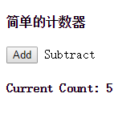
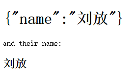
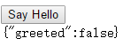
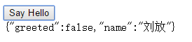

#Angular权威指南第五章之控制器

---

##**前言**
本章主要学习控制器的基本使用和多层控制器的作用域嵌套使用。

---
##**简单的控制器**

Angular中控制器的作用是**增强视图**，Angular中的控制器是一个函数，用来向视图的作用域中添加额外的功能，我们用它来给作用域对象设置初始状态，并添加自定义行为。

当我们在模块中创建控制器时，AngularJS会生成并传递一个新的`$scope`给这个控制器，可以在这个控制器里初始化`$scope`：

    var app = angular.module('app',[]);
    app.controller('FirstController',function($scope){
    	$scope.message = "hello";
    });

我们可以在视图中像调用普通数据一样调用`$scope`上的函数。我们可以**通过内置指令ng-click将按钮、链接等其他任何DOM元素同点击事件进行绑定**：

    <!doctype html>
    <html lang="en" ng-app="app">
    <head>
    	<meta charset="UTF-8">
    	<title>Document</title>
    	
    </head>
    <body>
    

      <h4>简单的计数器</h4>
      <button ng-click="add(1)">Add</button>
      <a ng-click="subtract(1)">Subtract</a>
      <h4>Current Count: {{ counter }}</h4>
    

    
    </body>
    </html>

视图中通过调用控制器中对应函数来实现一个加单的计数器：

控制器并不适合用来执行DOM操作、格式化或数据操作，以及除存储数据模型之外的状态维护操作。它只是视图和`$scope`之间的桥梁。

AngularJS允许在`$scope`上设置包括对象在内的任何类型的数据，并且在视图中还可以展示对象的属性：

    

      

      	<h1>{{ person }}</h1>
      	and their name:
      	<h2>{{ person.name }}</h2>
      

    

    

效果如下：

---

##**控制器嵌套**

AngularJS应用的任何一个部分，无论它渲染在哪个上下文中，都有父级作用域存在，对于ng-app所处的层级来讲，它的父级作用域就是$rootScope。除非是在指令内部创建的作用域，也就是孤立作用域除外。除了孤立作用域，所有的作用域都是通过原型继承而来的，这也是它们可以访问父级作用域的原因。

默认情况下，AngularJS在当前作用域中无法找到某个属性时，便会在父级作用域中查找，如果找不到，则会顺着父级作用域一直向上寻找，直到抵达$rootScope为止，如果这时也找不到，则继续运行，但是视图无法更新。

我们看一个例子：

    

      

      	

          <button ng-click="sayHello()">Say Hello</button> 
        

        {{ person }}
      

    

    

页面初次渲染效果如下：

我们点击按钮后，执行ChildController中的sayHello方法，访问ParentController中的`$scope.person`的值，效果如下：

---
##**感悟**

其实控制器我在后端开发中还是经常用到的。
说说最佳实践，设计良好的应用会将复杂的逻辑放到指令和服务中。通过使用指令和服务，我们可以将控制器重构成一个轻量且更易维护的形式。
就好像在后端开发中我们不会把所有的业务逻辑全部写到控制器中一样，我们一样需要通过分层来将数据、逻辑、接口分开来开发。

这里只是提一提思路来提醒自己，自己还不清楚指令和服务哈。
