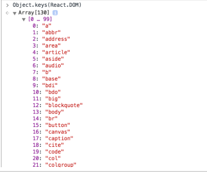

# React Up&Running第一章Hello World


---

##**前言**

跟着react官网对其进行了基本的学习，现在跟着React Up&Running 这本书来看看有没有什么深入理解的内容。

---

##**React.DOM.***

在使用JSX语法时，我们构建一个简单的helloworld组件代码如下：
```
    React.render(
      <h1>Hello,world!</h1>,
      document.getElementById('example')
    );
```

如果不使用JSX的话，我们需要React.DOM.h1来构建h1标签：
```
  React.render(
    React.DOM.h1(null, "Hello world!"),
    document.getElementById("app")
  );
```

还有很多其他的标签的React.DOM.*如下：



再回头看看，我们的第一个参数为null，是因为第一个参数是用来赋予属性的：
```
React.DOM.h1(
  {
    id: "my-heading"
  },
  "Hello world!"
)
```

如果有嵌套就有点麻烦了：
```
React.DOM.h1(
  {id: "my-heading"},
  React.DOM.span(null,
    React.DOM.em(null, "Hell"),
    "o"
  ),
  " world!"
);
```

如果使用JSX就简单了：
```
React.render(
  <h1 id="my-heading">
    <span><em>Hell</em>o</span> world!
  </h1>,
  document.getElementById("app")
);
```

---

##**特殊的属性**

前面说到了属性的赋予，有些属性比如class和for比较特殊，**需要用className和htmlFor来替换**：
```
// COUNTEREXAMPLE
// this doesn't work
React.DOM.h1(
  {
    class: "pretty",
    for: "me"
  },
  "Hello world!"
);
// PROPER EXAMPLE
// this works
React.DOM.h1(
  {
    className: "pretty",
    htmlFor: "me"
  },
  "Hello world!"
);
```

这样是为了防止XSS攻击。
而对于样式：
```
// COUNTEREXAMPLE
// this doesn't work
React.DOM.h1(
  {
    style: "background: black; color: white; font-family: Verdana"
  },
  "Hello world!"
);
// PROPER EXAMPLE
// this works
React.DOM.h1(
  {
    style: {
      background: "black",
      color: "white",
      fontFamily: "Verdana"
    }
  },
  "Hello world!"
);
```

我们不能直接在style中拼接字符串。


