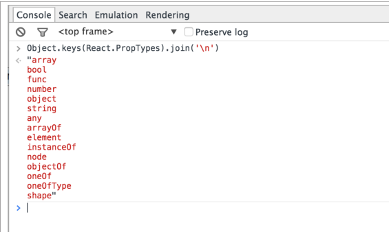

# React Up&Running第二章The life of a component


---

##**前言**

本章主要是讲解一些有关组件数据传递和生命周期还有提高复用性的基础。
之前的笔记中也有相应的提到过，这里再次巩固了一遍。

---

##**propTypes**

propTypes是一共列表，这个列表中定义了组件可以接受的属性以及它们的类型。[前面我也写过][1]。
使用优势：1.使用这个组件的时候可以直接在propTypes找到对应属性的类型，而不用再去render方法中查找；2.React会自动根据propTypes在运行的时候进行验证传入的属性。

至于这里说的第一点优势，可以举一个例子，就是我们在多层子级中调用某一父类的属性时，propTypes配合context的使用：

```
var MyContainer = React.createClass({
    getInitialState: function(){
        return {
            curItem: 'item1'
        }
    },
    //验证数据类型，这个必须要
    childContextTypes: {
        curItem: React.PropTypes.any,
        changeItem: React.PropTypes.any
    },
    getChildContext: function(){
        return {
            curItem: this.state.curItem,
            changeItem: this.changeItem
        }
    },
    changeItem: function(item){
        this.setState({
            curItem: item
        });
    },
    render: function(){
        return (
            <div>
                <CurItemWrapper />
                <ListWrapper changeItem={this.changeItem}/>
            </div>
        )
    }
});
var CurItemWrapper = React.createClass({
    render: function(){
        return (
            <div>
                <CurItemPanel />
            </div>
        )
    }
});
//通过this.context.***直接调用祖先级别的属性
var CurItemPanel = React.createClass({
    contextTypes: {
        curItem: React.PropTypes.any
    },
    render: function(){
        return (
            <p>
                The curItem is: {this.context.curItem}
            </p>
        )
    }
});
var ListWrapper = React.createClass({
    render: function(){
        return (
            <div>
                <List />
            </div>
        )
    }
});
var List = React.createClass({
    contextTypes: {
        changeItem: React.PropTypes.any
    },
    //this.context.changeItem祖先级方法
    onClickItem: function(item){
        this.context.changeItem(item);
    },
    render: function(){
        return (
            <ul>
                <li onClick={this.onClickItem.bind(this, 'item1')}>I am item1, click me!</li>
                <li onClick={this.onClickItem.bind(this, 'item2')}>I am item2, click me!</li>
            </ul>
        )
    }
});
```

完整的propTypes列表如下：



---

##**state和props**

这个相对基础，[state][2]和[props][3]都比较容易掌握， 我们可以把props理解为只读的属性，而state为需要交互的属性。

---

##**生命周期**

生命周期我在前面也有说过，在不同的阶段会调用不同的方法，所以我们需要自己安排合适的位置。


  [1]: https://github.com/brizer/Study-Notes/blob/master/%E5%BF%83%E5%BE%97%E4%BD%93%E4%BC%9A/%E7%A4%BE%E5%8C%BA/React/%E7%AC%AC%E5%85%AD%E8%AF%BE%E5%8F%AF%E5%A4%8D%E7%94%A8%E7%BB%84%E4%BB%B6.md
  [2]: https://github.com/brizer/Study-Notes/blob/master/%E5%BF%83%E5%BE%97%E4%BD%93%E4%BC%9A/%E7%A4%BE%E5%8C%BA/React/%E7%AC%AC%E5%9B%9B%E8%AF%BEstate%E4%BA%A4%E4%BA%92.md
  [3]: https://github.com/brizer/Study-Notes/blob/master/%E5%BF%83%E5%BE%97%E4%BD%93%E4%BC%9A/%E7%A4%BE%E5%8C%BA/React/%E7%AC%AC%E4%B8%83%E8%AF%BEprops%E4%BC%A0%E9%80%92.md