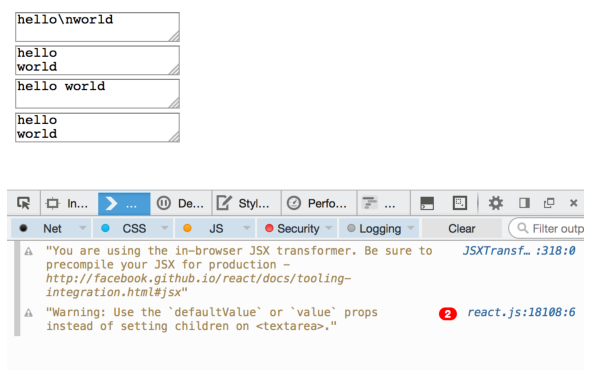

# React Up&Running第四章 JSX


---

##**前言**

前面的章节都是在没有使用JSX的基础上来完成的，现在来学习JSX。关于JSX的基本语法我[在前面写过][1]，这里就不再重复了。主要记录下之前不了解的地方,比如说{}的用法，JSX和HTML的区别，还有表单控件的一些细节问题。

---

##**{ }**

**空格**

先来说说{}的用法吧。{ }中可以存放表达式，也可以直接存放变量的值。
比如下面的JSX：
```
<h1>
  {1} plus {2} is {3}
</h1>
```
转化为HTML后变成：
```
<h1>
  <span>1</span><span> plus </span><span>2</span><span> is </span><span>3</span>
</h1>
```

而如果我们采用JSX的多行写法：
```
<h1>
  {1}
  plus
  {2}
  is
  {3}
</h1>
```
则结果为：
```
<h1>
  <span>1</span><span>plus</span><span>2</span><span>is</span><span>3</span>
</h1>
```
和前面的区别在于空格没有了。

**符号**

再来说说符号，看看下面的JSX：
```
<h2>
  More info &raquo;
</h2>
```
$raquo会转化为>>,而如果我们使用{ }将其包裹起来，这会按照原样输出：
```
<h2>
  {"More info &raquo;"}
</h2>
```

---

##**JSX和HTML区别**

官方文档中关于这一块提到的不多，这里正好做个补充。

**class和for**

当我们在JSX中给组件设置class和for时要转换成className和htmlFor，因为这两个是javascript的保留关键字:
```
// NO-NO!
var em = <em class="important" />;
var label = <label for="thatInput" />;
// OK
var em = <em className="important" />;
var label = <label htmlFor="thatInput" />;
```

**styles**

当我们给标签赋予样式时，需要注意通过对象的方式赋予：
```
NO-NO!
var em = <em style="font-size: 2em; line-height: 1.6" />;
// OK
var styles = {
  fontSize: '2em',
  lineHeight: '1.6'
};
var em = <em style={styles} />;
// inline is also OK
// note the double {{}} - one for dynamic value in JSX, one for JS object
var em = <em style={{fontSize: '2em', lineHeight: '1.6'}} />;
```

**标签闭合**

在html中有时候我们可以不用闭合标签，因为浏览器会帮助我们来识别，而在JSX中必须闭合：
```
// NO-NO, unclosed tags, though fine in HTML
var gimmeabreak = <br>;
var list = <ul><li>item</ul>;
var meta = <meta charset="utf-8">;
// OK
var gimmeabreak = <br />;
var list = <ul><li>item</li></ul>;
var meta = <meta charSet="utf-8" />;
// or
var meta = <meta charSet="utf-8"></meta>;
```

**驼峰**

JSX中默认都是以驼峰命名方式来识别的，打个比方，onclick必须是onClick才有效：
```
// NO-NO!
var a = <a onclick="reticulateSplines()" />;
// OK
var a = <a onClick={reticulateSplines} />;

```

---

##**表单**

接下来说说表单，表单我在前面也提到过，主要是[value和defaultValue的区别][2]，还有[onChange事件][3]，这里就不再多提，还是写些学到的新东西。

**textarea中的值**

不同表示方式下，不同的显示，看看如下代码：
```
function log(event) {
  console.log(event.target.value);
  console.log(event.target.defaultValue);
}
React.render(
  <textarea defaultValue="hello\nworld" onChange={log} />,
  document.getElementById('app1')
);
React.render(
  <textarea defaultValue={"hello\nworld"} onChange={log} />,
  document.getElementById('app2')
);
React.render(
  <textarea onChange={log}>hello
  world
  </textarea>,
  document.getElementById('app3')
);
React.render(
  <textarea onChange={log}>{"hello\n\
  world"}
  </textarea>,
  document.getElementById('app4')
);
```

效果如下：




**select的值**

对于select的值来说，html中我们要选中需要设置selected：
```
<!-- old school HTML -->
<select>
  <option value="stay">Should I stay</option>
  <option value="move" selected>or should I go</option>
</select>
```

但是在JSX中，我们通过defaultValue来设置：
```
// React/JSX
<select defaultValue="move">
  <option value="stay">Should I stay</option>
  <option value="move">or should I go</option>
</select>
```

如果多选也是类似：
```
<select defaultValue={["stay", "move"]} multiple={true}>
  <option value="stay">Should I stay</option>
  <option value="move">or should I go</option>
  <option value="trouble">If I stay it will be trouble</option>
</select>

```

当然了，我们也可以通过value而不是defaultValue来设置，这样就变得灵活一些：
```
var MySelect = React.createClass({
  getInitialState: function() {
    return {value: 'move'};
  },
  _onChange: function(event) {
    this.setState({value: event.target.value});
  },
  render: function() {
    return (
      <select value={this.state.value} onChange={this._onChange}>
        <option value="stay">Should I stay</option>
        <option value="move">or should I go</option>
        <option value="trouble">If I stay it will be trouble</option>
      </select>
    );
  }
});

```


  [1]: https://github.com/brizer/Study-Notes/blob/master/%E5%BF%83%E5%BE%97%E4%BD%93%E4%BC%9A/%E7%A4%BE%E5%8C%BA/React/%E7%AC%AC%E4%B8%89%E8%AF%BEJSX%E8%AF%AD%E6%B3%95.md
  [2]: https://github.com/brizer/Study-Notes/blob/master/%E5%BF%83%E5%BE%97%E4%BD%93%E4%BC%9A/%E7%A4%BE%E5%8C%BA/React/%E7%AC%AC%E5%85%AB%E8%AF%BE%E8%A1%A8%E5%8D%95%E7%BB%84%E4%BB%B6.md#%E4%B8%8D%E5%8F%97%E9%99%90%E7%BB%84%E4%BB%B6
  [3]: https://github.com/brizer/Study-Notes/blob/master/%E5%BF%83%E5%BE%97%E4%BD%93%E4%BC%9A/%E7%A4%BE%E5%8C%BA/React/%E7%AC%AC%E5%85%AB%E8%AF%BE%E8%A1%A8%E5%8D%95%E7%BB%84%E4%BB%B6.md#%E5%B1%9E%E6%80%A7