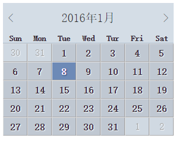

# 对表单和数据表格应用样式

---

##**前言**
本章主要对表格和表单的相关标签和样式进行了学习。

---

##**表格样式**

曾经一段时间，表格元素被用作为布局，我也见识过表格布局的代码，可维护性极差。现在，随着div+css布局的逐步成熟，表格正在慢慢恢复它们原来的用途，也就是只用来显示表格数据，而不是布局。

虽然表格有自己的缺陷，但是我们不能够完全抛弃表格。在某些情况下，它还是有其使用价值的。比如说，**数据报表的呈现、日历选择**等常用场景。

###**表格标签和属性**

表格的基本标签tr,th,td这个一般人都知道了，这里主要说一下容易忽略的标签和属性。

**caption**
用作表格的标题，尽管不是必须的，但是尽可能使用caption总是好的。
**summary**
该属性用于表格table标签，用来描述表格的内容，和图像的alt文本相似。
用法如下：

    <table class="cal" summary="日历组件">
      <caption>
        <a href="#" rel="prev">prev</a>
        2016年1月
        <a href="#" rel="next">next</a>
      </caption>
    </table>

**thead,tbody,tfoot**
这是容易让人忽略的标签，可以将表格划分为几个逻辑部分，可以将所有的th标题头放到thead中，一个表格中只能有一个thead和tfoot元素，但是可以用多个tbody元素将复杂的表格划分为更容易管理的几部分。

其中表格标签th可以设置scope属性为row和col分别表示行标题还是列标题。
用法如下：

      <thead>
        <tr>
          <th scope="col">Sun</th>
          <th scope="col">Mon</th>
          <th scope="col">Tue</th>
          <th scope="col">Wed</th>
          <th scope="col">Tur</th>
          <th scope="col">Fri</th>
          <th scope="col">Sat</th>
        </tr>
      </thead>

**col和colgroup**
通过设置rowgroup或colgroup，表示标题与多行或多列相关。
colgroup能够使用col元素对一个或多个列定义和分组。
用法如下：

      <colgroup>
        <col id="sun"/>
        <col id="mon"/>
        <col id="tue"/>
        <col id="wed"/>
        <col id="thu"/>
        <col id="fri"/>
        <col id="sat"/>
      </colgroup>

###**日历表格组件**
运用前面说的细节，就可以完成一个比较漂亮的日历表格组件了：

    
    <table cellspacing="0" class="cal" summary="日历组件">
      <caption>
        <a class="prev" href="#" rel="prev">&lt;</a>
        2016年1月
        <a class="next" href="#" rel="next">&gt;</a>
      </caption>
      <colgroup>
        <col id="sun"/>
        <col id="mon"/>
        <col id="tue"/>
        <col id="wed"/>
        <col id="thu"/>
        <col id="fri"/>
        <col id="sat"/>
      </colgroup>
      <thead>
        <tr>
          <th scope="col">Sun</th>
          <th scope="col">Mon</th>
          <th scope="col">Tue</th>
          <th scope="col">Wed</th>
          <th scope="col">Tur</th>
          <th scope="col">Fri</th>
          <th scope="col">Sat</th>
        </tr>
      </thead>
      <tbody>
        <tr>
          <td class="null">30</td>
          <td class="null">31</td>
          <td><a href="#">1</a></td>
          <td><a href="#">2</a></td>
          <td><a href="#">3</a></td>
          <td><a href="#">4</a></td>
          <td><a href="#">5</a></td>
        </tr>
        <tr>
          <td><a href="#">6</a></td>
          <td><a href="#">7</a></td>
          <td class="selected"><a href="#">8</a></td>
          <td><a href="#">9</a></td>
          <td><a href="#">10</a></td>
          <td><a href="#">11</a></td>
          <td><a href="#">12</a></td>
        </tr>
        <tr>
          <td><a href="#">13</a></td>
          <td><a href="#">14</a></td>
          <td><a href="#">15</a></td>
          <td><a href="#">16</a></td>
          <td><a href="#">17</a></td>
          <td><a href="#">18</a></td>
          <td><a href="#">19</a></td>
        </tr>
        <tr>
          <td><a href="#">20</a></td>
          <td><a href="#">21</a></td>
          <td><a href="#">22</a></td>
          <td><a href="#">23</a></td>
          <td><a href="#">24</a></td>
          <td><a href="#">25</a></td>
          <td><a href="#">26</a></td>
        </tr>
        <tr>
          <td><a href="#">27</a></td>
          <td><a href="#">28</a></td>
          <td><a href="#">29</a></td>
          <td><a href="#">30</a></td>
          <td><a href="#">31</a></td>
          <td class="null">1</td>
          <td class="null">2</td>
        </tr>        
      </tbody>
    </table>

[demo][1]

---
##**表单控件**

表单是什么，表单就是用来提交用户填写信息到服务器的"一封信",表单的请求可以分为GET和POST。
用法如下：

    <!-- 一个简单的表单，这个表单会发送一个 GET 请求 -->
    <form action="">
      <label for="GET-name">Name:</label>
      <input id="GET-name" type="text" name="name">
      <input type="submit" value="Save">
    </form>
    <!-- 一个简单的表单，发送 POST 请求 -->
    <form action="" method="post">
      <label for="POST-name">Name:</label>
      <input id="POST-name" type="text" name="name">
      <input type="submit" value="Save">
    </form>

我们通过设置form标签中的method属性来变化请求方式。
POST和GET请求的区别如下：
1.GET使用URL传递参数，对所发送信息的大小也有限制，一般2000个字符；而POST是通过提交表单来传参，且对发送信息大小没有限制。
2.GET的效率更高，POST需要先传递头信息，再传递实体信息。

常见表单控件：
`<form>`    定义供用户输入的表单    
`<input>`    定义输入域    
`<textarea>`    定义文本域 (一个多行的输入控件)    
`<label>`    定义了 `<input>` 元素的标签，一般为输入标题    
`<fieldset>`    定义了一组相关的表单元素，并使用外框包含起来    
`<legend>`    定义了 `<fieldset>` 元素的标题    
`<select>`    定义了下拉选项列表    
`<optgroup>`    定义选项组    
`<option>`    定义下拉列表中的选项    
`<button>`    定义一个点击按钮    
`<datalist>`   指定一个预先定义的输入控件选项列表    
`<keygen>`   定义了表单的密钥对生成器字段    
`<output>`    定义一个计算结果
`<progress>`   定义了一个进度条

其中，input的type属性又可以取值submit,reset,text,number,range,date,color,search,button,checkbox,file,radio,hidden等等，可谓功能强大而全面了。

**表单示例**

自己写了一个比较全面的表单控件：

    <form action="" method="post">
      <fieldset>
        <legend>表单标题</legend>
        

          <label for="pname">姓名：</label>
          <input type="text" name="pname" id="pname" placeholder="请输入姓名">
        

        

          <label for="page">年龄: </label>
          <input type="number" name="page" id="page" min="18" max="100">
        

        

          <label for="psex">性别: </label>
          男<input type="radio" name="psex" value="男" checked="checked">
          女<input type="radio" name="psex" value="女">      
        

        

          <label for="pskill">掌握技能: </label>
          javascript<input type="checkbox" name="javascript">
          css<input type="checkbox" name="css">
        

        

          <label for="pschool">学历: </label>
          <select name="pschool" id="pschool">
            <option value="a">大专</option>
            <option value="b">本科</option>
            <option value="c">硕士</option>
            <option value="d">博士</option>
          </select>
        

        

          <label for="ppassword">密码: </label>
          <input type="password" name="ppassword" id="ppassword">
        

        

          <label for="pdisabled">禁用: </label>
          <input type="text" disabled>
        

        

          <label for="pwhere">地区: </label>
          <input list="pwhere">
          <datalist id="pwhere">
            <option value="武汉">
            <option value="杭州">
            <option value="北京">   
          </datalist>
        

        

          <label for="pprogress">程序: </label>
          <progress value="82" max="100"></progress>
        

        

          <label for="pcolor">颜色: </label>
          <input type="color">
        

        

          <label for="ptime">时间: </label>
          <input type="date">
        

      </fieldset>
    </form>

[demo][2]

---

##**感悟**
主要学到了表格和表单的相关知识，虽然表格布局已经淘汰，但是该使用表格的时候还是不能含糊。
至于表单，是每一个web都需要的东西，只不过好像HTML5新推出的一些标签和type类型我见过应用的并不多，可能由于各个浏览器的基础样式都不同，所以开发团队都是自己定义组件的样式。
至于表单中的label来关联这个细节，以前没有注意到，回忆一下也发现确实有些网站没有使用label来关联控件。

  [1]: http://codepen.io/brizer/pen/QyOMgB
  [2]: http://codepen.io/brizer/pen/KVyjYZ