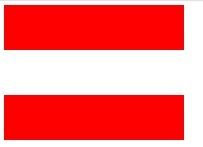
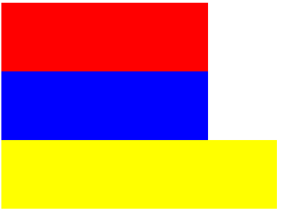
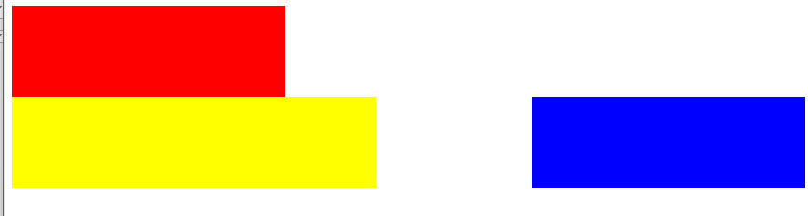
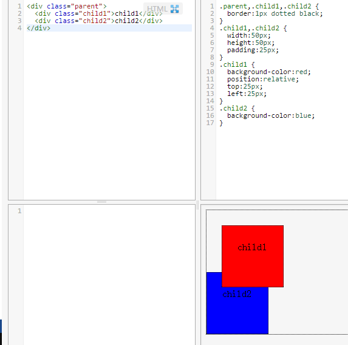
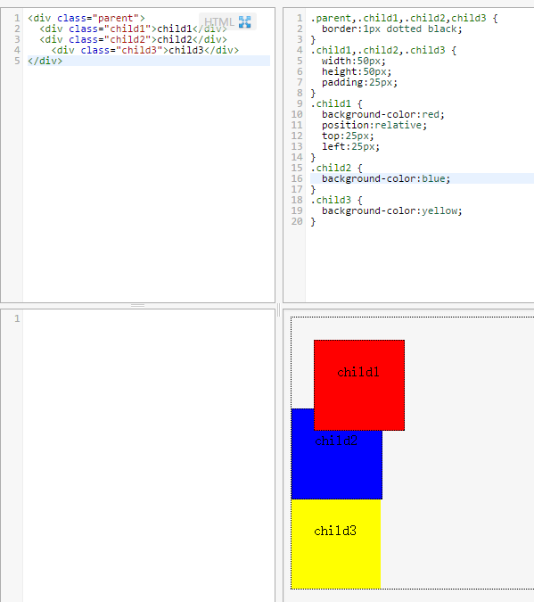
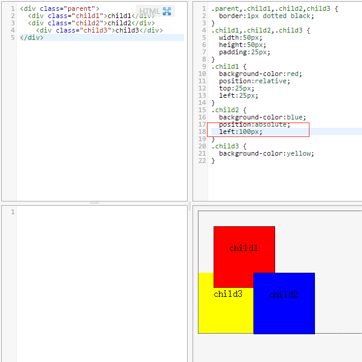
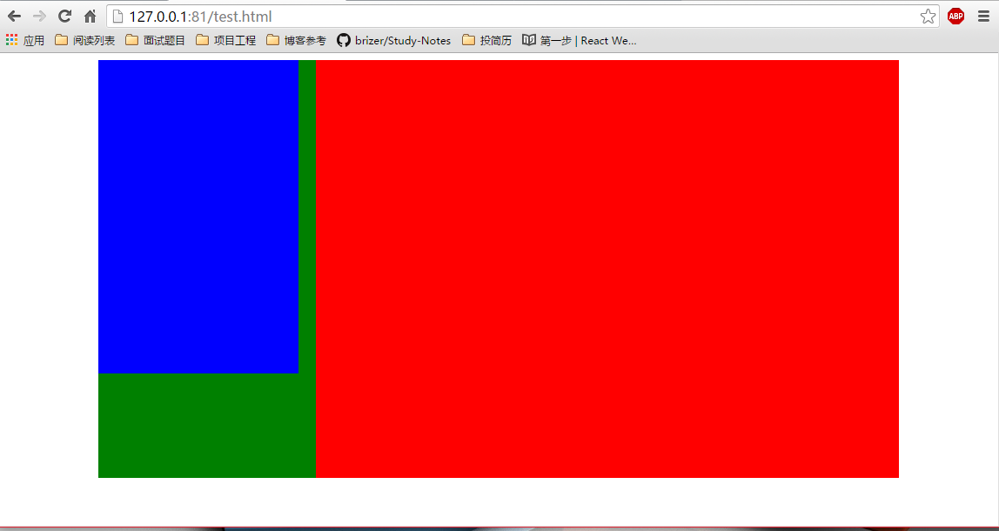
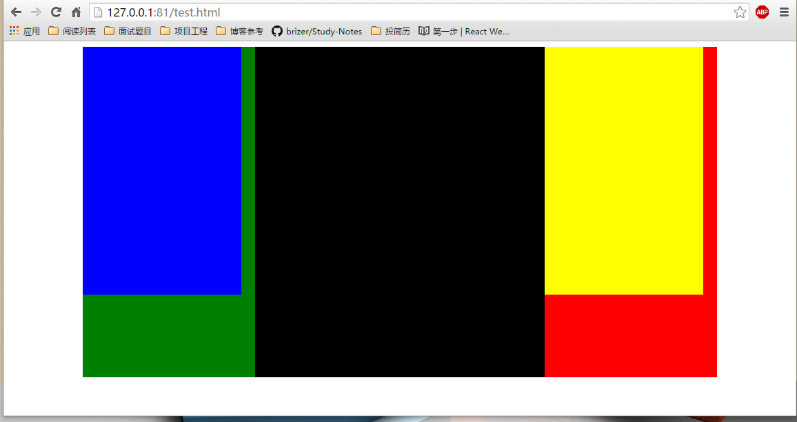

# 布局

---

##**前言**
本章主要总结了正常文档流，浮动，相对绝对布局等基本概念还有固定三列两列布局，流式布局等应用问题。下一章会主要学习css3的flex布局和双飞翼布局思想。

---
##**Normal Flow**

文档流其实在针对浮动和绝对布局来讲的。也就是说，float和position:absolute会导致元素脱离正常的文档流，也就是Normal Flow。

那么在Normal Flow中，元素是如何局部的呢？

这里就需要先说说**块级元素**和**行内元素**。css中将不同的html标签分为块级元素和行内元素。

比如块级元素有h1,div,ul,li,p,table等，行内元素有input,img,label,a等。

来看看两者的在Normal Flow中的区别吧：

1. 在Normal Flow中，**块级元素是垂直延伸**的，而行内元素是从左到右水平延伸的。
2. 块级元素可以包含行内元素和块级元素，而**行内元素不能包含块级元素**。
3. 行内元素的width,height,margin和padding属性无效。

上面提到，块级元素是垂直延伸的。那么我们需要注意一个问题，就是**块级元素的垂直margin是重叠的**，取两者最大值，而水平margin则是两者之和。

    .p {  
      width:200px;  
      height:50px;  
      margin:50px 0;  
      background-color:red;  
    }  
    

  
    

  

效果如下：

如果想要弄清楚这个问题，就不得不提到块级格式化上下文了，也就是**BFC**。这里我写过[一篇文章][1]，所以就不再写了。

文章最后提到了解决上面所说的margin重叠的问题，只需要将第二个div套一个父亲div，然后将其overflow设为hidden来触发另外一个块级格式上下文即可。

说完了块级元素和行内元素在文档流中的布局规则。我们再来看看传统的浮动和它的工作原理。

---
##**浮动**

浮动是CSS1中提到的一个概念，通过设置元素的float:left或者float:right，将元素浮动起来。CSS允许浮动任何元素、从图像到段落再到列表，所有元素都可以浮动。

**浮动元素会脱离正常的文档流**，这一点和定位布局类似。一个元素浮动时，其他内容会环绕该元素。一个浮动的元素会在包含它的边框或者其他浮动元素的边框处停留。

使用float来进行浮动在没有flex布局的传统布局中，确实是一种常用的手段。但是**其对正常的文档流会有一定的影响**。文档流会表现得和浮动框不存在一样。

比如代码：

    <head>
    	<meta charset="UTF-8">
    	<title>Document</title>
    		
    </head>
    <body>
    

    	

    	

    	

    

    </body>

效果如下：

如果我们**将b浮动起**来：

    #b {
    	float:right;
    	background-color:blue;
    }

结果变成：

也就是说c由于b脱离，而上移了。
我们只有通过清除浮动来使其正常：

    

    	

    	

    	

    	

    

###**清除浮动**
下面我们来说说**清除浮动的一些手段**：
1.使用空标签清除浮动。就和上面的demo一样，通过添加一个style为clear:both的div来清除浮动。
2.使用overflow。通过将包含浮动元素的父元素的overflow设置为auto或hidden来清除浮动。

    #b_parent {
    	overflow:auto;
    }
    </style>		
    </head>
    <body>
    

    	

    	

    		

    	

    	

    

3.使用after伪元素。将浮动元素的父元素添加:after的样式。

    #b_parent:after {
        content:".";
        height:0;
        visibility:hidden;
        display:block;
        clear:both;
    }
    </style>		
    </head>
    <body>
    

    	

    	

    		

    	

    	

    

    </body>

浮动布局是一种传统的布局方式，也衍生出了很多问题以及经典的解决方案。

---
##**position**

再来说说position属性。
position是css中的一个常用属性。它主要是用来设置元素的定位方式，为将要定位的元素定义定位规则。
position属性的取值为：**relative,absolute,fixed和static**。下面一一进行介绍。

###**relative**

相对定位指的是相对于这个元素原位置的定位，且会占住原来的位置。
所谓原位置指不设置relative属性时它的位置（既static属性时的位置）
**relative偏移相对的是元素自身margin的左上侧**。
例如对child1设置relative属性后，会根据top，right，bottom，left属性偏移，而child2的位置由于child1占住原来的位置而不变:

###**absolute**

绝对定位是根据其**最近进行定位的父对象的 padding的左上角进行定位**，基本分为以下两种情况：
例如对sub1设置absolute，如果sub1的父级元素（parent或者其父级元素）设置了absolute或relative或fixed，那么sub1就会相对这个父元素定位。
如果父级元素都没有设置absolute或relative，那sub1相对body定位。

我们在上面的例子中添加一个div：

我们将child2的position设置为absolute，left:100px;效果如下：

说明child2跳出了文档流，child3从原来位置上浮。

这里有一个需要注意的地方，就是**position:absolute和float都会隐式改变display类型**，不论之前是什么类型（display:none）除外，**都会改为display:inline-block**的方式显示，可以设置宽高，默认宽度并不占满父元素。
而**position:relative则不会改变display**类型。

###**fixed**
fixed是特殊的absolute，即fixed总是以body为定位对象的，按照浏览器的窗口进行定位。

###**static**
position的默认值，一般不设置position属性时，会按照正常的文档流进行排列。

---

##**固定布局**

前面提到了浮动的元素不再占据文档流中的任何空间，它们就不再对包围它们的块框产生任何影响。为了解决这个问题，我们需要清除浮动。这里需要注意一点的是，我们不应该连续地浮动和清理元素，而是应该浮动几乎所有元素，然后在整个文档的关键点上进行一次或两次清除。

###**两列布局**
各大知名网站中都有采用固定两列布局的，现在就来说说如何创建一个两列布局的基本模型。

    

      

      	<!-- 主要内容 -->
      

      

      	<!-- 边栏 -->
      
	
    

我们模拟主要内容primary位于页面右边，而导航栏也就是边栏位于页面左边。**为了优先加载主要内容，我们将其放在文档的前面**。
在创建浮动的布局时，一般都是将两列都向左浮动，然后使用外边距或者内边距在两列之间创建一个隔离带。但是这样做会出现一个问题，就是如果出现一点点偏差，就有可能由于宽度不够导致一列位于另一列的下面。
为了防止发生这种情况，我们可以**让一个元素左浮动，另一个元素右浮动**，从而造成视觉上的隔离。这样如果一个元素的尺寸意外地增加了几个像素，那么它不会立刻占满水平空间并下降，而只是扩展到视觉隔离带中。

    .content {
      width:920px;
      margin:0 auto;
      overflow: hidden;
      background-color: green;
    }
    .content .primary {
      width:650px;
      height:480px;
      padding-right: 20px;
      float:right;
      display:inline;
      background-color:red;
    }
    .content .secondary {
      width:230px;
      height: 360px;
      float:left;
      display:inline;
      background-color: blue;
    }

这里需要注意，由于子元素primary和secondary浮动脱离了文档流，所有父元素content要通过设置overflow为hidden来触发BFC，这一点前面也提到过。至于display:inline则是为了兼容ie下的双倍margin问题。效果如下：

一个完美的固定两列布局就完成了。

###**三列布局**

固定三列布局和两列布局类似，我们可以在刚才两列的基础上进行一定的修改：

    

      

      	<!-- 主要内容 -->
      	

      	<!-- 最主要内容 -->
      	

      	

      	<!-- 第三列 -->
      	

      

      

      	<!-- 边栏 -->
      
	
    

然后添加对应的css：

    .content .primary .primary {
      width:400px;
      height:480px;
      float:left;
      display:inline;
      background-color:black;
    }
    .content .primary .secondary {
      width:230px;
      height:360px;
      padding-left: 20px;
      float:right;
      display:inline;
      background-color: yellow;
    }

就可以实现一个不错的三列布局啦：

---

##**流式布局**

前面提到的固定布局非常常见，因为它可以使开发人员对布局和定位有更大的控制能力。但是其也有缺点，无论窗口的尺寸有多大，它的尺寸总是不变。所以说固定布局不能充分地利用可用空间。在高分辨率的屏幕上，为分辨率为1024*760的屏幕创建的设计会缩小并且出现在屏幕的中间。
这个时候，流式布局就流行了。**在使用流式布局时，尺寸是用百分比来表示的，不再是像素了**。这样，随着浏览器窗口大小的变化，列也会对应的变化。但是需要注意一点，当窗口非常小时，行内会变得非常窄，很难阅读，所以有必要添加min-width来限制。

下面我们将前面的固定宽度三列布局转化为流式的。我们模拟浏览器窗口为1250px，则我们的宽度就为(960/1250) = 76.8%。依次往下计算。

    .content {
      width:76.8%;
      margin:0 auto;
      overflow: hidden;
      min-width:62em;
      background-color: green;
    }
    .content .primary {
      width:72.82%;
      height:480px;
      float:right;
      display:inline;
      background-color:red;
    }
    .content .secondary {
      width:25%;
      height: 360px;
      float:left;
      display:inline;
      background-color: blue;
    }
    .content .primary .primary {
      width:59.7%;
      height:480px;
      float:left;
      display:inline;
      background-color:black;
    }
    .content .primary .secondary {
      width:34.33%;
      height:360px;
      padding-left: 2.63%;
      float:right;
      display:inline;
      background-color: yellow;
    }

就可以出现一个漂亮的流式三列布局。

---
##**感悟**

这里把之前掌握的和布局有关知识以及书本上的知识进行了结合，在整理的过程中回顾了不少知识也学到了不少内容。
但是由于出差很忙，项目的代码也得修改，用户的需求也在不断的变化，所以时间是真的很紧迫。
关于css3的flex布局和双飞翼布局思想就是我明天的目标了！

  [1]: http://blog.csdn.net/mevicky/article/details/47008939