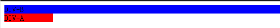
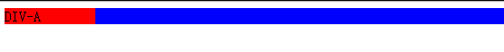
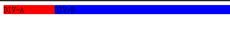
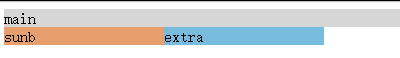
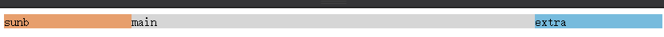

# 布局2


---

##**前言**

前面整理了正常文档流，浮动，定位布局和两列、三列布局等常见概念。
本章学习flex布局和双飞翼方式实现两列，三列布局。

---
##**双飞翼布局**

双飞翼布局其实说的是三列布局，而我习惯把这个思路理解为双飞翼实现。

###**两列布局**

模拟一个需求，要求页面分为两列，左边一列为固定宽度，而右边一列随着浏览器宽度变化而变化。

我们定义html代码如下：

    <div id='div-ab-1'>
      <div id="div-b-1">DIV-B</div>
      <div id="div-a-1">DIV-A</div>
    </div>

其中DIV-A是固定宽度的列，而DIV-B是随宽度变化的列。

    #div-ab-1{
      overflow: hidden;/*将这个div撑起来*/
    }
    #div-b-1{
      float:left;
      width:100%;
      background-color: #0000fd;
    }
    #div-a-1{
      float:left;
      width:100px;
      background-color:#fe0002;
    }

效果如下：



接下来我们将DIV-A上移：

    #div-a-1{
      float:left;
      width:100px;
      background-color:#fe0002;
      margin-left:-100%;
    }

效果如下：



发现DIV-A把DIV-B挡住了。我们通过给父元素设置padding-left,再将DIV-A相对布局：

    #div-ab-1{
      padding-left:100px;
      overflow: hidden;/*将这个div撑起来*/
    }
    #div-b-1{
      float:left;
      width:100%;
      background-color: #0000fd;
    }
    #div-a-1{
      float:left;
      width:100px;
      background-color:#fe0002;
      margin-left:-100%;
      position:relative;
      left:-100px;
    }
    
这样就完美了：



[完成版demo][1]

###**三列布局**

再来看看真正的双飞翼散三列布局。需求就在左右两列固定宽度，而中间部分宽度随浏览器变化而变化。

首先定义html：

    <div id="bd-1">
      <div id="main-1">main</div>
      <div id="sub-1">sunb</div>
      <div id="extra-1">extra</div>
    </div>

基础样式：

    #bd-1{
    }
    #main-1{
      float:left;
      width:100%;
      background-color: #d6d6d6;
    }
    #sub-1{
      float:left;
      width:160px;
      background-color: #e79f6d;
    }
    #extra-1{
      float:left;
      width:160px;
      background-color: #77bbdd;
    }

效果如下：



还是通过调整margin-left和left来完成布局：

    #bd-1{
      padding: 0 160px 0 160px;
    }
    #main-1{
      float:left;
      width:100%;
      background-color: #d6d6d6;
    }
    #sub-1{
      float:left;
      width:160px;
      background-color: #e79f6d;
      margin-left:-100%;
      position:relative;
      left:-160px;
    }
    #extra-1{
      float:left;
      width:160px;
      background-color: #77bbdd;
      margin-left:-160px;
      position:relative;
      left:160px;
    }

就可以得到完整的双飞翼布局：



[完成版demo][2]

---

##**flex布局**

弹性盒布局是一个用于页面布局的全新CSS3模块功能。弹性盒布局的定义中，它可以自动调整子元素的宽和高，来很好的填充任何显示设备中的可用显示空间，收缩内容防止内容溢出。
和块级元素基于垂直方向布局以及行内元素基于水平方向布局不同，弹性盒布局的算法是方向无关的。
最基本的用法如下：

```
div {
  border:1px solid black;
}
#box1 {
  display:flex;
  width:120px;
  height:120px;
}

```

```
<!--flex用法-->
<div id="box1"></div>

```

**只需要将父元素的display属性设置为flex**，其所有子元素都会变成弹性伸缩项目。
下面分别介绍flex的父元素的属性。

###**flex-direction**

该属性决定**子元素排列的方向**。
其可以设置的属性值如下：
row | row-reverse | column | column-reverse
分别对应：
row（默认值）：主轴在水平方向，起点在左端
row-reverse：主轴在水平方向，起点在右端
column：主轴在垂直方向，起点在上沿
column-reverse：主轴在垂直方向，起点在下沿

实例如下：

```
<!--flex-direction用法-->
<div id="box2">
  <div id="box2-1">1</div>
  <div id="box2-2">2</div>
  <div id="box2-3">3</div>
</div>
<div id="box3">
  <div id="box3-1">1</div>
  <div id="box3-2">2</div>
  <div id="box3-3">3</div>
</div>
<div id="box4">
  <div id="box4-1">1</div>
  <div id="box4-2">2</div>
  <div id="box4-3">3</div>
</div>
<div id="box5">
  <div id="box5-1">1</div>
  <div id="box5-2">2</div>
  <div id="box5-3">3</div>
</div>

```

```
#box2 {
  display:flex;
  flex-direction:row;/*主轴为水平方向，起点在左端1,2,3*/  
}
#box2 div {
  width:40px;
  height:40px;
  border:1px solid black;
}
#box3 {
  display:flex;
  flex-direction:row-reverse;/*主轴为水平方向，起点在右端3,2,1*/  
}
#box3 div {
  width:40px;
  height:40px;
  border:1px solid black;
}
#box4 {
  display:flex;
  flex-direction:column;/*主轴为垂直方向，起点在上端1,2,3*/  
}
#box4 div {
  width:40px;
  height:40px;
  border:1px solid black;
}
#box5 {
  display:flex;
  flex-direction:column-reverse;/*主轴为垂直方向，起点在下端3,2,1*/  
}
#box5 div {
  width:40px;
  height:40px;
  border:1px solid black;
}

```

效果如下：


###**flex-wrap**
该属性决定**如果一行放不下后，该如何换行**。

其可以设置的属性值如下：
nowrap | wrap | wrap-reverse
分别对应：
nowrap（默认）：不换行
wrap：换行，第一行在上方
wrap-reverse：换行，第一行在下方

实例如下：

```
<!--flex-wrap用法-->
<div id="clear"></div>
<div id="box6">
  <div id="box6-1">1</div>
  <div id="box6-2">2</div>
  <div id="box6-3">3</div>
  <div id="box6-4">4</div>
  <div id="box6-5">5</div>
  <div id="box6-6">6</div>
</div>
<div id="clear"></div>
<div id="box7">
  <div id="box7-1">1</div>
  <div id="box7-2">2</div>
  <div id="box7-3">3</div>
  <div id="box7-4">4</div>
  <div id="box7-5">5</div>
  <div id="box7-6">6</div>
</div>
<div id="clear"></div>
<div id="box8">
  <div id="box8-1">1</div>
  <div id="box8-2">2</div>
  <div id="box8-3">3</div>
  <div id="box8-4">4</div>
  <div id="box8-5">5</div>
  <div id="box8-6">6</div>
</div>

```

```
#box6 {
  display:flex; 
  flex-wrap:nowrap;/*不换行,即使超出范围*/
}
#box6 div {
  width:300px;
  height:40px;
  border:1px solid black;
}
#box7 {
  display:flex; 
  flex-wrap:wrap;/*换行,第一行是上方*/
}
#box7 div {
  width:300px;
  height:40px;
  border:1px solid black;
}
#box8 {
  display:flex; 
  flex-wrap:wrap-reverse;/*换行,第一行在下方*/
}
#box8 div {
  width:300px;
  height:40px;
  border:1px solid black;
}

```
效果如下：


###**justify-content**

该属性定义了**子元素在主轴上的对齐方式**，非常关键。

取值范围：
flex-start | flex-end | center | space-between | space-around

分别对应：
flex-start（默认值）：左对齐
flex-end：右对齐
center： 居中
space-between：两端对齐，项目之间的间隔都相等。
space-around：每个项目两侧的间隔相等。所以，项目之间的间隔比项目与边框的间隔大一倍。

实例如下：

```
<!--justify-content用法-->
<div id="clear"></div>
<div id="box9">
  <div id="box9-1"></div>
  <div id="box9-2"></div>
  <div id="box9-3"></div>
</div>
<div id="box10">
  <div id="box10-1"></div>
  <div id="box10-2"></div>
  <div id="box10-3"></div>
</div>
<div id="box11">
  <div id="box11-1"></div>
  <div id="box11-2"></div>
  <div id="box11-3"></div>
</div>
<div id="box12">
  <div id="box12-1"></div>
  <div id="box12-2"></div>
  <div id="box12-3"></div>
</div>
<div id="box13">
  <div id="box13-1"></div>
  <div id="box13-2"></div>
  <div id="box13-3"></div>
</div>

```

```
#box9 {
  display:flex; 
  justify-content:flex-start;/*左对齐*/
  background-color:blue;
}
#box9 div {
  background-color:red;
  margin:20px;
  width:40px;
  height:40px;
  border:1px solid black;
}
#box10 {
  display:flex; 
  justify-content:flex-end;/*右对齐*/
  background-color:blue;
}
#box10 div {
  background-color:red;
  margin:20px;
  width:40px;
  height:40px;
  border:1px solid black;
}
#box11 {
  display:flex; 
  justify-content:center;/*居中*/
  background-color:blue;
}
#box11 div {
  background-color:red;
  margin:20px;
  width:40px;
  height:40px;
  border:1px solid black;
}
#box12 {
  display:flex; 
  justify-content:space-between;/*两端对齐，项目之间的间隔都相等*/
  background-color:blue;
}
#box12 div {
  background-color:red;
  margin:20px;
  width:40px;
  height:40px;
  border:1px solid black;
}
#box13 {
  display:flex; 
  justify-content:space-around;/*每个项目两侧的间隔相等。所以，项目之间的间隔比项目与边框的间隔大一倍*/
  background-color:blue;
}
#box13 div {
  background-color:red;
  margin:20px;
  width:40px;
  height:40px;
  border:1px solid black;
}

```
效果如下：


###**align-items**

该属性定义**子元素在垂直方向如何对齐**

取值范围：
flex-start | flex-end | center | baseline | stretch

分别对应：
flex-start：垂直方向的起点对齐。
flex-end：垂直方向的终点对齐。
center：垂直方向的中点对齐。
baseline: 第一行文字的基线对齐。
stretch（默认值）：如果项目未设置高度或设为auto，将占满整个容器的高度。

实例如下：

```
<!--align-items用法-->
<div id="clear"></div>
<div id="box14">
  <div class="items1" id="box14-1"></div>
  <div class="items2" id="box14-2"></div>
  <div class="items3" id="box14-3"></div>
</div>
<div id="clear"></div>
<div id="box15">
  <div class="items1" id="box15-1"></div>
  <div class="items2" id="box15-2"></div>
  <div class="items3" id="box15-3"></div>
</div>
<div id="clear"></div>
<div id="box16">
  <div class="items1" id="box16-1"></div>
  <div class="items2" id="box16-2"></div>
  <div class="items3" id="box16-3"></div>
</div>
<div id="clear"></div>
<div id="box17">
  <div class="items1" id="box17-1">1</div>
  <div class="items2" id="box17-2">2</div>
  <div class="items3" id="box17-3">3</div>
</div>
<div id="clear"></div>
<div id="box18">
  <div class="items1" id="box18-1"></div>
  <div class="items2" id="box18-2"></div>
  <div class="items3" id="box18-3"></div>
</div>

```

```
.items1 {
  background-color:red;
  width:40px;
  height:40px;
  border:1px solid black;
}
.items2 {
  background-color:red;
  width:40px;
  height:140px;
  border:1px solid black;
}
.items3 {
  background-color:red;
  width:40px;
  height:80px;
  border:1px solid black;
}
#box14 {
  display:flex; 
  align-items:flex-start;/*垂直方向的起点对齐*/
  background-color:blue;
}
#box15 {
  display:flex; 
  align-items:flex-end;/*垂直方向的终点对齐*/
  background-color:blue;
}
#box16 {
  display:flex; 
  align-items:center;/*垂直方向的中点对齐*/
  background-color:blue;
}
#box17 {
  display:flex; 
  align-items:baseline;/*第一行文字的基线对齐*/
  background-color:blue;
}
#box18 {
  display:flex; 
  align-items:stretch;/*如果子元素未设置高度或设为auto，将占满整个容器的高度*/
  background-color:blue;
}

```

效果如下：


下面我们来介绍flex的子元素的属性。


###**order**

该属性定义**子元素的排列属性，数值越小，排列越靠前，默认为0**.

实例如下：

```
<!--order用法-->
<div id="clear">order用法</div>
<div id="box19">
  <div id="box19-1">-3</div>
  <div id="box19-2">5</div>
  <div id="box19-3">0(默认)</div>
</div>

```

```
#box19 {
  display:flex; 
  background-color:blue;
}
#box19 div {
  background-color:red;
  width:40px;
  height:40px;
  border:1px solid black;
}
#box19-1 {
  order:-3;
}
#box19-2 {
  order:5;
}

```
效果如下：


###**flex**

该属性定义**子元素的比例**。
实例如下：

```
<!--flex用法-->
<div id="clear">flex用法</div>
<div id="box20">
  <div id="box20-1"></div>
  <div id="box20-2"></div>
  <div id="box20-3"></div>
</div>

```

```
#box20 {
  display:flex; 
  background-color:blue;
}
#box20 div {
  background-color:red;
  width:40px;
  height:40px;
  border:1px solid black;
}
#box20-1 {
  flex:1;
}
#box20-2 {
  flex:2;
}
#box20-3 {
  flex:1;
}

```
效果如下：


这里的flex还可以和固定宽度配合使用得到更加复杂的布局。

整个flex布局demo地址：[demo](http://codepen.io/brizer/pen/zvoRxj)

---

##**对比**


前面提到了用双飞翼的思想的来实现两列布局和三列布局，而通过css3的flex会更加容易：[两列布局双飞翼][3]  [三列布局双飞翼][4]

---

##**感悟**

经过这两天的学习，对css的布局有了一个跟深入的了解，但是光学习和写demo还是不够的，还是期望有一天可以真正的派上用场，在实战中检验自己积累的知识点和沉淀。

通过css的布局系统的优化，可以看到标准也在不断的进步，开发者的生产力将会越来越高，作为开发者而言，还是很开心的呢。


  [1]: http://codepen.io/brizer/pen/vLpJxG
  [2]: http://codepen.io/brizer/pen/bEaraa
  [3]: http://codepen.io/brizer/pen/jPpmQQ
  [4]: http://codepen.io/brizer/pen/BNPRqr