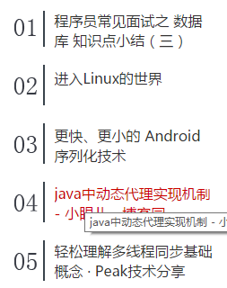
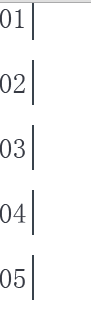

#**第六章 列表样式和导航栏**

---
##**前言**
这一章主要是讲解列表在web应用中的运用的一些技巧和原理。

---

##**列表**

###**基本属性**

首先说说列表的分类，列表分为有序列表ol，li和无序列表ul，li。

先说说基本属性：
list-style-type。用来修改列表项的标志类型。其取值有[很多种][1]。但是我们一般是将其设为none，从而要么不使用标志，要么通过图像使用自定义的标志。

list-style-image。通过图像作为列表项的标志。用法如下：

    ul {
      list-style-image: url('/i/eg_arrow.gif');
    }

[demo][2]

list-style-position。决定标志出现在列表项内容之外还是内容内部。[该属性][3]用的机会比较小。

当然，也支持简约属性list-style来缩写上面三个属性。

###**使用技巧**

虽然外面前面说到有list-style-image属性，但是它对图片位置的控制能力不强，所以我们一般是通过使用背景图片的定位属性来更加精确地控制列表样式：

    ul {
      list-style-type:none;
      padding:0px;
      margin:0px;
    }
    ul li {
      background-image:url(sqpurple.gif);
      background-repeat:no-repeat;
      background-position:0px 5px; 
      padding-left:14px;
    }
    
 至于有序列表ol，我们通常是如下使用：
 

    <ol>
      <li>咖啡</li>
      <li>牛奶</li>
      <li>茶</li>
    </ol>
    
    <ol start="50">
      <li>咖啡</li>
      <li>牛奶</li>
      <li>茶</li>
    </ol>

但是由于序列号的不可控制性，我们可以通过使用ul和背景图片来配合实现有序列表的功能。我们以csdn的首页为例：

看起来像一个有序列表，其实代码如下：

    <ul>
      <li>
        <a title="程序员常见面试之 数据库 知识点小结（三）" href="http://geek.csdn.net/news/detail/51488" target="_blank" onclick="LogClickCount(this,363);">程序员常见面试之 数据库 知识点小结（三）
        </a>
      </li>
      <li>
        <a title="进入Linux的世界" href="http://geek.csdn.net/news/detail/51487" target="_blank" onclick="LogClickCount(this,363);">进入Linux的世界
        </a>
      </li>
      <li>
        <a title="更快、更小的 Android 序列化技术" href="http://geek.csdn.net/news/detail/51486" target="_blank" onclick="LogClickCount(this,363);">更快、更小的 Android 序列化技术
        </a>
      </li>
      ...
    </ul>

那么它是如何实现的呢？其实也是通过背景图片：

    .hot_blog ul {
      background: url(y.png) 5px -1270px no-repeat;
      padding-left: 50px;
    }

图片内容如下：

这样就清晰了。

---

##**导航栏**

导航栏是页码中一个比较常用的组件。

###**垂直导航栏**

通过前面学到的链接的样式和列表的样式属性，很容易就可以做出一个垂直导航栏：

    
    
    <ul class="nav">
      <li><a href="#">Home</a></li>
      <li><a href="#">About</a></li>
      <li><a href="#">Our Server</a></li>
      <li><a href="#">Our Work</a></li>
      <li><a href="#">News</a></li>
      <li><a href="#">Contact</a></li>
    </ul>

[demo][4]

###**水平分页导航栏**

分页也是网页中的常见组件，实现一个简单的分页代码：

    
    <ol class="pagination">
      <li><a href="#" rel="prev">prev</a></li>
      <li><a href="#">1</a></li>
      <li class="selected">2</li>
      <li><a href="#">3</a></li>
      <li><a href="#">4</a></li>
      <li><a href="#">5</a></li>
      <li><a href="#" rel="next">next</a></li>
    </ol>

[demo][5]

###**下拉导航栏**
下拉导航栏也是网页中非常常见的组件。实现一个简单的，代码如下：

    
    <ul class="nav">
      <li><a href="#">Home</a></li>
      <li><a href="#">Products</a>
        <ul>
          <li><a href="#">Sliverback</a></li>
          <li><a href="#">Font Deck</a></li>
        </ul>
      </li>
      <li><a href="#">Services</a>
        <ul>
          <li><a href="#">Design</a></li>
          <li><a href="#">Develolpment</a></li>
          <li><a href="#">Consultancy</a></li>
        </ul>
      </li>  
      <li><a href="#">Contact Us</a></li>
    </ul>

[demo][6]

---

##**图像映射**
图像映射我个人用的场景并不多，但是在web的历史上还是很流行的。

图像映射在我的理解中和图片地图差不多。就是在一张图片中会对应很多的链接。比如说中国地图导航到各个省份。

但是我个人的理解是这个功能可以通过map和area标签来实现，我不明白为什么书中需要用到ul，li再来通过定位决定。可能是由于之前还没有出现map和area标签的缘故吧。

这里就用map和area来实验：

    
    <map name="planetmap" id="planetmap">
      <area shape="circle" coords="180,139,14" href="javascript:alert('火星');" alt="" />
      <area shape="circle" coords="129,161,10" href="javascript:alert('土星');" alt="" />  
      <area shape="rect" coords="0,0,110,260" href="javascript:alert('太阳');" alt="" />
    </map>  

[demo][7]

这里呢，我们会发现一个问题，就是我们无法给area添加border属性，这时我才明白书中通过li来实现图像映射的一个优势，虽然麻烦点，但是**可以控制的地方就多些了**。

---
##**感悟**

这一章需要实践的内容比前面多一些，所以花的时间也多些。但是学到的东西也不少。虽然都是些简单的组件demo，但是让我明白了细节的重要性。

比如下拉框中通过left取一个很远的值使得元素不显示在屏幕上，还有area虽然简便但是样式可控性不高等技巧。

通过图片映射，我认为其实css还有很多为了提高可控性而需要更加重视的地方，希望在日后的应用中可以一一积累。

  [1]: http://www.w3school.com.cn/cssref/pr_list-style-type.asp
  [2]: http://www.w3school.com.cn/tiy/t.asp?f=csse_list-style-image
  [3]: http://www.w3school.com.cn/cssref/pr_list-style-position.asp
  [4]: http://codepen.io/brizer/pen/RrLEyj
  [5]: http://codepen.io/brizer/pen/obGJaW
  [6]: http://codepen.io/brizer/pen/LGzwQb
  [7]: http://codepen.io/brizer/pen/obogPZ