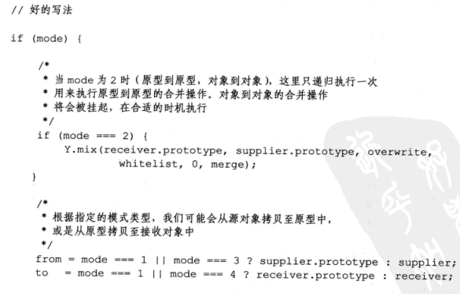
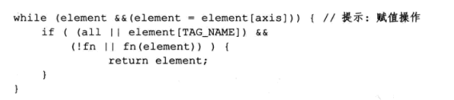
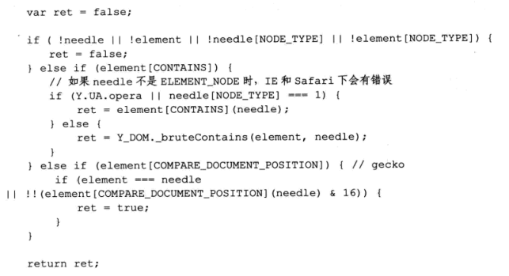

# 编写可维护的javascript第二章注释


---

##**前言**

前面说到了基本的编程风格，这一章主要说说注释的问题。

---


##**单行注释**

两个斜线开始。

##**多行注释**

以`/*`开头，以`*/`结束。
可以采用如下格式：
```
/**
 *
 */
```
 
---
 
##**使用注释**
 
何时应该添加注释
 
###难以理解的代码

难以理解的代码需要注释：

;

###可能被误认为错误的代码

有些代码会被检测工具检测为错误，这里就需要注释一下，防止别的开发者修改。

;


###浏览器特性hack

有时，一些为了hack浏览器的代码会显得非常丑陋和无法理解，这个时候可以使用注释：

;


