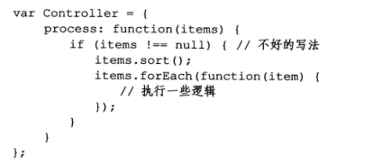
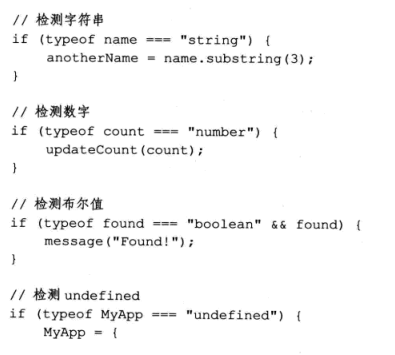
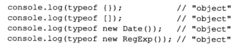
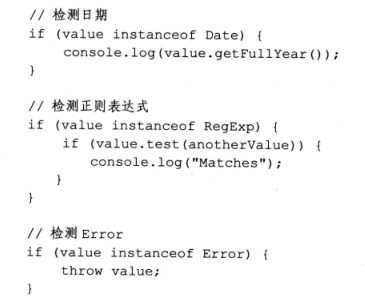
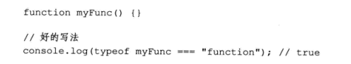
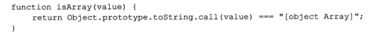
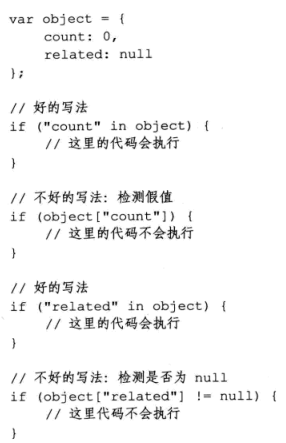

# 编写可维护的javascript第八章避免“空比较”

---

##**前言**

本章主要针对如何判断各种类型的数据，提出最佳实践方案

---

这里看一段代码：

本意是如果items不是一个数组，则停止接下来的操作。但是如果items是字符串或者数字呢？还是会报错。所以说数据类型的检测是相对重要的。

---

##**检测原始值**

javascript中有5中原始类型：字符串、数字、布尔型、null和undefined。如果**需要判断一个值是字符串、数字、布尔型或undefined，最好使用typeof方法**。

typeof运算符的独特之处在于，将其用于一个未声明的变量也不会报错。未定义的变量和值为undefined的变量通过typeof都将返回“undefined”。

---

##**检测引用值**

引用值也称为对象，在javascript中除了原始值之外的值都是引用。有这样几种内置的引用类型：Object,Array,Date和Error。typeof在判断这些引用类型时会显得力不从心，全部返回“object”。

所以，**检测引用值最好用instanceof方法**：

instanceof有一个特性是它不仅检测构造这个对象的构造器，还检测原型链。所以说每个对象都继承自Object，所以每个对象的`value instanceof Object`都会返回true。

---

##**检测函数**

函数也是引用类型，但是函数可以用typeof来判断：

---

##**检测数组**

通过toString方法，可以来判断数组：

---

##**检测属性**

当检测一个属性是否在对象中存在时，不要与null比较，可以使用in来判断，in会仅仅判断属性是否存在，而不会去读属性的值。

当然，如果只想检测实例对象的某个属性是否存在，也可以使用hasOwnProperty方法。

---

##**感悟**

主要是说，不要遇到什么都和null来比较，需要分类型来不同对待，这样才能严谨的面对更多的情况。

