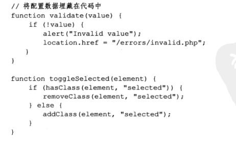
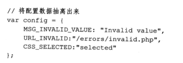

# 编写可维护的javascript第九章将配置数据从代码中分离出来


---


##**什么是配置数据**

配置数据是在应用中写死的值。看下面代码：



这段代码有三个配置数据片段，第一个是字符串“Invalid value”,第二个是URL“/errors/invalid.php”，第三个是className“selected”。

这些都是配置数据，它们都是写死在代码里的，且将来可能会被修改的数据。

---

##**抽离配置数据**

我们可以将配置数据抽离出来统一管理：



我们也可以将整个config对象放到单独的文件中，这样对配置数据的修改可以完全和使用这些数据的代码隔离开来。

---

##**保存配置数据**

有三种常见的格式。第一种就是JSON。我们常常将JSON数据放置于另外一个文件中，或者向服务器提交查询时也用JSON格式：

```
{"MSG_INVALID_VALUE":"Invalid value","URL_INVALID":"/errors/invalid.php","CSS_SELECTED":"selected"}
```

第二种是JSONP，JSON with padding,是将JSON结构用一个函数包装起来：

```
myfunc({"MSG_INVALID_VALUE":"Invalid value","URL_INVALID":"/errors/invalid.php","CSS_SELECTED":"selected"});
```

因为JSONP是一个合法的javascript文件，我们可以将它和其他的文件合并在一起，以便其他的逻辑可以读取这段数据。

最后一种是纯javascript，这种方法是将JSON对象赋值给一个变量，这个变量会被程序用到。比如：

```
var config = {"MSG_INVALID_VALUE":"Invalid value","URL_INVALID":"/errors/invalid.php","CSS_SELECTED":"selected"};
```

