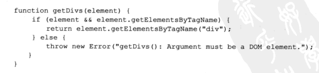
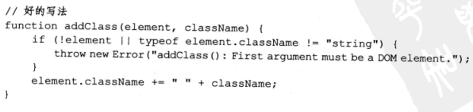
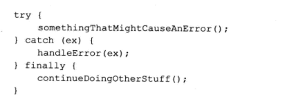

# 编写可维护的javascript第十章抛出自定义错误


---

##**前言**

在javascript中抛出错误是一门艺术，摸清楚代码中哪里合适抛出错误是需要时间的。因此，一旦搞清楚了这一点，调试代码的时间将大大缩短，对代码的满意度将急剧提升。

---

##**在javascript中抛出错误**

任何类似的对象都可以作为错误抛出，然而，Error对象是最常用的：

```
throw new Error("Something bad happened.")
```

不要直接将字符串作为错误抛出：
```
throw "message";
```

某些浏览器做出的响应可能和我们预期的不一样。

---

##**抛出错误的好处**

抛出自己的错误可以使用确切的文本供浏览器显示。除了行和列的号码，还可以包括任何你需要的有助于调试问题的信息。比如下面的例子，我们可以包括出错函数的名称：



---

##**何时抛出错误**

辨识代码中哪些部分在特定的情况下最有可能导致失败，并只在那些地方抛出错误才是关键所在。




我们的目的不是防止错误，而是在错误发生时能更加容易地调试。

---

##**try-catch语句**

try-catch-finally的用法不再介绍：



我们需要知道的是何时用throw，何时用try-catch。
throw只应该在应用程序中最深的部分抛出，就像javascript类库的代码，从底层组件中抛出错误。

所以说大部分时候都是try-catch。这里需要注意，不要将try-catch中的catch留空。要实实在在处理错误，而不是忽略它。


