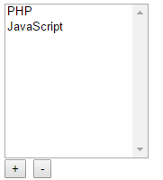

# 简单理解javascript中的MVC


---

##**前言**

用过一些MVC的框架，一直知其然不知其所以然，正好看到两篇不错的文章，于是针对文章中的内容，进行一定的理解，来初步认识MVC的原理。

---

##**MVC**

其实在后端开发中，MVC已经是轻车熟路了，笔者自己也做过PHP的MVC框架，不过性能就不敢保证了。

所以MVC的基本概念就不再提了。M主要是处理数据，V是监听模型上的改变，从而更新html，C则是接受用户的操作，通过监听V上的用户行为来调用M或V完成用户的操作。

---

##**发布/订阅**

上面说到了监听，javascript中都是通过事件监听的，我们需要让多个对象按照一定的配置来监听各自的目标，就需要用到发布/订阅模式。
```
/*
 下面是观察者模式类,它又叫发布---订阅模式;它定义了对象间的一种一对多的关系，
  让多个观察者对象同时监听某一个主题对象，当一个对象发生改变时，所有依赖于它的对象都将得到通知。
*/
function Event(observer) {
    this._observer = observer;
    this._listeners = [];
}
Event.prototype = {
    constaructor: 'Event',
    attach : function(listeners) {
        this._listeners.push(listeners);
    },
    notify: function(objs){
        for(var i = 0,ilen = this._listeners.length; i < ilen; i+=1) {
            this._listeners[i](this._observer,objs);
        }
    }
};

```

attach是用来指定监听者的，而nofify则同来通知各个监听者。

我们以一个实例来看看MVC是如何工作的：



[完整demo地址][1]


---

##**model**

我们通过模型来处理数据相关的操作：
```
/*
 模型用于封装与应用程序的业务逻辑相关的数据以及对数据处理的方法。模型有对数据直接访问的权利。
 模型不依赖 "视图" 和 "控制器", 也就是说 模型它不关心页面如何显示及如何被操作.
*/
function Mode(elems) {
    // 所有元素
    this._elems = elems;
    
    // 被选中元素的索引
    this._selectedIndex = -1;

    // 增加一项
    this.itemAdd = new Event(this);

    // 删除一项
    this.itemRemoved = new Event(this);

    this.selectedIndexChanged = new Event(this);
}

Mode.prototype = {

    constructor: 'Mode',

    // 获取所有的项
    getItems: function(){
        return [].concat(this._elems);
    },
    // 增加一项
    addItem: function(elem) {
        this._elems.push(elem);
      //通知视图进行改变
        this.itemAdd.notify({elem:elem});
    },
    // 删除一项
    removeItem: function(index) {
        var item = this._elems[index];
        this._elems.splice(index,1);
        this.itemRemoved.notify({elem:item});

        if(index === this._selectedIndex) {
            this.setSelectedIndex(-1);
        }
    },
    getSelectedIndex: function(){
        return this._selectedIndex;
    },
    setSelectedIndex: function(index){
        var previousIndex = this._selectedIndex;
        this._selectedIndex = index;
        this.selectedIndexChanged.notify({previous : previousIndex});
    }
};
```

可以看到，我们在构造函数中对每个操作声明了新的发布订阅者Event，并在对应方法中进行了具体数据操作和事件通知notify。

---

##**view**

接下来我们定义视图：

```
/*
 * 视图显示模型数据，并触发UI事件。
 */
function View(model,elements){
    this._model = model;
    this._elements = elements;
    
    this.listModified = new Event(this);
    this.addButtonClicked = new Event(this);
    this.delButtonClicked = new Event(this);
    var that = this;

    // 绑定模型监听器
    this._model.itemAdd.attach(function(){
        that.rebuildList();
    });
    this._model.itemRemoved.attach(function(){
        that.rebuildList();
    });

    // 将监听器绑定到HTML控件上
    this._elements.list.change(function(e){
        that.listModified.notify({index: e.target.selectedIndex});
    });
    // 添加按钮绑定事件
    this._elements.addButton.click(function(e){
        that.addButtonClicked.notify();
    });
    // 删除按钮绑定事件
    this._elements.delButton.click(function(e){
        that.delButtonClicked.notify();
    });
}
View.prototype = {
    constructor:  'View',
    show:  function(){
        this.rebuildList();
    },
  //重新构建list
    rebuildList: function(){
        var list = this._elements.list,
            items,
            key;
        list.html("");
        items = this._model.getItems();
        for(key in items) {
            if(items.hasOwnProperty(key)) {
                list.append('<option value="'+items[key]+'">' +items[key]+ '</option>');
            }
        }
        this._model.setSelectedIndex(-1);
    }
};
```

我们发布了一些事件，也监听了模型中事件并进行对应的操作。比如监听itemAdd后进行rebulidList操作重新构建list。而addButton，则是通过发布事件给控制器来监听从而在控制器中调用模型进行数据操作。

---

##**controller**

最后看看控制器：
```
/*
 控制器响应用户操作，调用模型上的变化函数
 负责转发请求，对请求进行处理
*/
function Controller(model,view) {
    this._model = model;
    this._view = view;
    var that = this;
    //控制器订阅通知并对请求进行处理
    this._view.listModified.attach(function(sender,args){
        that.updateSelected(args.index);
    });
    this._view.addButtonClicked.attach(function(){
        that.addItem();
    });
    this._view.delButtonClicked.attach(function(){
        that.delItem();
    });
}
Controller.prototype = {
    constructor: 'Controller',
//具体的处理函数，调用模型进行对应的数据处理
    addItem: function(){
        var item = window.prompt('Add item:', '');
        if (item) {
            this._model.addItem(item);
        }
    },
    
    delItem: function(){
        var index = this._model.getSelectedIndex();
        if(index !== -1) {
            this._model.removeItem(index);
        }
    },
    
    updateSelected: function(index){
        this._model.setSelectedIndex(index);
    }
};
```

控制器负责转发，调用模型的方法来处理数据。

---

##**部署**

我们接下来只需要定义html：
```
<select id="list" size="10" style="width: 10rem"></select><br/>
<button id="plusBtn">  +  </button>
<button id="minusBtn">  -  </button>

```
和完成初始化即可：

```
//---------------------------------
//初始化
$(function () {
    var model = new Mode(['PHP', 'JavaScript']),
      view = new View(model, {
        'list' : $('#list'), 
        'addButton' : $('#plusBtn'), 
        'delButton' : $('#minusBtn')
       }),
      controller = new Controller(model, view);        
    view.show();
});

```

通过初始化将html中的节点对象和view中的参数对应起来即可。


---

##**感悟**

绕来绕去看起来确实比较麻烦，但是对于大型项目来说，MVC的开发思想可以让开发者关注于数据和状态的变化，而不用在乎一些琐碎的细节，其实又是相当有帮忙的。

当然这个例子很不完善，也没有复用性，但是却简单的让人知道了MVC的基本原理，还是很有收获的。

---

##**参考**

[理解javascript中的mvc][2]


  [1]: http://codepen.io/brizer/pen/NxZxBq
  [2]: http://www.cnblogs.com/tugenhua0707/p/5156179.html